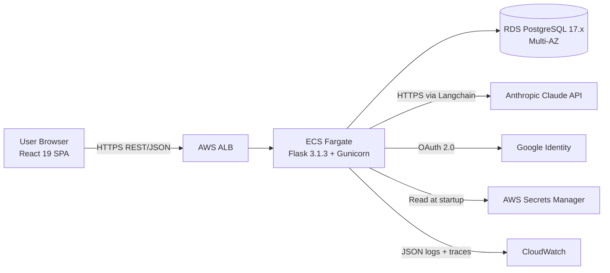

# Sales-Connections

Sales-Connections is a connection intelligence platform that lets contributors log curated "Connection Idea" records about real people in their professional networks, automatically generate AI-assisted outreach talking points via Anthropic Claude, and surface those records to a sales team for prioritized follow-up. The system is engineered as a three-tier web application (React 19 SPA + Flask 3.1.3 REST API + PostgreSQL 17.x) deployed on AWS ECS Fargate.

MVP scope: 14 bound features (F-001 through F-014) covering connection intake, AI note generation, outreach status tracking, role-based access control, audit trail, and an admin panel.

---

## Quick Start

A new developer should be able to clone, configure, and run the entire local stack in under 10 minutes.

### Prerequisites

Install the following on your workstation. Versions are the lowest tested floor.

| Tool | Required Version | Notes |
| ------ | ------------------ | ------- |
| Python | 3.12 | Backend runtime; only required if running the backend outside Docker. |
| Node.js | 20 LTS (20.20.2 or newer) | Frontend toolchain; only required if running the frontend outside Docker. |
| Docker Engine | 24.x or newer | Includes the `docker compose` plugin used by the local dev stack. |
| PostgreSQL | 17.x | Provided by the `postgres:17-alpine` container in `docker-compose.yml`; no host install needed. |
| Terraform | 1.7.x or newer | Only required when working under `infra/terraform/`. |

### Clone and configure

```bash
git clone <repository-url>
cd Sales-Connections
```

Copy the environment templates and populate the secret values. The templates document every required key.

```bash
cp backend/.env.example backend/.env
cp frontend/.env.example frontend/.env
```

In `backend/.env`, fill in:

- `ANTHROPIC_API_KEY` — required for F-002 (AI note generation). If absent, the AI endpoint returns a 504 with `error.code = "ai_timeout"` and the form remains submittable.
- `GOOGLE_OAUTH_CLIENT_ID` and `GOOGLE_OAUTH_CLIENT_SECRET` — required for F-012 (Google sign-in). The email/password fallback flow does not depend on these values.
- `JWT_SIGNING_KEY` — required to mint and verify session JWTs. Use a 32+ byte high-entropy random string.
- `DATABASE_URL` — defaults to the local docker-compose Postgres DSN; override only if you are pointing at a different database.

In `frontend/.env`, set:

- `VITE_API_BASE_URL` — defaults to `http://localhost:5000` for the local docker-compose setup.

### Start the local stack

```bash
docker compose up --build
```

This brings up three services from `docker-compose.yml`: `postgres` (Postgres 17 on host port 5432), `backend` (Flask + Gunicorn on host port 5000), and `frontend` (Vite-built SPA served by nginx on host port 5173).

### First-time database setup

Migrations are applied automatically on backend startup: `docker-compose.yml` sets `RUN_MIGRATIONS=true` on the backend service so the entrypoint runs `alembic upgrade head` before launching Gunicorn. The schema is therefore ready by the time the backend health check passes; no manual migration step is required for the local stack.

If you need to verify the migration state explicitly (for example, after authoring a new migration locally), the following command is safe to run and will report `INFO  [alembic.runtime.migration] Context impl PostgresqlImpl.` followed by `Will assume transactional DDL.` and a no-op when the schema is already current:

```bash
docker compose exec backend alembic upgrade head
```

### Verify it works

Open or `curl` each of the following URLs:

- `http://localhost:5173` — Frontend SPA login screen.
- `http://localhost:5000/healthz` — Backend liveness probe (returns 200 unconditionally).
- `http://localhost:5000/readyz` — Backend readiness probe (200 only when a DB round-trip succeeds within 1 second).
- `http://localhost:5000/metrics` — Prometheus metrics endpoint (scrape-formatted text).

### Tearing it down

```bash
docker compose down -v
```

The `-v` flag removes the Postgres data volume; omit it to retain database state across restarts.

---

## Architecture

The system uses a stateless Flask 3.1.3 backend serving a single React 19 SPA via REST/JSON, persisting all data in a PostgreSQL 17.x RDS Multi-AZ database, with Anthropic Claude accessed only from the backend through a Langchain abstraction layer. All inter-service communication is synchronous; there are no message queues, event buses, or async drivers.



The same diagram source is also exported to `docs/diagrams/system-context.mmd` for reuse from architecture documentation. Deeper documentation lives under `docs/`:

- `docs/architecture.md` — Detailed component architecture, layering, and data flow.
- `docs/api.md` — REST endpoint catalog with request and response shapes.
- `docs/diagrams/` — Mermaid sources for the system context, request lifecycle, ERD, and three state diagrams.
- `docs/decision-log.md` — Master decision log per the Explainability rule, with one row per non-trivial choice.
- `docs/onboarding.md` — Extended onboarding guide covering domain context and pitfalls.
- `docs/operations.md` — Deploy, rollback, secret rotation, and observability dashboard runbook.
- `docs/security.md` — Authentication, RBAC, audit, secrets, and data-scoping model.

---

## Repository Structure

```text
Sales-Connections/
|-- backend/             Python 3.12 / Flask 3.1.3 / SQLAlchemy 2.x / pydantic 2.x application
|-- frontend/            React 19.2.5 / TypeScript 5.x / Vite SPA
|-- infra/               Terraform 1.7+ infrastructure-as-code (modules + per-environment compositions)
|-- .github/             GitHub Actions CI/CD workflows and governance (CODEOWNERS, PR template)
|-- docs/                Markdown documentation including the master decision log and Mermaid diagrams
|-- blitzy-deck/         Self-contained reveal.js executive summary deck
|-- docker-compose.yml   Local development stack (Postgres + backend + frontend, optional pgAdmin)
|-- .gitignore           Polyglot ignore patterns for Python, Node, Terraform, and Docker
|-- .env.example files   Documented environment variables (one per tier)
`-- README.md            This file
```

Each tier owns its own dependency manifests (`backend/requirements.txt`, `backend/pyproject.toml`, `frontend/package.json`) and its own Dockerfile. There is no cross-tier source coupling; the only contract between frontend and backend is the REST/JSON envelope documented in `docs/api.md`.

---

## Tech Stack

| Layer | Technology | Version | Purpose |
| ------- | ------------ | --------- | --------- |
| Backend Runtime | Python | 3.12 | Application runtime |
| Backend HTTP | Flask | 3.1.3 | REST API framework |
| Backend WSGI | Gunicorn | 23.x | Production WSGI worker |
| Backend ORM | SQLAlchemy | 2.x | Data access |
| Backend DB Driver | psycopg | 3.x | PostgreSQL adapter |
| Backend Validation | pydantic | 2.x | Authoritative server-side validation |
| AI Integration | Anthropic SDK | 0.97.0 | Claude API client (via Langchain wrapper) |
| AI Abstraction | Langchain | latest 0.x | Provider-replaceable AI orchestration |
| Auth | Authlib + PyJWT | 1.x + 2.x | OAuth 2.0 (Google) and JWT minting |
| Frontend Library | React | 19.2.5 | UI library |
| Frontend Language | TypeScript | 5.x | Type-safe scripting |
| Frontend Build | Vite | latest 5.x | Build and dev server |
| Frontend Styling | TailwindCSS | 3.x | Utility-first CSS |
| Frontend State | TanStack Query | 5.x | Server-state cache |
| Frontend Routing | react-router-dom | 6.x | Client-side routing |
| Frontend Validation | Zod | latest 3.x | Client-side schema validation |
| Database | PostgreSQL | 17.x LTS | Multi-AZ RDS (production targets the 17.x major series; `postgres:17-alpine` is used locally) |
| Container Runtime | Docker Engine | 24.x or newer | Local and ECS runtime |
| IaC | Terraform | 1.7.x or newer | AWS provisioning |
| CI/CD | GitHub Actions | latest | Build, test, deploy pipeline |
| Observability | structlog + prometheus_client + OpenTelemetry | 24.x + latest + 1.x | Logs, metrics, traces |

The exact pinned versions live in `backend/requirements.txt`, `backend/pyproject.toml`, and `frontend/package.json`. Drift between this table and those manifests is a documentation defect; report it via a pull request.

---

## Features

The MVP scope is exhaustively the 14 features listed below. Feature IDs are stable and are referenced from the technical specification, the decision log, and pull request descriptions.

| ID | Name | Priority | Description |
| ---- | ------ | ---------- | ------------- |
| F-001 | Connection Idea Form | Critical | Structured 9-field web form for capturing connection records |
| F-002 | AI Note Generation | Critical | Anthropic Claude integration converting relationship context into outreach talking points |
| F-003 | Involvement Indicator | Critical | Three-valued enum (Warm Intro / Soft Reference / Target Only) for outreach participation |
| F-004 | Connection Feed and Dashboard | Critical | Filterable, sortable card or table view of records |
| F-005 | Outreach Status Tracking | Critical | Four-state status field gated to Sales Rep or Admin roles |
| F-006 | Submitter / Owner Attribution | Critical | Permanent owner identity on every record |
| F-007 | Record Editing and Soft Deletion | Critical | Edit-in-place plus soft-delete with `deleted_at`; hard-delete is Admin-only |
| F-008 | Tagging and Categorization | High | Many-to-many tags for industry, use-case, geography |
| F-009 | Role-Based Access Control | High | Three-role authorization (Admin / Contributor / Viewer) |
| F-010 | Duplicate LinkedIn URL Detection | High | Non-blocking pre-submit warning |
| F-011 | Connection Detail View with Edit History | High | Full record view plus audit-sourced history feed |
| F-012 | User Authentication | Critical | Google OAuth plus email/password fallback, server-validated JWT cookie |
| F-013 | Audit Trail | High | Append-only `audit_events` table with 8 event types |
| F-014 | Admin Panel | High | User and role management, record moderation, basic analytics |

---

## Development

### Common commands

Backend (run from repository root unless noted):

```bash
cd backend
python -m venv .venv
source .venv/bin/activate
pip install -r requirements.txt -r requirements-dev.txt
pytest
ruff check .
mypy .
```

Frontend:

```bash
cd frontend
npm install
npm run dev          # Vite dev server on :5173
npm run build        # Production bundle into dist/
npm test             # vitest run (single pass, CI-safe)
npm run lint         # eslint
npm run type-check   # tsc -b --noEmit
```

Database migrations (Alembic):

```bash
cd backend
alembic revision --autogenerate -m "describe the change"
alembic upgrade head
alembic downgrade -1
```

Local stack lifecycle:

```bash
docker compose up                  # Start the full stack in the foreground
docker compose down -v             # Stop and remove containers plus volumes
docker compose logs -f backend     # Tail backend logs
```

### Code quality gates

Every pull request must pass these gates before merge. Each gate is enforced by `.github/workflows/ci.yml`.

- Lint must pass: `ruff check`, `eslint`, `prettier --check` exit zero on every modified file.
- Type checks must pass: `tsc --noEmit` for frontend; `mypy backend/app` advisory but expected to pass.
- Tests must pass with coverage at or above 85 percent for both backend (`pytest --cov`) and frontend (`vitest run --coverage`).
- Every state-changing endpoint must emit an audit event; this is asserted by a pytest fixture that scans `audit_events` after each state-mutation test.

### Pull request expectations

- Use the template at `.github/pull_request_template.md`. Fill every checklist item before requesting review.
- Reviewers are assigned automatically by `.github/CODEOWNERS` based on the modified paths.
- Every non-trivial change requires a row in `docs/decision-log.md` recording what was decided, what alternatives existed, why this choice was made, and what risks it carries. Rationale never lives in code comments; the decision log is the single source of truth.

---

## Performance Budgets

The following budgets are hard targets engineered into the system. Each is enforced by an alarm on the corresponding histogram or by a database index sized for the documented scale.

| Operation | Budget | Enforcement |
| ----------- | -------- | ------------- |
| AI note generation | 5 seconds P95 end-to-end | Timeout watchdog in `services/ai_orchestration.py` plus a Prometheus histogram alarm |
| Authentication completion | 2 seconds | Prometheus histogram on `/auth/google/callback` and `/auth/login` |
| Form submit (excluding AI) | 2 seconds | Prometheus histogram on `POST /api/connections` |
| RBAC authorization check | well under 50 ms | In-process JWT claim check, no DB round-trip |
| Audit event emission | 100 ms | Single INSERT inside the parent transaction |
| Pre-submit duplicate check | sub-second at 10K records | Unique partial index `(org_id, normalized_linkedin_url) WHERE deleted_at IS NULL` |
| Feed load and filter | responsive at 10K records | Composite index `(org_id, deleted_at, submission_date DESC)` on `records` |

Scale ceiling for MVP is 10,000 records per organization. Optimizations beyond this ceiling (table partitioning, read replicas, server-side cache) are out of scope.

---

## Security

A concise summary; consult `docs/security.md` for the full model.

- Authentication uses OAuth 2.0 (Google) as the primary path, with an email/password fallback hashed via bcrypt at cost factor 12. OAuth tokens are never exposed to the SPA; only the server-minted session JWT (HttpOnly, Secure, SameSite=Lax) crosses the client boundary.
- Server-side validation is authoritative. pydantic re-validates every payload regardless of Zod success on the client; client-supplied owner identity is rejected at the schema layer.
- The `audit_events` table is append-only by design. Database-level grants restrict the application role to `INSERT`; `UPDATE` and `DELETE` are revoked, so no application code path can mutate or remove audit rows.
- Secrets are sourced exclusively from AWS Secrets Manager at process startup and never logged. A structlog redaction processor filters keys named `*_key`, `*_secret`, `password`, `token`, and `authorization` before any record is emitted.

---

## Observability

A concise summary; consult `docs/operations.md` for the full runbook.

- Structured JSON logs via structlog, with a per-request correlation ID injected by `backend/app/middleware/correlation.py` and propagated end-to-end via the `X-Correlation-Id` header.
- Prometheus metrics at `/metrics`, exposing HTTP request counters by status, handler-duration histograms, an AI-latency histogram, and an active-sessions gauge.
- OpenTelemetry distributed tracing with an OTLP exporter; Flask and SQLAlchemy auto-instrumentation cover the request lifecycle and every database round-trip.
- Health checks at `/healthz` (liveness, no dependencies) and `/readyz` (readiness, includes a 1-second DB ping). Both are wired to ALB target-group health checks in production and to `docker-compose` healthchecks locally.

The full observability surface is verified end-to-end in the local Docker Compose environment before any deploy.

---

## Out of Scope

The following are explicitly NOT being built in MVP. They are documented here so contributors do not propose them as in-scope work.

- Multi-tenant runtime operation across organizations. The data model is multi-tenant (every entity carries `org_id`); the runtime is single-org. There is no organization-creation flow, no org-switcher, and no per-org branding in MVP.
- Native mobile or PWA. No React Native, Swift, Kotlin, Objective-C, Electron, or service worker.
- Slack, email, CSV, or CRM integrations. No Slack webhook, no SES/SendGrid, no CSV import or export, no Salesforce/HubSpot/Pipedrive sync.
- Server-side cache (Redis or ElastiCache), RDS read replicas, or table partitioning. The only cache is the client-side TanStack Query cache.
- Inbound API rate limiting, OpenAPI tooling, or `/v1/` API versioning. The SPA and the API ship together as a single artefact pair.
- LinkedIn API or scraping integration. Only the URL string is captured; no profile photo, no profile data, no auto-population.
- Analytics beyond the basic three panels (most active contributors, leads by status, weekly activity sparkline). No lead velocity, no funnel analysis, no time-series trends.

---

## Common Pitfalls

These are the small papercuts that have already cost time during development. Read them before your first contribution.

- Forgetting to set `ANTHROPIC_API_KEY` in `backend/.env`. AI note generation will return a 504 with `error.code = "ai_timeout"` and the SPA will render a non-blocking "AI unavailable; you can still submit" affordance, but the form remains submittable.
- Forgetting to run `alembic upgrade head` after pulling new migrations. Symptom: the backend starts, but reads and writes fail against the new schema.
- Accidentally committing `.env` files. They are listed in `.gitignore` but watch for IDE-generated `.env.local`, `.env.development`, or editor-specific copies under `.vscode/`. The wildcard `*.env*.local` rules in `.gitignore` cover most cases.
- Issuing `UPDATE` or `DELETE` against `audit_events`. The application database role lacks these privileges by design; the SQL will fail with `permission denied`. If you need to change historical audit data you are doing something wrong.
- Calling `fetch()` directly in frontend code. Always import the wrapped client from `frontend/src/api/client.ts` so correlation-ID propagation, 401-redirect behavior, and error envelope parsing are uniform.
- Importing the Anthropic SDK from any module other than `backend/app/services/ai_orchestration.py`. The provider-replaceability invariant requires that the only point of contact with the SDK is the orchestration module; everything else uses the abstract service interface.

---

## Suggested Next Tasks

These are improvements identified during MVP scoping that were deliberately deferred. They are valuable extensions for the next development phase.

- Multi-organization onboarding flow. The data model is already multi-tenant; the missing piece is the org-creation UX and the organization switcher.
- Slack notifications for new high-warmth records. A simple webhook posted from a post-commit hook on the `records` table (or via a small notifier service) would close the loop with the sales channel.
- CSV import for existing networks. A bulk upload form plus a server-side validator would let teams seed the platform from a spreadsheet export.
- LinkedIn URL profile preview enrichment. Fetching public profile metadata (with appropriate consent) would let the feed render richer cards.
- Lead velocity and conversion analytics. Histograms of time-to-close and conversion rates by involvement type would extend the basic analytics panel.
- Mobile PWA shell with offline form drafting. A service worker plus IndexedDB queue would let contributors draft new records while disconnected.

---

## Contributing

Contributions are welcome from project maintainers. Open a feature branch off `main`, implement the change with full test coverage, and open a pull request using the template at `.github/pull_request_template.md`. Reviewers are assigned automatically by `.github/CODEOWNERS` based on the paths you touched. Every non-trivial decision must be recorded as a row in `docs/decision-log.md`; pull requests that introduce architectural choices without a decision-log entry will be sent back for revision.

The pull request template enforces these checklists: a passing CI run, an updated decision log row when applicable, a refreshed Mermaid diagram when the architecture changed, an observability assertion (logs, metrics, or traces) for any new code path, and an onboarding-doc update when the developer experience changed.

---

## License

License: Proprietary (internal Blitzy delivery). No external redistribution.

---

## References

Internal documentation:

- `docs/decision-log.md` — Master decision log per the Explainability rule.
- `docs/architecture.md` — Detailed component architecture and integration surfaces.
- `docs/api.md` — REST endpoint catalog.
- `docs/onboarding.md` — Extended onboarding guide.
- `docs/operations.md` — Deploy, rollback, and observability runbook.
- `docs/security.md` — Authentication, RBAC, audit, and secrets model.
- `docs/diagrams/` — Mermaid sources: system context, request lifecycle, ERD, state diagrams for outreach, record lifecycle, and authentication.
- `blitzy-deck/index.html` — Self-contained reveal.js executive summary deck for non-technical leadership.

External dependencies and services (acknowledgments):

- Anthropic Claude API — provider of the AI note-generation capability backing F-002.
- Google OAuth 2.0 / Google Identity — primary single sign-on provider for F-012.
- AWS — managed cloud platform (ECS Fargate, RDS, ALB, Secrets Manager, CloudWatch, ECR, IAM, VPC).
- PostgreSQL — relational data store, used in production via AWS RDS Multi-AZ.
- React, Flask, SQLAlchemy, Vite, TailwindCSS, TanStack Query, Langchain, structlog, prometheus_client, OpenTelemetry — open-source frameworks and libraries pinned in the dependency manifests; full version pins live in `backend/requirements.txt` and `frontend/package.json`.
