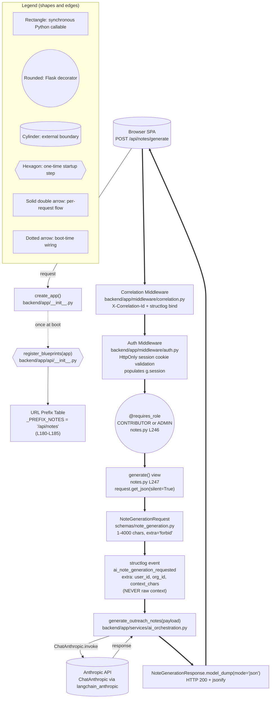

# backend/app/api

This folder is the Flask Blueprint package that composes the HTTP surface of the Sales-Connections backend. The notes blueprint at `[backend/app/api/notes.py]` is the F-002 AI note generation integration point with the `generate_outreach_notes` service; sibling blueprints serve authentication, health, connection records, tags, and admin operations.

## 1. Purpose

The API package hosts the Flask Blueprints that compose the HTTP surface for the React SPA. The `notes` blueprint at `[backend/app/api/notes.py]` is the F-002 integration point with the AI orchestrator at `[backend/app/services/ai_orchestration.py]`. All blueprints are registered through the application factory at `[backend/app/__init__.py]` via `register_blueprints` defined in `[backend/app/api/__init__.py]`. The package is consistently thin-handler oriented per AAP § 0.5.3: route modules import Pydantic schemas, RBAC and validation middleware, and then delegate substantive business logic to service-layer functions. Per AAP § 0.4.4, the notes blueprint is the SOLE caller of the AI orchestration service across the entire backend; the Anthropic SDK, `langchain`, and `langchain_anthropic` packages are NEVER imported from any feature handler directly, preserving the provider-replaceability invariant. Importing any blueprint module triggers ZERO database calls and ZERO network activity (verified in the notes.py module docstring at `[backend/app/api/notes.py:L1-L76]`).

## 2. Business Context

The F-002 endpoint exists because of the following business reality, captured verbatim from the user-supplied product framing in AAP § 0.2.3:

> "Sales-Connections is expected to be used during weekly sales pipeline review meetings. Sales leaders will add connection ideas before or during the meeting, and SDRs will use the generated notes as 'meeting-ready context' to decide which warm leads to pursue that week."

The AI-generated note is not just convenience text; it is a prioritization aid that helps the SDR team quickly answer four questions:

1. Why is this person worth contacting now?
2. How should the submitter be referenced?
3. Should the submitter make a warm intro, be mentioned softly, or stay uninvolved?
4. What first outbound angle should an SDR use?

The documentation deliberately frames this endpoint in business-value terms: **speed-to-action**, **reduced ambiguity for SDRs**, **preservation of relationship trust**, and **faster conversion of leadership networks into outbound pipeline**. This framing must remain consistent across the services README, this API README, and the deep-dive at `[docs/ai-note-generation-workflow.md]`.

## 3. Key Files

The package contains seven module-level files. The `notes` blueprint is the primary focus of this README; sibling blueprints are listed by name only.

| File | Purpose | URL Prefix | Status for F-002 |
|------|---------|------------|------------------|
| `notes.py` | `POST /api/notes/generate` — AI note generation endpoint | `/api/notes` | **Primary focus** |
| `auth.py` | Login, logout, registration, Google OAuth, `/api/me` session probe | `/auth` and `/api` | Sibling — listed by name only |
| `connections.py` | CRUD for connection records (create, list, detail, update, status, soft delete, history) | `/api/connections` | Sibling — listed by name only |
| `tags.py` | Org-scoped tag listing and creation | `/api/tags` | Sibling — listed by name only |
| `admin.py` | Admin endpoints (user management, role updates, moderation, hard delete, analytics) | `/api/admin` | Sibling — listed by name only |
| `health.py` | `/healthz` (liveness) and `/readyz` (readiness) for ALB and orchestrator probes | (root, no prefix) | Sibling — listed by name only |
| `__init__.py` | Blueprint composition; URL-prefix table; `register_blueprints(app)` entry point | — | Reference |

**Citations:**

- `[backend/app/api/__init__.py:L180-L185]` — URL-prefix constants `_PREFIX_AUTH`, `_PREFIX_API`, `_PREFIX_NOTES`, `_PREFIX_TAGS`, `_PREFIX_CONNECTIONS`, `_PREFIX_ADMIN`
- `[backend/app/api/__init__.py:L202-L210]` — `__all__` block listing the seven publicly exported names (`admin_bp`, `auth_bp`, `connections_bp`, `health_bp`, `notes_bp`, `register_blueprints`, `tags_bp`)
- `[backend/app/api/notes.py:L208]` — `notes_bp = Blueprint("notes", __name__)`
- `[backend/app/api/notes.py:L227]` — `__all__ = ["notes_bp"]`
- `[backend/app/api/notes.py:L237]` — `_AI_FAILURE_CLASS: type[AIServiceUnavailableError] = AIServiceUnavailableError`
- `[backend/app/api/notes.py:L245-L247]` — Route decorator, `@requires_role`, and `def generate()` (function name is `generate`, NOT `generate_notes`)

## 4. Data Flow

Diagram D7 below traces the F-002 request lifecycle through the API package, from the browser's `POST /api/notes/generate` through Flask's middleware chain to the `generate()` view function and the delegated service call. The diagram makes explicit that the `register_blueprints(app)` step runs ONCE at application startup, while all other steps run per request.



**Legend (Diagram D7):**

- Rectangles = synchronous Python callables (middleware, view function, service delegate)
- Rounded shapes = Flask decorators (e.g., `@requires_role`)
- Hexagons = one-time application-startup steps (e.g., `register_blueprints`)
- Cylinders = external boundaries (the browser SPA, the Anthropic API)
- Solid double arrows (`==>`) = per-request flow (one per inbound HTTP request)
- Dotted arrows (`-. .->`) = boot-time wiring (executed once per worker process)
- The `register_blueprints` step happens ONCE at startup; all other steps happen per request
- The Anthropic API call is performed inside the service layer, NOT inside the API handler (thin-handler convention per AAP § 0.5.3)

## 5. Public Interfaces

The package exposes one public HTTP route for F-002: `POST /api/notes/generate`. The endpoint contract is summarized below; the canonical full contract for every API endpoint lives at `[docs/api.md]`.

### `POST /api/notes/generate` Endpoint Contract

**Request body shape**:

```json
{ "relationship_context": "string (1-4000 chars, post-strip)" }
```

**Response body shape (HTTP 200)**:

```json
{
  "ai_notes": "string (≤ 8000 chars)",
  "model": "claude-sonnet-4-5",
  "generated_at": "2026-05-27T19:21:00Z"
}
```

**Schema sources:**

- `[backend/app/schemas/note_generation.py:NoteGenerationRequest]` (defined at line 108) — note that this file is `note_generation.py`, NOT `notes.py`
- `[backend/app/schemas/note_generation.py:NoteGenerationResponse]` (defined at line 167)

### Request validation rules

- `relationship_context: Annotated[str, Field(min_length=1, max_length=4000)]` — Pydantic constraint
- `str_strip_whitespace=True` model_config — leading/trailing whitespace stripped BEFORE the length check, so a payload of `"   "` is rejected by `min_length=1` after the strip
- `extra='forbid'` model_config — additional JSON fields (e.g., user-supplied `model`/`temperature` overrides) cause `validation_failed` HTTP 422

### RBAC

`@requires_role(UserRole.CONTRIBUTOR, UserRole.ADMIN)` at `[backend/app/api/notes.py:L246]` enforces role gating. The decorator is defined at `[backend/app/middleware/rbac.py]`. Roles `VIEWER` and any unauthenticated request are rejected (401 for missing/invalid session cookie; 403 for authenticated callers without the required role). The decorator runs against `g.session.role`, populated by the auth middleware (`[backend/app/middleware/auth.py]`), with no DB round-trip per AAP § 0.7.3 sub-50ms RBAC budget.

### Cross-link to canonical full API contract

This README summarizes the F-002 surface only. For the canonical full REST contract — every endpoint, every schema, RBAC matrix, pagination conventions, and the uniform error envelope — see `[docs/api.md]`. DO NOT duplicate that contract here; the source of truth is `[docs/api.md]`.

## 6. Error Handling

All errors emitted by the API blueprints are produced by the central error handler in `[backend/app/middleware/error_handlers.py]`. AI failures propagate WITHOUT local handling — the orchestrator raises `AIServiceUnavailableError`, which is converted to the standard envelope shape by the registered Flask error handlers. This is the **thin handler convention** per AAP § 0.5.3.

### Uniform error envelope

```json
{
  "error": {
    "code": "ai_timeout",
    "message": "AI provider did not respond within the configured timeout.",
    "correlation_id": "sc-fe-...",
    "fields": []
  }
}
```

The `correlation_id` is sourced from `g.correlation_id` (populated by `[backend/app/middleware/correlation.py]`). When `g` is not available (e.g., the helper is called outside a request context), the value falls back to an empty string rather than raising.

### Variants table

| `code` | HTTP | Trigger |
|--------|------|---------|
| `validation_failed` | 422 | Pydantic `ValidationError` on request body (missing field, wrong type, length out of range, extra fields) OR a body that is not a JSON object |
| `ai_not_configured` | 503 | Missing or empty `ANTHROPIC_API_KEY` Flask config value |
| `ai_unavailable` | 502 | Provider exception (ChatAnthropic raised, network failure, malformed response) |
| `ai_timeout` | 504 | Watchdog cancellation (timeout exceeded; default 5 seconds per `AI_REQUEST_TIMEOUT_SECONDS`) |

### Validation behavior

The complete validation flow (including JSON envelope examples for all four failure modes) is preserved verbatim in the existing `generate()` docstring at `[backend/app/api/notes.py:L249-L362]`. The docstring is the canonical specification for the contract; this README's role is to summarize and cross-link, not to duplicate.

### Why no local catch

The view function NEVER catches `AIServiceUnavailableError` locally. Letting the exception propagate to the central handler in `[backend/app/middleware/error_handlers.py]` preserves the thin-handler convention from AAP § 0.5.3, centralizes envelope wiring in one place, and ensures that any future error-code refactor only touches one file. The `_AI_FAILURE_CLASS` module-level alias at `[backend/app/api/notes.py:L237]` documents the contract at import time so a future rename of the exception class surfaces as an ImportError at app startup rather than silently drifting.

## 7. Security and Privacy Notes

The F-002 endpoint inherits the application's defense-in-depth posture. Four invariants apply specifically to this handler.

- **HttpOnly session cookie auth** — The session cookie is set by the SPA's `[frontend/src/api/client.ts]` via `credentials: "include"` and is HttpOnly so JavaScript cannot read it. The auth middleware at `[backend/app/middleware/auth.py]` validates the cookie and populates `g.session.user_id`, `g.session.org_id`, and `g.session.role` for downstream code. Missing or invalid cookies surface as HTTP 401 via `AuthError`.

- **Correlation ID propagation** — The `X-Correlation-Id` request header is read by `[backend/app/middleware/correlation.py]` and bound onto every log line via structlog `bind`. The header is generated by the SPA from `[frontend/src/lib/correlationId.ts]` with a `sc-fe-*` prefix. The middleware echoes the value back via the response header on every response (including error responses) so the SPA can correlate UI failures with backend logs.

- **Privacy — never log raw context** — The handler logs ONLY `user_id`, `org_id`, and `context_chars` (the integer length of `relationship_context`) at `[backend/app/api/notes.py:L447-L454]`. The raw `relationship_context` text is **NEVER** logged because it may contain PII about people in the contributor's network. The privacy invariant is documented in the "why" comment block at `[backend/app/api/notes.py:L432-L444]`.

- **Sanitization happens server-side** — Pydantic validation enforces the length cap and `extra='forbid'` rule at the handler boundary. Byte-level sanitization (control characters, bidi/zero-width Unicode) is performed in the service layer at `[backend/app/services/ai_orchestration.py]` via `sanitize_for_ai_prompt`, NOT in the view function. This README mentions the boundary; refer to the services README at `[backend/app/services/README.md]` for the sanitization details.

For the canonical security policy (threat model, auth flows, authorization, secrets, multi-tenancy, validation, network and browser protections), see `[docs/security.md]`.

## 8. Operational Notes

The notes blueprint is intentionally a thin handler per AAP § 0.5.3. It emits ONE structured log event and contributes NO metrics, audit events, or health endpoints of its own.

### Structured log events emitted by this blueprint

- `ai_note_generation_requested` (level=info) — emitted by `_logger.info(...)` at the top of the view function at `[backend/app/api/notes.py:L447-L454]`. The `extra` dict carries `user_id`, `org_id`, and `context_chars` (length only — NEVER the raw text). This is the ONLY event the API layer emits for the F-002 path.

Service-layer events `ai_request_start`, `ai_request_success`, `ai_request_timeout`, and `ai_request_error` are emitted by `[backend/app/services/ai_orchestration.py]`, NOT by this blueprint. See the services README at `[backend/app/services/README.md]` § 8 for those events.

### Metrics

The API layer does NOT directly emit metrics for the AI call. The Prometheus histogram `ai_request_duration_seconds{outcome}` is observed by the service layer at `[backend/app/services/ai_orchestration.py]`, not by this blueprint. The view is purely a thin handler per AAP § 0.5.3. The Prometheus `/metrics` endpoint is mounted by `[backend/app/observability/metrics.py]` separately from the API blueprints; it is NOT a route on `notes_bp`.

### Health endpoints

Liveness `/healthz` and readiness `/readyz` are owned by `health_bp` (the `health.py` sibling), NOT by `notes.py`. The notes blueprint contributes NO health endpoints of its own.

### Deployment

The Flask app is served by `gunicorn` with sync workers; the AI orchestrator's `ThreadPoolExecutor` watchdog runs per-request inside the same worker process. The notes blueprint is registered into the Flask app instance by `register_blueprints(app)` at `[backend/app/api/__init__.py:L218]`. Per AAP § 0.7.1 invariant 1 (Stateless backend workers), the Flask app is constructed once per worker process and `register_blueprints` is therefore invoked exactly once per app instance. See `[docs/operations.md]` for production deployment details.

### Pinned dependencies for this layer

The following Python packages are pinned in `[backend/requirements.txt]` and are the runtime dependencies for the API layer:

- `Flask==3.1.3`
- `gunicorn==23.0.0`
- `pydantic==2.10.3`
- `structlog==24.4.0`

## 9. Examples

Two short examples illustrate the F-002 endpoint contract. For the full canonical contract, see `[docs/api.md]`.

**Example 1 — curl invocation against local dev**:

```bash
curl -X POST http://localhost:5000/api/notes/generate \
  -H "Content-Type: application/json" \
  -H "X-Correlation-Id: sc-fe-$(uuidgen)" \
  --cookie "session=<your-session-cookie>" \
  --data '{"relationship_context":"VP Eng at Acme; met at SaaStr"}'
```

**Example 2 — Happy-path response shape (HTTP 200)**:

```json
{
  "ai_notes": "1. Reach out about Acme's recent Series C and the engineering scale challenges that follow.\n2. Reference your shared SaaStr connection to establish warm rapport.\n3. Suggest a 20-minute call focused on his team's tooling stack.",
  "model": "claude-sonnet-4-5",
  "generated_at": "2026-05-27T19:21:00Z"
}
```

Failure-mode JSON envelope examples for `validation_failed`, `ai_timeout`, `ai_unavailable`, and `ai_not_configured` are preserved verbatim in the existing `generate()` docstring at `[backend/app/api/notes.py:L249-L362]` — refer there for the canonical envelopes.

## 10. Related Modules

- `[backend/app/services/README.md]` — AI orchestrator that fulfills the endpoint; the sole importer of the Anthropic and langchain_anthropic packages per AAP § 0.4.4
- `[backend/app/services/ai_orchestration.py]` — The `generate_outreach_notes` service function called from the view
- `[backend/app/schemas/note_generation.py]` — `NoteGenerationRequest` and `NoteGenerationResponse` Pydantic models (note: file is `note_generation.py`, NOT `notes.py`)
- `[backend/app/middleware/correlation.py]` — `X-Correlation-Id` extraction, structlog binding, response-header echo
- `[backend/app/middleware/auth.py]` — HttpOnly session cookie validation and `g.session` population
- `[backend/app/middleware/rbac.py]` — `requires_role` decorator
- `[backend/app/middleware/error_handlers.py]` — `AppError` hierarchy and central JSON error envelope handler
- `[backend/app/api/__init__.py]` — `register_blueprints(app)` and the URL-prefix table
- `[docs/api.md]` — Canonical full API contract for all blueprints
- `[docs/ai-note-generation-workflow.md]` — Cross-cutting F-002 workflow deep-dive
- `[docs/security.md]` — Security policy (auth, RBAC, validation, sanitization invariants)
- `[docs/operations.md]` — Operations runbook (deployment, health checks, alarms, `ai_latency_p95` runbook)
