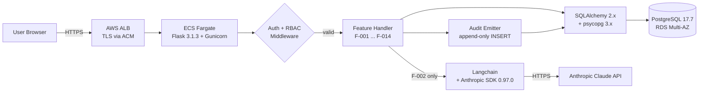
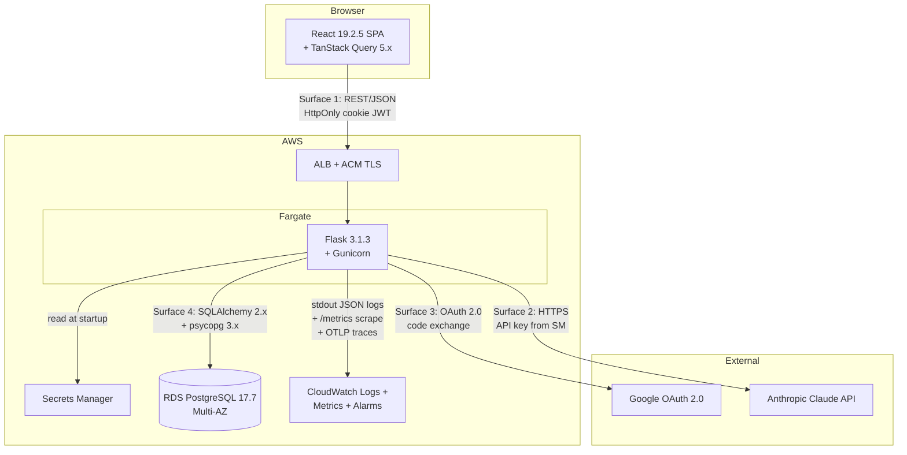
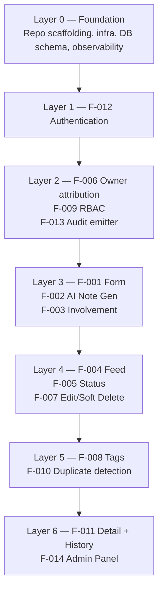
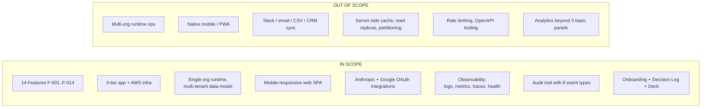

# Technical Specification

# 0. Agent Action Plan

## 0.1 Intent Clarification

### 0.1.1 Core Feature Objective

Based on the prompt, the Blitzy platform understands that the new product to be created is a **Sales-Connections** platform — a connection intelligence application that allows authenticated users to log "Connection Idea" records tied to real people in their network and surface those records to a sales team for prioritization and execution. The user's stated north-star outcome is that the platform must turn "passive network knowledge into something a sales team can actually act on immediately," and the user has explicitly identified the "AI note generation + involvement indicator" combination as the central magic of the product.

The Blitzy platform restates the user's product requirements with technical precision as fourteen bound features, all of which are in MVP scope:

- **F-001 Connection Idea Form (Critical)** — A structured web form capturing nine fields per record (full name, LinkedIn URL, company, job title, relationship context, AI-generated outreach notes, involvement indicator, owner/submitter name, submission date), with a 2-second submit round-trip budget excluding the AI call.
- **F-002 AI Note Generation (Critical)** — Backend invocation of the Anthropic Claude API that converts free-form relationship context into edit-ready outreach talking points, bound by a 5-second P95 end-to-end latency budget.
- **F-003 Involvement Indicator (Critical)** — A required three-valued enumeration (Warm Intro / Soft Reference / Target Only) signaling how the submitter wishes to participate in outreach.
- **F-004 Connection Feed & Dashboard (Critical)** — A filterable, sortable card or table view across five filter dimensions (company, involvement type, owner/submitter, date added, outreach status) that remains responsive at 10,000 records per organization.
- **F-005 Outreach Status Tracking (Critical)** — A four-valued status field (Not Started / In Progress / Contacted / Closed) where status mutation requires Sales Rep or Admin role.
- **F-006 Submitter / Owner Attribution (Critical)** — Permanent, non-overwritable owner identity attached to every record via a non-null foreign key with a denormalized display name.
- **F-007 Record Editing & Soft Deletion (Critical)** — Edit-in-place semantics with a `deleted_at` flag for soft delete; hard delete is restricted to Admin role.
- **F-008 Tagging & Categorization (High)** — Many-to-many tag relations supporting industry, use-case, and geography classification.
- **F-009 Role-Based Access Control (High)** — Three-role authorization model (Admin / Contributor / Viewer-Sales Rep) enforced at the API layer with sub-50 ms authorization checks.
- **F-010 Duplicate LinkedIn URL Detection (High)** — Pre-submit warning (non-blocking) when a normalized LinkedIn URL already exists in the organization's records.
- **F-011 Connection Detail View with Edit History (High)** — Full record view exposing all fields plus an edit-history feed sourced from the audit trail.
- **F-012 User Authentication (Critical)** — OAuth 2.0 authorization-code flow against Google with email/password fallback, session via server-validated PyJWT tokens, completed within 2 seconds.
- **F-013 Audit Trail (High)** — Append-only `audit_events` table capturing every state-changing operation with sub-100 ms emission inside the parent transaction.
- **F-014 Admin Panel (High)** — Administrative surface for user/role management, record moderation, and basic aggregation analytics (most active contributors, leads by status).

Implicit requirements surfaced from the user's brief that the Blitzy platform will deliver as part of MVP completeness:

- **Multi-tenant data scoping engineered from day one** — every entity carries an `org_id` foreign key and every read/write injects `WHERE org_id = session.org`, even though MVP operations execute against a single organization. This satisfies the user's "scalability in mind because other people may find it helpful" intent without exposing cross-organization features.
- **Authoritative server-side validation** — three-layer validation (Zod for UX, pydantic for API authority, PostgreSQL constraints as the last line of defense) that closes off the form-tampering risk implicit in any browser-submitted form.
- **Atomic state-change + audit-emit transaction** — the F-001 record create and F-013 audit emit must succeed together or roll back together, leveraging PostgreSQL MVCC; this is required by the user's "track who added/edited each record and when" instruction even though they did not specify atomicity.
- **Synchronous-only communication patterns** — message queues, event buses, async DB drivers, and saga patterns are excluded by design because they introduce eventual-consistency surfaces incompatible with the audit-atomicity invariant.
- **Mobile-responsive web only** — the user said "mobile-responsive"; native iOS/Android, PWAs, Electron, React Native, Swift, Kotlin, and Objective-C are excluded from MVP.

### 0.1.2 Special Instructions and Constraints

The Blitzy platform captures the following specific directives drawn directly from the user's prompt and from the user-supplied implementation rules:

- **Greenfield repository.** The repository is empty save for a `README.md` containing only the title "Sales-Connections" and the line "Testing Purposes." All scaffolding, source code, configuration, infrastructure, and documentation must be created from scratch.
- **Stack mandates from the user's brief, taken verbatim:**
    - Frontend: web application with a clean, fast UI; mobile-responsive
    - Backend: REST API or serverless backend
    - AI: Anthropic Claude API (or equivalent)
    - Database: relational database (PostgreSQL preferred)
    - Auth: simple email-based auth or SSO (Google OAuth)
    - Infrastructure: cloud-hosted, scalable to support multiple teams/organizations in the future
- **AI is provider-replaceable.** The user wrote "Anthropic Claude API (or equivalent)." The implementation must wrap Anthropic via Langchain so that the provider is replaceable without changing feature handlers.
- **Soft delete only.** No permanent record deletion is permitted except by Admin. Hard deletion of records by non-Admin users is unsupported.
- **Status update authority.** Outreach status is updatable only by Sales Rep or Admin roles, never by the original submitter without Admin rights, in order to "preserve sales team accountability."
- **Owner attribution permanence.** Each record has an owner/submitter name permanently attached and visible. Anonymous submissions are unsupported.
- **AI notes are suggestions only.** The contributor must be able to edit or override the AI-generated text before saving; AI failure must not block form submission.
- **Duplicate LinkedIn URL detection is a warning, not a block.** The system warns the user but does not prevent submission.
- **LinkedIn URL format validation is required.** The field must validate proper LinkedIn URL format on input.
- **Audit trail is mandatory.** Track who added/edited each record and when.

The Blitzy platform also captures the following user-supplied implementation rules that govern all deliverables:

- **Explainability rule.** Every non-trivial implementation decision must be documented in a Markdown decision log table — what was decided, what alternatives existed, why this choice was made, and what risks it carries. Rationale must not be embedded in code comments; the decision log is the single source of truth for "why" decisions.
- **Visual Architecture Documentation rule.** All visual documentation must use Mermaid diagrams with descriptive titles and legends, referenced by name in accompanying documentation.
- **Observability rule.** The application is not complete until it is observable. Every deliverable must include structured logging with correlation IDs, distributed tracing across service boundaries, a metrics endpoint, health/readiness checks, and a dashboard template — verified to work in the local development environment.
- **Onboarding & Continued Development rule.** Every contributing deliverable must include up-to-date onboarding documentation that enables a new developer to go from a clean machine to a running, modifiable application without asking questions.
- **Executive Presentation rule.** Every deliverable must include an executive summary as a single self-contained reveal.js HTML file (12–18 slides; Blitzy brand identity; pinned CDN versions reveal.js 5.1.0, Mermaid 11.4.0, Lucide 0.460.0; canonical theme file referenced at `blitzy-deck/references/blitzy-reveal-theme.css`).

User examples preserved verbatim from the prompt:

- **User Example (relationship context for AI):** "We went to college together, he's now VP of Ops at a Series B logistics startup"
- **User Example (involvement indicator values):** Warm Intro / Soft Reference / Target Only
- **User Example (outreach status values):** Not Started / In Progress / Contacted / Closed
- **User Example (tag dimensions):** industry, use case, geography
- **User Example (User Flow 1 — Add a Connection Idea):** "Click 'Add Connection' → Fill in name, LinkedIn, company, title → Enter relationship context → Trigger AI note generation → Review/edit AI notes → Select involvement level → Tag and submit → Record appears in team feed"
- **User Example (User Flow 2 — Browse & Claim a Lead):** "Open connection list → Filter by involvement type or industry tag → Select a record → Review AI notes and submitter context → Update outreach status to 'In Progress' → Work the lead"
- **User Example (User Flow 3 — Manage the Platform):** "View all submissions → Edit or remove records → Manage users and roles → View activity across contributors"

Web search requirements: The Blitzy platform has verified the latest published versions of all critical packages — Anthropic Python SDK 0.97.0 (released April 23, 2026), Flask 3.1.3 (released February 19, 2026), and React 19.2.5 — to confirm the version-pinning policy documented in §3.3 of the technical specification. No additional web research is required; all design decisions trace to the specification or to the user's prompt.

### 0.1.3 Technical Interpretation

These feature requirements translate to the following technical implementation strategy. Every requirement maps to a specific concrete action against the greenfield repository:

- **To realize the Connection Idea Form (F-001),** create a React 19.2.5 + TypeScript 5.x form component at `frontend/src/features/connections/AddEditConnectionForm.tsx` backed by a Flask 3.1.3 endpoint at `backend/app/api/connections.py` (`POST /api/connections`) that uses pydantic 2.x validation, persists via SQLAlchemy 2.x to a `records` table on PostgreSQL 17.7, and emits an audit event in the same transaction.
- **To realize AI Note Generation (F-002),** create an AI orchestration module at `backend/app/services/ai_orchestration.py` wrapping Langchain over the `anthropic` Python SDK 0.97.0, exposed via `POST /api/notes/generate`, that reads the Anthropic API key from AWS Secrets Manager at runtime, sanitizes user-supplied context server-side, and enforces a 5-second timeout watchdog.
- **To realize the Involvement Indicator (F-003),** define a PostgreSQL enum type with values `Warm Intro`, `Soft Reference`, `Target Only`, surface it in the form as a single-select control, render it as a colored badge on each feed row, and index it for filter queries.
- **To realize the Connection Feed & Dashboard (F-004),** create a React route `/feed` with a TanStack Query 5.x server-state cache, paginated GET endpoint at `backend/app/api/connections.py` (`GET /api/connections`), and a composite PostgreSQL index `(org_id, deleted_at, submission_date DESC)` on `records` to keep feed loads responsive at 10,000 records per organization.
- **To realize Outreach Status Tracking (F-005),** define a PostgreSQL enum type with values `Not Started`, `In Progress`, `Contacted`, `Closed`, gate the status-mutation endpoint at `backend/app/api/connections.py` (`PATCH /api/connections/:id/status`) behind RBAC middleware that admits only Sales Rep and Admin roles, and emit an audit event capturing before/after status.
- **To realize Owner Attribution (F-006),** add a non-null `owner_user_id` foreign key on `records` whose value is sourced exclusively from `session.user_id` server-side; reject any client-supplied owner value at the pydantic layer; denormalize `owner_display_name` for fast feed rendering.
- **To realize Record Editing & Soft Deletion (F-007),** implement endpoints `PATCH /api/connections/:id` (edit) and `DELETE /api/connections/:id` (soft delete by setting `deleted_at = NOW()`); restrict the hard-delete path `DELETE /api/connections/:id?hard=true` to Admin role; default all read paths to `WHERE deleted_at IS NULL`.
- **To realize Tagging & Categorization (F-008),** create `tags` and `record_tags` tables with composite primary keys, expose tag input on the form, and join into the feed query for "contains-any-of" filter semantics.
- **To realize Role-Based Access Control (F-009),** create RBAC middleware at `backend/app/middleware/rbac.py` that loads the role from JWT claims once per request and rejects forbidden state-changing endpoints with 403; mirror the role gating in the SPA so forbidden actions are hidden in the UI as a secondary defense.
- **To realize Duplicate LinkedIn URL Detection (F-010),** add a `normalized_linkedin_url` column on `records`, indexed and scoped by `org_id`, normalize the URL server-side (lower-case, strip trailing slash, drop query parameters), and add a `GET /api/connections/duplicate-check` endpoint that returns a non-blocking warning before submission.
- **To realize the Connection Detail View (F-011),** create a React route `/connections/:id` rendering all nine fields plus the edit-history feed sourced via `GET /api/connections/:id/history` from the `audit_events` table; surface role-conditioned edit/delete/status controls.
- **To realize User Authentication (F-012),** implement the OAuth 2.0 authorization-code flow against Google using Authlib at endpoints `GET /auth/google/start` and `GET /auth/google/callback`; provide an email/password fallback validated against bcrypt salted hashes; mint server-validated PyJWT session tokens stored in HttpOnly cookies and rotated on logout.
- **To realize the Audit Trail (F-013),** create an `audit_events` table with eight enum-constrained event types (`create`, `status_change`, `edit`, `soft_delete`, `hard_delete`, `role_change`, `authentication`, `admin_op`) and an Audit Event Emitter at `backend/app/services/audit.py` that issues an INSERT in the same transaction as every state-changing operation.
- **To realize the Admin Panel (F-014),** create an admin-only React surface at `/admin` with sub-routes for user management, record moderation, and basic aggregation analytics; gate all admin endpoints (`/api/admin/*`) behind the Admin role check.

The cross-cutting technical strategy that binds all fourteen features:




## 0.2 Repository Scope Discovery

### 0.2.1 Comprehensive File Analysis

The Blitzy platform performed exhaustive repository inspection and confirmed that the repository is a **greenfield workspace**. The complete inventory of pre-existing files is:

| Path | Type | Contents |
|------|------|----------|
| `README.md` | file (3 lines) | Project title "Sales-Connections" and the line "Testing Purposes" |

There are no `package.json`, no `pyproject.toml`, no `requirements.txt`, no Vite config, no Tailwind config, no React components, no Flask blueprints, no SQLAlchemy models, no Alembic migrations, no Dockerfile, no `docker-compose.yml`, no Terraform modules, no GitHub Actions workflows, no `.env.example`, no test scaffolding, and no `.blitzyignore` file anywhere on the filesystem. The repository functions as a documentation-only entry point.

**Implication for scope:** every file listed in subsequent sections is a *create-from-scratch* artifact. No existing modules need to be modified, refactored, or deleted. There are no integration touchpoints to discover within the repository — all integration touchpoints are *outbound* to external services (Anthropic, Google, AWS, PostgreSQL).

### 0.2.2 Existing Files to Modify

| Path | Type | Modification Required |
|------|------|------------------------|
| `README.md` | file | Replace placeholder body with onboarding documentation per the user-supplied "Onboarding & Continued Development" rule: setup instructions, domain context, common pitfalls, how to extend the project, and suggested next tasks. |

No other files exist in the repository. There are no glob patterns of existing files to enumerate (e.g., `src/**/*.py` is empty; `tests/**/*` is empty; `**/*.md` matches only `README.md`).

### 0.2.3 New File Requirements

Because the repository is empty, the entire source tree, configuration tree, infrastructure tree, and test tree must be created. The Blitzy platform groups new files by tier and by feature responsibility.

**Backend tier — Python 3.12 / Flask 3.1.3 / SQLAlchemy 2.x / pydantic 2.x — created under `backend/`:**

| Path | Purpose | Feature(s) |
|------|---------|------------|
| `backend/pyproject.toml` | PEP 621 project metadata, ruff and mypy configuration | All |
| `backend/requirements.txt` | Pinned production dependency manifest | All |
| `backend/requirements-dev.txt` | Pinned development dependency manifest (pytest, pytest-flask, ruff, mypy) | All |
| `backend/Dockerfile` | Python 3.12 slim image with Gunicorn entrypoint and Alembic migration command | Infrastructure |
| `backend/.env.example` | Documented environment variables for local development | All |
| `backend/wsgi.py` | Gunicorn WSGI entrypoint that imports the Flask app factory | Infrastructure |
| `backend/app/__init__.py` | Flask application factory `create_app()` registering blueprints, extensions, error handlers | All |
| `backend/app/config.py` | Configuration classes (Development, Testing, Production) sourcing values from environment | All |
| `backend/app/extensions.py` | SQLAlchemy `db`, Authlib OAuth client, structlog logger initialized as Flask extensions | All |
| `backend/app/models/__init__.py` | Re-exports of all SQLAlchemy models for Alembic autogenerate | F-001, F-006, F-007, F-008, F-009, F-012, F-013 |
| `backend/app/models/organization.py` | `Organization` model (id, name, created_at) | F-009 |
| `backend/app/models/user.py` | `User` model (id, org_id, email, display_name, password_hash, role, created_at) | F-006, F-009, F-012 |
| `backend/app/models/record.py` | `Record` model with all nine fields plus `org_id`, `owner_user_id`, `normalized_linkedin_url`, `deleted_at`, `involvement` enum, `outreach_status` enum | F-001, F-003, F-005, F-006, F-007, F-010 |
| `backend/app/models/tag.py` | `Tag` and `RecordTag` association table | F-008 |
| `backend/app/models/audit_event.py` | `AuditEvent` model (id, actor_user_id, target_record_id, event_type enum, event_timestamp, before_payload jsonb, after_payload jsonb) | F-013 |
| `backend/app/models/enums.py` | Python enums for `InvolvementType`, `OutreachStatus`, `UserRole`, `AuditEventType` | F-003, F-005, F-009, F-013 |
| `backend/app/schemas/__init__.py` | Re-exports of pydantic schemas | All |
| `backend/app/schemas/connection.py` | pydantic `ConnectionCreate`, `ConnectionUpdate`, `ConnectionRead`, `ConnectionStatusUpdate` | F-001, F-005, F-007, F-011 |
| `backend/app/schemas/note_generation.py` | pydantic `NoteGenerationRequest`, `NoteGenerationResponse` | F-002 |
| `backend/app/schemas/admin.py` | pydantic `UserRead`, `UserRoleUpdate`, `AnalyticsResponse` | F-014 |
| `backend/app/api/__init__.py` | Blueprint registration | All |
| `backend/app/api/auth.py` | `GET /auth/google/start`, `GET /auth/google/callback`, `POST /auth/login`, `POST /auth/logout` | F-012 |
| `backend/app/api/connections.py` | `POST/GET/PATCH/DELETE /api/connections[/:id]`, `GET /api/connections/duplicate-check`, `PATCH /api/connections/:id/status`, `GET /api/connections/:id/history` | F-001, F-004, F-005, F-007, F-010, F-011 |
| `backend/app/api/notes.py` | `POST /api/notes/generate` | F-002 |
| `backend/app/api/tags.py` | `GET /api/tags`, `POST /api/tags` | F-008 |
| `backend/app/api/admin.py` | `GET/PATCH /api/admin/users[/:id]`, `GET /api/admin/records`, `DELETE /api/admin/records/:id` (hard delete), `GET /api/admin/analytics` | F-014 |
| `backend/app/api/health.py` | `GET /healthz` (liveness) and `GET /readyz` (readiness with DB ping) | Observability |
| `backend/app/middleware/auth.py` | JWT verification middleware extracting `session.user_id`, `session.org_id`, `session.role` | F-012 |
| `backend/app/middleware/rbac.py` | Role-gate decorator `@requires_role(...)` enforcing the permission matrix | F-009 |
| `backend/app/middleware/correlation.py` | Per-request correlation ID injection into structlog context | Observability |
| `backend/app/middleware/error_handlers.py` | Mappers from validation/auth/RBAC/server errors to JSON error envelopes (401/403/422/500) | All |
| `backend/app/services/__init__.py` | Service layer re-exports | All |
| `backend/app/services/connections.py` | Business logic for record create/update/delete/list with org-scoping and soft-delete-aware queries | F-001, F-004, F-007, F-011 |
| `backend/app/services/ai_orchestration.py` | Langchain-wrapped Anthropic Claude client with prompt template, sanitization, 5 s timeout | F-002 |
| `backend/app/services/auth.py` | Password hashing (bcrypt), JWT mint/verify, OAuth user upsert | F-012 |
| `backend/app/services/duplicate_detection.py` | LinkedIn URL normalization and duplicate lookup | F-010 |
| `backend/app/services/audit.py` | `emit_audit_event(event_type, actor, target, before, after)` invoked inside the parent transaction | F-013 |
| `backend/app/services/admin.py` | Aggregation queries for analytics and record-moderation operations | F-014 |
| `backend/app/utils/url.py` | LinkedIn URL validation and normalization helpers | F-001, F-010 |
| `backend/app/utils/sanitization.py` | Server-side input sanitization for AI prompts and user-supplied free text | F-002 |
| `backend/app/observability/logging.py` | structlog configuration emitting JSON logs with correlation IDs | Observability |
| `backend/app/observability/metrics.py` | prometheus_client metrics endpoint at `/metrics` | Observability |
| `backend/app/observability/tracing.py` | OpenTelemetry tracer initialization with OTLP exporter | Observability |
| `backend/migrations/env.py` | Alembic environment configuration | Data tier |
| `backend/migrations/script.py.mako` | Alembic migration script template | Data tier |
| `backend/migrations/versions/0001_initial_schema.py` | Initial migration creating `organizations`, `users`, `records`, `tags`, `record_tags`, `audit_events`, all seven indexes, three enum types, and the database-level `INSERT/UPDATE/DELETE` privilege restriction on `audit_events` | F-001, F-003, F-005, F-006, F-007, F-008, F-009, F-013 |
| `backend/tests/conftest.py` | Pytest fixtures (Flask test client, isolated test DB, factory-boy factories) | All |
| `backend/tests/factories.py` | factory-boy factories for `User`, `Record`, `Tag`, `AuditEvent` | All |
| `backend/tests/api/test_connections.py` | API tests for F-001, F-004, F-005, F-007, F-010, F-011 | F-001, F-004, F-005, F-007, F-010, F-011 |
| `backend/tests/api/test_notes.py` | API tests for F-002 (success, timeout, AI failure non-blocking) | F-002 |
| `backend/tests/api/test_auth.py` | API tests for F-012 (OAuth happy path, email/password, JWT rotation on logout) | F-012 |
| `backend/tests/api/test_admin.py` | API tests for F-014 | F-014 |
| `backend/tests/services/test_audit.py` | Tests for F-013 (atomic emission, append-only enforcement) | F-013 |
| `backend/tests/services/test_duplicate_detection.py` | Tests for F-010 normalization edge cases | F-010 |
| `backend/tests/services/test_ai_orchestration.py` | Tests for F-002 prompt construction, sanitization, timeout watchdog | F-002 |
| `backend/tests/services/test_rbac.py` | Permission-matrix coverage for F-009 across all three roles | F-009 |

**Frontend tier — React 19.2.5 / TypeScript 5.x / Vite / TailwindCSS 3.x — created under `frontend/`:**

| Path | Purpose | Feature(s) |
|------|---------|------------|
| `frontend/package.json` | npm manifest with React 19.2.5, Vite, TanStack Query 5.x, react-router-dom 6.x, Zod, Tailwind 3.x, vitest, @testing-library/react | All |
| `frontend/package-lock.json` | npm lockfile | All |
| `frontend/tsconfig.json` | TypeScript 5.x compiler configuration targeting ES2022 | All |
| `frontend/tsconfig.node.json` | TypeScript configuration for Vite config files | All |
| `frontend/vite.config.ts` | Vite build configuration (alias paths, env prefixes, dev proxy to Flask) | All |
| `frontend/tailwind.config.ts` | Tailwind theme configuration | All |
| `frontend/postcss.config.cjs` | PostCSS 8.x with Autoprefixer 10.x | All |
| `frontend/index.html` | SPA shell HTML loading the Vite-bundled JS | All |
| `frontend/.env.example` | Documented environment variables (e.g., `VITE_API_BASE_URL`) | All |
| `frontend/Dockerfile` | Multi-stage build producing nginx static-asset image (alternative to S3+CloudFront) | Infrastructure |
| `frontend/nginx.conf` | nginx SPA configuration (history-mode fallback, gzip, cache headers) | Infrastructure |
| `frontend/src/main.tsx` | React 19 root mount with QueryClientProvider, RouterProvider, AuthProvider | All |
| `frontend/src/App.tsx` | Top-level layout shell | All |
| `frontend/src/router.tsx` | `react-router-dom 6.x` route table for `/login`, `/feed`, `/connections/new`, `/connections/:id`, `/connections/:id/edit`, `/admin`, `/admin/users`, `/admin/records`, `/admin/analytics`, `/auth/google/start`, `/auth/google/callback` | F-004, F-011, F-012, F-014 |
| `frontend/src/api/client.ts` | Fetch wrapper with credential inclusion, 401 redirect, correlation-ID propagation | All |
| `frontend/src/api/connections.ts` | TanStack Query hooks for record CRUD, duplicate check, history | F-001, F-004, F-007, F-010, F-011 |
| `frontend/src/api/notes.ts` | TanStack Query mutation hook for AI note generation | F-002 |
| `frontend/src/api/auth.ts` | TanStack Query hooks for login/logout/session | F-012 |
| `frontend/src/api/admin.ts` | TanStack Query hooks for admin user/record/analytics endpoints | F-014 |
| `frontend/src/auth/AuthProvider.tsx` | React context exposing session state and role-gate hook `useRole()` | F-009, F-012 |
| `frontend/src/auth/ProtectedRoute.tsx` | Route guard redirecting unauthenticated users to `/login` | F-012 |
| `frontend/src/auth/RoleGate.tsx` | Component wrapper hiding admin-only or status-mutation actions in the UI as secondary defense | F-009 |
| `frontend/src/features/connections/AddEditConnectionForm.tsx` | The Add / Edit Connection form (F-001) with Zod validation, "Generate AI Notes" button, inline editable AI text, involvement single-select, tag input, duplicate-warning banner | F-001, F-002, F-003, F-008, F-010 |
| `frontend/src/features/connections/ConnectionFeed.tsx` | The Connection Feed (F-004) with six row elements, six filter dimensions, five sort dimensions | F-004 |
| `frontend/src/features/connections/ConnectionDetail.tsx` | The Connection Detail View (F-011) showing all fields plus edit-history feed | F-011 |
| `frontend/src/features/connections/StatusChip.tsx` | Outreach status chip with the four documented states and role-gated mutation | F-005 |
| `frontend/src/features/connections/InvolvementBadge.tsx` | Three-state involvement badge | F-003 |
| `frontend/src/features/connections/EditHistoryFeed.tsx` | Audit-event-sourced edit history component | F-011, F-013 |
| `frontend/src/features/connections/DuplicateWarning.tsx` | Inline warning banner shown when a normalized URL match is found | F-010 |
| `frontend/src/features/connections/TagInput.tsx` | Multi-tag input control bound to the org's tag list | F-008 |
| `frontend/src/features/auth/LoginScreen.tsx` | Login surface with Google OAuth button and email/password form | F-012 |
| `frontend/src/features/admin/AdminPanel.tsx` | Admin Panel root layout with tab navigation | F-014 |
| `frontend/src/features/admin/UserManagement.tsx` | Admin user/role management view | F-009, F-014 |
| `frontend/src/features/admin/RecordModeration.tsx` | Admin moderation view including soft-deleted records | F-007, F-014 |
| `frontend/src/features/admin/Analytics.tsx` | Admin analytics view (most active contributors, leads by status) | F-014 |
| `frontend/src/components/ui/Button.tsx` | Tailwind-styled button primitive | All |
| `frontend/src/components/ui/Input.tsx` | Tailwind-styled input primitive | F-001 |
| `frontend/src/components/ui/Select.tsx` | Tailwind-styled select primitive | F-001, F-003, F-005 |
| `frontend/src/components/ui/Table.tsx` | Tailwind-styled table primitive (used by feed and admin views) | F-004, F-014 |
| `frontend/src/components/ui/Badge.tsx` | Tailwind-styled badge primitive (used by involvement and tag chips) | F-003, F-008 |
| `frontend/src/components/ui/Modal.tsx` | Tailwind-styled modal primitive (delete confirmation, role change confirmation) | F-007, F-014 |
| `frontend/src/components/ui/Toast.tsx` | Toast notifications for success/error feedback | All |
| `frontend/src/schemas/connection.ts` | Zod schemas mirroring backend pydantic for Connection records | F-001, F-005, F-007, F-011 |
| `frontend/src/schemas/auth.ts` | Zod schemas for login | F-012 |
| `frontend/src/schemas/admin.ts` | Zod schemas for admin views | F-014 |
| `frontend/src/lib/queryClient.ts` | TanStack Query 5.x client configuration | All |
| `frontend/src/lib/correlationId.ts` | Generates and propagates per-request correlation IDs | Observability |
| `frontend/src/styles/index.css` | Tailwind directives and global styles | All |
| `frontend/tests/setup.ts` | vitest setup file with @testing-library/jest-dom matchers | All |
| `frontend/tests/features/connections/AddEditConnectionForm.test.tsx` | Component tests for the form | F-001, F-002, F-003, F-008, F-010 |
| `frontend/tests/features/connections/ConnectionFeed.test.tsx` | Component tests for the feed (filtering, sorting) | F-004 |
| `frontend/tests/features/connections/ConnectionDetail.test.tsx` | Component tests for the detail view (edit history) | F-011 |
| `frontend/tests/features/admin/AdminPanel.test.tsx` | Component tests for the admin surface | F-009, F-014 |
| `frontend/tests/features/auth/LoginScreen.test.tsx` | Component tests for the login screen | F-012 |
| `frontend/tests/api/client.test.ts` | Tests for the fetch wrapper, 401 redirect, correlation propagation | F-012, Observability |

**Infrastructure tier — Terraform / Docker — created under `infra/`:**

| Path | Purpose | Feature(s) |
|------|---------|------------|
| `docker-compose.yml` | Local dev stack: PostgreSQL 17.x, backend, frontend, optional pgAdmin | All |
| `infra/terraform/main.tf` | Top-level Terraform module aggregating workspaces | Infrastructure |
| `infra/terraform/versions.tf` | Pinned `terraform` and provider versions | Infrastructure |
| `infra/terraform/providers.tf` | AWS provider with OIDC-federated authentication | Infrastructure |
| `infra/terraform/variables.tf` | Module input variables | Infrastructure |
| `infra/terraform/outputs.tf` | Module outputs (ALB DNS, RDS endpoint, ECR URLs) | Infrastructure |
| `infra/terraform/modules/network/main.tf` | VPC, public/private subnets, route tables, security groups | Infrastructure |
| `infra/terraform/modules/database/main.tf` | RDS PostgreSQL 17.7 Multi-AZ, parameter group, subnet group | Infrastructure |
| `infra/terraform/modules/ecs/main.tf` | ECS cluster, Fargate task definition, service, task role | Infrastructure |
| `infra/terraform/modules/ecr/main.tf` | ECR repositories for backend and frontend with native scanner enabled | Infrastructure |
| `infra/terraform/modules/alb/main.tf` | Application Load Balancer, listener, target group, ACM certificate | Infrastructure |
| `infra/terraform/modules/secrets/main.tf` | Secrets Manager entries for `ANTHROPIC_API_KEY`, `GOOGLE_OAUTH_CLIENT_SECRET`, JWT signing key, DB credentials | Infrastructure |
| `infra/terraform/modules/observability/main.tf` | CloudWatch log groups, metric alarms, dashboard | Observability |
| `infra/terraform/envs/dev/main.tf` | Dev workspace composition | Infrastructure |
| `infra/terraform/envs/staging/main.tf` | Staging workspace composition | Infrastructure |
| `infra/terraform/envs/prod/main.tf` | Prod workspace composition | Infrastructure |

**CI/CD tier — GitHub Actions — created under `.github/`:**

| Path | Purpose | Feature(s) |
|------|---------|------------|
| `.github/workflows/ci.yml` | Lint → type-check → test → build → security-scan pipeline on every PR | All |
| `.github/workflows/cd.yml` | Push to ECR → terraform plan → terraform apply (dev auto, staging on merge to main, prod on manual approval) | Infrastructure |
| `.github/workflows/dependabot.yml` | Dependabot config for npm and pip | Security |
| `.github/CODEOWNERS` | Path-based reviewer assignments | Governance |
| `.github/pull_request_template.md` | PR template enforcing decision-log, diagram, observability, onboarding, deck checklist | Governance |

**Documentation tier — Markdown — created under `docs/`:**

| Path | Purpose | Feature(s) |
|------|---------|------------|
| `README.md` | Top-level project overview replacing the placeholder; quick-start, architecture diagram, links into `docs/` | All |
| `docs/decision-log.md` | Master decision log per the user's "Explainability" rule, with one row per non-trivial choice | All |
| `docs/architecture.md` | Architecture documentation referencing Mermaid diagrams by name | All |
| `docs/onboarding.md` | New-developer onboarding (clean machine → running app), domain context, common pitfalls, suggested next tasks | All |
| `docs/api.md` | REST endpoint catalog with request/response shapes | All |
| `docs/operations.md` | Operational runbook: deploys, rollbacks, secret rotation, observability dashboards | Infrastructure, Observability |
| `docs/security.md` | Security model: authentication, RBAC, audit, secrets, data scoping | F-009, F-012, F-013 |
| `docs/diagrams/system-context.mmd` | Mermaid system context diagram | All |
| `docs/diagrams/request-lifecycle.mmd` | Mermaid request-lifecycle sequence | All |
| `docs/diagrams/erd.mmd` | Mermaid entity-relationship diagram for the six tables | Data tier |
| `docs/diagrams/state-outreach.mmd` | Mermaid state diagram for outreach status | F-005 |
| `docs/diagrams/state-record-lifecycle.mmd` | Mermaid state diagram for record lifecycle | F-007 |
| `docs/diagrams/state-auth-session.mmd` | Mermaid state diagram for authentication session | F-012 |
| `blitzy-deck/index.html` | Self-contained reveal.js executive summary deck per the user's "Executive Presentation" rule | All |
| `blitzy-deck/references/blitzy-reveal-theme.css` | Canonical Blitzy reveal.js theme (referenced by `blitzy-deck/index.html`) | Governance |

### 0.2.4 Web Search Research Conducted

The Blitzy platform conducted version-confirmation research to validate the dependency pins specified in §3.3 of the technical specification:

- **Anthropic Python SDK** — Confirmed `0.97.0` (released April 23, 2026) is the current stable release on PyPI. The SDK is officially supported on Python 3.9–3.14, validating compatibility with the project's pinned Python 3.12.
- **Flask** — Confirmed `3.1.3` (released February 19, 2026) is the current stable release. Release 3.1.3 is a security-fix release introducing no behavioral changes that would affect this project's design.
- **All other frameworks and libraries** — Versions are accepted as already documented in §3.2 and §3.3 of the technical specification: React 19.2.5, TypeScript 5.x, TailwindCSS 3.x, SQLAlchemy 2.x, psycopg 3.x, react-router-dom 6.x, @tanstack/react-query 5.x, Zod (latest 3.x), pydantic 2.x, Authlib (latest), PyJWT (latest 2.x), bcrypt (latest 4.x), structlog (latest 24.x), prometheus_client (latest), opentelemetry-api / opentelemetry-sdk (latest 1.x), Langchain (latest 0.x compatible with `anthropic>=0.97.0`), pytest (latest 8.x), pytest-flask (latest), ruff (latest), mypy (latest), vitest (latest 1.x), @testing-library/react (latest 14.x), Vite (latest 5.x), PostCSS 8.x, Autoprefixer 10.x.

No further web research is required.


## 0.3 Dependency Inventory

### 0.3.1 Runtime Inventory

| Runtime | Registry | Version | Purpose |
|---------|----------|---------|---------|
| Python | python.org | 3.12 (with 3.11 LTS as documented fallback per §3.1) | Backend application runtime |
| Node.js | nodejs.org | 20 LTS | Frontend build toolchain (Vite, vitest, eslint) |
| PostgreSQL | postgresql.org | 17.7 LTS | Relational data store |
| Docker Engine | docker.com | 24.x or higher | Local container runtime |
| Terraform | hashicorp.com | 1.7.x or higher | Infrastructure-as-Code |
| nginx | nginx.org | 1.27.x | Optional frontend static-asset image |

### 0.3.2 Backend Public Packages — Python (PyPI)

| Package | Registry | Version | Purpose |
|---------|----------|---------|---------|
| `Flask` | PyPI | `3.1.3` | Backend HTTP framework |
| `gunicorn` | PyPI | `latest 22.x` | WSGI pre-fork worker |
| `SQLAlchemy` | PyPI | `2.x` | ORM and SQL toolkit |
| `psycopg` | PyPI | `3.x` (with binary extra) | PostgreSQL driver |
| `alembic` | PyPI | `latest 1.x` | Database migrations |
| `pydantic` | PyPI | `2.x` | Authoritative server-side validation |
| `anthropic` | PyPI | `0.97.0` | Anthropic Claude API client |
| `langchain` | PyPI | `latest 0.x compatible with anthropic>=0.97` | AI provider abstraction |
| `langchain-anthropic` | PyPI | `latest` | Langchain Anthropic adapter |
| `Authlib` | PyPI | `latest 1.x` | OAuth 2.0 client (Google) |
| `PyJWT` | PyPI | `2.x` | JWT mint and verify |
| `bcrypt` | PyPI | `4.x` | Password hashing |
| `python-dotenv` | PyPI | `latest 1.x` | `.env` loading in development |
| `structlog` | PyPI | `latest 24.x` | Structured logging |
| `prometheus-client` | PyPI | `latest` | `/metrics` endpoint |
| `opentelemetry-api` | PyPI | `latest 1.x` | Tracing API |
| `opentelemetry-sdk` | PyPI | `latest 1.x` | Tracing SDK |
| `opentelemetry-instrumentation-flask` | PyPI | `latest 0.x` | Flask auto-instrumentation |
| `opentelemetry-instrumentation-sqlalchemy` | PyPI | `latest 0.x` | SQLAlchemy auto-instrumentation |
| `opentelemetry-exporter-otlp` | PyPI | `latest 1.x` | OTLP exporter |
| `boto3` | PyPI | `latest 1.x` | AWS SDK (Secrets Manager retrieval) |

### 0.3.3 Backend Development Packages — Python (PyPI)

| Package | Registry | Version | Purpose |
|---------|----------|---------|---------|
| `pytest` | PyPI | `8.x` | Test runner |
| `pytest-flask` | PyPI | `latest` | Flask test client integration |
| `pytest-cov` | PyPI | `latest` | Coverage |
| `factory-boy` | PyPI | `latest 3.x` | Test data factories |
| `freezegun` | PyPI | `latest` | Time mocking for audit-event timestamps |
| `responses` | PyPI | `latest` | HTTP mocking for Anthropic and Google clients |
| `ruff` | PyPI | `latest` | Lint + format |
| `mypy` | PyPI | `latest` | Optional static typing |
| `pip-tools` | PyPI | `latest 7.x` | `requirements.txt` compilation |

### 0.3.4 Frontend Public Packages — JavaScript / TypeScript (npm)

| Package | Registry | Version | Purpose |
|---------|----------|---------|---------|
| `react` | npm | `19.2.5` | UI library |
| `react-dom` | npm | `19.2.5` | DOM renderer |
| `react-router-dom` | npm | `6.x` | Client-side routing |
| `@tanstack/react-query` | npm | `5.x` | Server-state cache |
| `zod` | npm | `latest 3.x` | Client-side schema validation |
| `tailwindcss` | npm | `3.x` | Utility-first CSS |
| `postcss` | npm | `8.x` | CSS post-processor |
| `autoprefixer` | npm | `10.x` | CSS vendor-prefix automation |
| `clsx` | npm | `latest 2.x` | Conditional class composition |
| `lucide-react` | npm | `latest 0.x` | Icon set (also used by reveal.js deck) |

### 0.3.5 Frontend Development Packages — npm

| Package | Registry | Version | Purpose |
|---------|----------|---------|---------|
| `typescript` | npm | `5.x` | Compiler |
| `vite` | npm | `latest 5.x` | Build tool and dev server |
| `@vitejs/plugin-react` | npm | `latest 4.x` | Vite React plugin |
| `vitest` | npm | `latest 1.x` | Test runner |
| `@testing-library/react` | npm | `latest 14.x` | React component testing |
| `@testing-library/jest-dom` | npm | `latest 6.x` | Test matchers |
| `@testing-library/user-event` | npm | `latest 14.x` | User interaction simulation |
| `jsdom` | npm | `latest 25.x` | Test DOM |
| `eslint` | npm | `latest 9.x` | Lint |
| `@typescript-eslint/parser` | npm | `latest 8.x` | TS parser for ESLint |
| `@typescript-eslint/eslint-plugin` | npm | `latest 8.x` | TS ESLint rules |
| `eslint-plugin-react-hooks` | npm | `latest 5.x` | React hooks rules |
| `prettier` | npm | `latest 3.x` | Format |
| `msw` | npm | `latest 2.x` | API mocking in tests |

### 0.3.6 External Service Dependencies

| Service | Provider | Purpose | Credential Mechanism |
|---------|----------|---------|----------------------|
| Anthropic Claude API | Anthropic | F-002 AI note generation | `ANTHROPIC_API_KEY` from AWS Secrets Manager, server-side only |
| Google OAuth 2.0 | Google | F-012 single sign-on | `GOOGLE_OAUTH_CLIENT_ID` and `GOOGLE_OAUTH_CLIENT_SECRET` from AWS Secrets Manager |
| AWS RDS PostgreSQL | AWS | F-001/F-004/F-005/F-006/F-007/F-008/F-009/F-013 persistence | DB credentials from AWS Secrets Manager, IAM auth optional post-MVP |
| AWS ECS Fargate | AWS | Backend container orchestration | OIDC-federated GitHub Actions deploy role |
| AWS ECR | AWS | Container image registry with native scanner | Same OIDC role |
| AWS ALB | AWS | TLS termination, request routing | ACM-issued certificate |
| AWS Secrets Manager | AWS | Secret storage with automatic rotation hooks | Read by ECS task role at runtime |
| AWS IAM | AWS | Task and deploy role isolation | Two-role separation (deploy role / task role) |
| AWS CloudWatch | AWS | Log aggregation, metrics, dashboards, alarms | Direct integration from ECS tasks |
| AWS VPC + Security Groups | AWS | Network isolation | Terraform-managed |
| AWS S3 + CloudFront | AWS | Optional alternative for SPA static delivery | Terraform-managed |

### 0.3.7 Dependency Updates

Because the repository is greenfield, no existing imports or external references require transformation. There are no legacy modules to update. There are no dependency-version migrations to perform. The dependency manifests (`backend/requirements.txt`, `backend/pyproject.toml`, `frontend/package.json`, `frontend/package-lock.json`) will be created with the versions enumerated above as their initial state.

The Blitzy platform will introduce the following dependency conventions at file creation time so that subsequent contributors can rely on a consistent import shape:

- **Backend imports** follow the pattern `from app.{models|schemas|api|services|middleware|utils|observability} import ...` rooted at the `backend/app/` package.
- **Frontend imports** use the Vite path alias `@/` mapped to `frontend/src/`, e.g. `import { ConnectionFeed } from '@/features/connections/ConnectionFeed'`.
- **Test imports** mirror the production import path with no relative `..` traversal beyond the test root.


## 0.4 Integration Analysis

### 0.4.1 Existing Code Touchpoints

There are **no existing code touchpoints** to modify in the repository. The repository is greenfield; the only pre-existing file is `README.md` which functions as a placeholder. All "touchpoints" identified in this section are *create-once* integration points — the wiring that will exist after the initial scaffolding is in place. The Blitzy platform documents them here so that contributors understand exactly how feature handlers, middleware, services, and external APIs connect to one another.

### 0.4.2 Integration Surfaces

The system has exactly four integration surfaces, all synchronous, as enforced by §6.3 of the technical specification.



### 0.4.3 Surface 1 — SPA ↔ Backend REST

**Bind point:** `frontend/src/api/client.ts` (fetch wrapper) ↔ `backend/app/api/__init__.py` (blueprint registration).

**Touchpoints created:**

- `frontend/src/main.tsx` mounts `<QueryClientProvider>` from `frontend/src/lib/queryClient.ts` so that every TanStack Query hook in `frontend/src/api/*.ts` shares cache configuration.
- `frontend/src/api/client.ts` is the single point that calls `fetch()` with `credentials: 'include'`, attaches the correlation ID header from `frontend/src/lib/correlationId.ts`, intercepts 401 responses by redirecting to `/login`, and rethrows non-2xx status as typed `ApiError` for consumers.
- All five feature-specific API modules (`connections.ts`, `notes.ts`, `auth.ts`, `admin.ts`, plus tag operations co-located in `connections.ts`) import and reuse `client.ts`.
- The Vite dev server proxy (configured in `frontend/vite.config.ts`) forwards `/api/*` and `/auth/*` to the local Flask process at `http://localhost:5000` to avoid CORS in development.
- `backend/app/__init__.py` registers all API blueprints under the prefix `/api` (and `/auth` for the OAuth surface) and applies `backend/app/middleware/correlation.py`, `backend/app/middleware/auth.py`, and `backend/app/middleware/error_handlers.py` in the correct order.

**Endpoint catalog wired in this surface:**

| Method | Path | Feature | Handler File |
|--------|------|---------|--------------|
| `POST` | `/api/connections` | F-001 | `backend/app/api/connections.py` |
| `GET` | `/api/connections` | F-004 | `backend/app/api/connections.py` |
| `GET` | `/api/connections/:id` | F-011 | `backend/app/api/connections.py` |
| `GET` | `/api/connections/:id/history` | F-011 | `backend/app/api/connections.py` |
| `PATCH` | `/api/connections/:id` | F-007 | `backend/app/api/connections.py` |
| `PATCH` | `/api/connections/:id/status` | F-005 | `backend/app/api/connections.py` |
| `DELETE` | `/api/connections/:id` | F-007 (soft) | `backend/app/api/connections.py` |
| `GET` | `/api/connections/duplicate-check` | F-010 | `backend/app/api/connections.py` |
| `POST` | `/api/notes/generate` | F-002 | `backend/app/api/notes.py` |
| `GET` | `/api/tags` | F-008 | `backend/app/api/tags.py` |
| `POST` | `/api/tags` | F-008 | `backend/app/api/tags.py` |
| `GET` | `/api/admin/users` | F-014 | `backend/app/api/admin.py` |
| `PATCH` | `/api/admin/users/:id` | F-009, F-014 | `backend/app/api/admin.py` |
| `GET` | `/api/admin/records` | F-014 | `backend/app/api/admin.py` |
| `DELETE` | `/api/admin/records/:id` (hard delete) | F-007, F-014 | `backend/app/api/admin.py` |
| `GET` | `/api/admin/analytics` | F-014 | `backend/app/api/admin.py` |
| `POST` | `/auth/login` | F-012 | `backend/app/api/auth.py` |
| `POST` | `/auth/logout` | F-012 | `backend/app/api/auth.py` |
| `GET` | `/auth/google/start` | F-012 | `backend/app/api/auth.py` |
| `GET` | `/auth/google/callback` | F-012 | `backend/app/api/auth.py` |
| `GET` | `/healthz` | Observability | `backend/app/api/health.py` |
| `GET` | `/readyz` | Observability | `backend/app/api/health.py` |
| `GET` | `/metrics` | Observability | `backend/app/observability/metrics.py` |

**Error envelope** (uniform across all endpoints; emitted by `backend/app/middleware/error_handlers.py`):

```json
{ "error": { "code": "...", "message": "...", "correlation_id": "...", "fields": [] } }
```

The frontend `client.ts` wrapper consumes this envelope and dispatches typed exceptions or a global toast.

### 0.4.4 Surface 2 — Backend → Anthropic Claude API

**Bind point:** `backend/app/services/ai_orchestration.py`.

**Touchpoints created:**

- The Flask app factory in `backend/app/__init__.py` reads `ANTHROPIC_API_KEY` from AWS Secrets Manager via `boto3` at startup (cached for the worker lifetime), then injects it into a Langchain `ChatAnthropic` client.
- `backend/app/api/notes.py` (`POST /api/notes/generate`) is the **only** caller of `services/ai_orchestration.py`. The Anthropic SDK is never imported from any feature handler directly, preserving the provider-replaceability invariant.
- `backend/app/utils/sanitization.py` strips control characters and applies length caps to user-supplied relationship context before it is templated into the prompt.
- A 5-second timeout watchdog (using `concurrent.futures` or the SDK's built-in timeout parameter) caps the request; on timeout the handler returns HTTP 504 with `error.code = "ai_timeout"` and the frontend renders a non-blocking "AI unavailable; you can still submit" affordance.
- AI failure does **not** roll back the form submit. The frontend is responsible for the two-call flow: optional `POST /api/notes/generate` first, then `POST /api/connections` with the (optionally edited) `ai_notes` payload.

### 0.4.5 Surface 3 — Backend ↔ Google OAuth

**Bind point:** `backend/app/api/auth.py` and `backend/app/services/auth.py`.

**Touchpoints created:**

- `backend/app/extensions.py` registers an Authlib OAuth client for Google with `client_id` and `client_secret` sourced from Secrets Manager.
- `GET /auth/google/start` issues a 302 to Google's authorization URL with state and PKCE parameters, persisting the state value in a short-lived signed cookie.
- `GET /auth/google/callback` validates state, exchanges the code for an ID token, validates the ID token signature against Google's JWKS, upserts the user (matching by email within the configured organization), creates an `audit_events` row with `event_type = authentication`, mints a PyJWT session token, and sets it as an HttpOnly + Secure + SameSite=Lax cookie.
- The OAuth tokens themselves (access token, refresh token) are **never** persisted nor exposed to the SPA. Only the locally minted session JWT crosses the SPA boundary.

### 0.4.6 Surface 4 — Backend → AWS Managed Services

**Bind points:** `backend/app/extensions.py` (for SQLAlchemy/Authlib/secrets), `infra/terraform/modules/secrets/main.tf` (for credential storage), `infra/terraform/modules/database/main.tf` (for RDS).

**Touchpoints created:**

- **AWS Secrets Manager** — Read at process startup by `backend/app/config.py` via `boto3.client('secretsmanager')`. Secrets accessed: `ANTHROPIC_API_KEY`, `GOOGLE_OAUTH_CLIENT_SECRET`, `JWT_SIGNING_KEY`, `DB_PASSWORD`. No secret is ever logged; the structlog processor explicitly filters keys named `*_key`, `*_secret`, `password`, `token`.
- **AWS RDS PostgreSQL** — Connected via SQLAlchemy 2.x engine constructed from the DSN that combines the host (Terraform output), port (5432), database name, user, and password (from Secrets Manager). Connection pooling configured to match Gunicorn worker count.
- **AWS CloudWatch** — Logs delivered automatically by the `awslogs` Docker driver configured in the ECS task definition. Metrics exported via `prometheus_client` at `/metrics` and scraped by a CloudWatch agent sidecar (or via the AWS Distro for OpenTelemetry collector).
- **AWS ECR** — Images pushed by `.github/workflows/cd.yml` after successful CI; `ECR_REGISTRY` and `ECR_REPOSITORY` resolved at deploy time.

### 0.4.7 Database / Schema Updates

The complete database schema is created from scratch by Alembic migration `backend/migrations/versions/0001_initial_schema.py`. The migration creates:

- **Three enum types** — `involvement_type` (`Warm Intro`, `Soft Reference`, `Target Only`), `outreach_status` (`Not Started`, `In Progress`, `Contacted`, `Closed`), `audit_event_type` (`create`, `status_change`, `edit`, `soft_delete`, `hard_delete`, `role_change`, `authentication`, `admin_op`), and `user_role` (`Admin`, `Contributor`, `Viewer`).
- **Six tables** — `organizations`, `users`, `records`, `tags`, `record_tags`, `audit_events` with all columns, NOT NULL constraints, FK constraints, and CHECK constraints documented in §6.2.
- **Seven indexes** — `(org_id, deleted_at, submission_date DESC)` on `records` (most important index per §3.5); single-column index on `records.involvement`; single-column index on `records.outreach_status`; unique partial index on `(org_id, normalized_linkedin_url) WHERE deleted_at IS NULL`; composite index on `record_tags`; composite index on `(target_record_id, event_timestamp)` on `audit_events`; unique composite index on `(org_id, email)` on `users`.
- **Database-level audit immutability** — the migration grants only `INSERT` to the application role on `audit_events` and revokes `UPDATE` and `DELETE`. A separate elevated role (used only for migrations and ad-hoc admin) retains full privileges for governance.
- **Synchronous Multi-AZ replication** — configured in `infra/terraform/modules/database/main.tf` (not in the migration, but listed here as the data-tier integration constraint).

### 0.4.8 Dependency Injection / Wire-Up

Flask does not ship with a DI container; the project's wire-up convention is application-factory + Flask extensions:

- `backend/app/extensions.py` instantiates singletons (`db = SQLAlchemy()`, `oauth = OAuth()`, `logger = structlog.get_logger()`).
- `backend/app/__init__.py::create_app(config_object)` calls `db.init_app(app)`, `oauth.init_app(app)`, registers blueprints, registers middleware, and registers OpenTelemetry instrumentation. Tests construct test apps with an in-memory or per-test PostgreSQL database via the same factory.
- The frontend uses React contexts as its DI boundary: `AuthProvider` exposes `useSession()` and `useRole()`, and `QueryClientProvider` exposes the TanStack Query cache. No additional DI framework is introduced.

### 0.4.9 Excluded Integrations

The Blitzy platform explicitly excludes the following integration patterns from MVP, per §6.3.6:

- ✗ Message queues (SQS, RabbitMQ, Kafka)
- ✗ Event bus / pub-sub broadcasting
- ✗ Async DB driver (asyncpg-style); concurrency is achieved via Gunicorn worker count instead
- ✗ Saga / compensation patterns
- ✗ Multi-region active-active topology
- ✗ Server-side cache (Redis / ElastiCache)
- ✗ LinkedIn API or scraping integration
- ✗ CRM bidirectional sync (Salesforce, HubSpot)
- ✗ Calendar / inbox integrations


## 0.5 Technical Implementation

### 0.5.1 Implementation Sequencing

The fourteen features have a strict dependency order. The Blitzy platform implements them in the layer sequence dictated by §2.1 of the technical specification: F-012 first (root of the dependency graph), then F-006/F-009/F-013 (which all depend on a session and an audit pipe), then F-001/F-002 (which depend on attribution and audit), then F-004/F-005/F-007 (which operate on records that exist), then F-008/F-010 (which classify and validate existing records), then F-011/F-014 (which compose all preceding capabilities).



### 0.5.2 File-by-File Execution Plan

Every file listed in section 0.2.3 must be created. The Blitzy platform groups them here by build layer with the specific implementation directive for each.

**Layer 0 — Foundation (no feature dependency)**

- `backend/pyproject.toml`, `backend/requirements.txt`, `backend/requirements-dev.txt` — Pin all backend dependencies per the tables in section 0.3. Configure `ruff` (line length 100, target Python 3.12), `mypy` (strict optional, ignore third-party stubs absent), and `pytest` (test paths, coverage threshold 85%).
- `backend/Dockerfile` — Multi-stage build: stage 1 installs `requirements.txt` into a venv; stage 2 copies the venv and `app/` into `python:3.12-slim`. The CMD invokes `gunicorn` against `wsgi:app` with `--workers $WEB_CONCURRENCY --bind 0.0.0.0:8000 --access-logfile -`. An optional preflight step runs `alembic upgrade head` when `RUN_MIGRATIONS=true`.
- `backend/wsgi.py` — One-line module exposing `app = create_app()`.
- `backend/app/__init__.py` — Implement `create_app(config_object='app.config.ProductionConfig')`. Register `db`, `oauth`, register blueprints, register middleware in order (correlation → auth → rbac → error_handlers), register OpenTelemetry instrumentation, configure structlog, mount `/healthz`, `/readyz`, `/metrics`.
- `backend/app/config.py` — `BaseConfig`, `DevelopmentConfig`, `TestingConfig`, `ProductionConfig`. Production reads secrets from Secrets Manager via `boto3`; Development reads from `.env`; Testing uses ephemeral values.
- `backend/app/extensions.py` — Instantiate the `db`, `oauth` Authlib client, and `structlog` logger as module-level singletons.
- `backend/app/models/enums.py` — Python `IntEnum` / `StrEnum` definitions matching the PostgreSQL enums.
- `backend/app/observability/logging.py` — structlog processor chain emitting JSON with `correlation_id`, `user_id`, `org_id`, redacting secret-named keys.
- `backend/app/observability/metrics.py` — `prometheus_client` registry; counters for HTTP requests by status, histograms for handler duration and AI latency, gauges for active sessions.
- `backend/app/observability/tracing.py` — OpenTelemetry tracer provider with OTLP HTTP exporter; service name `sales-connections-api`.
- `backend/app/middleware/correlation.py` — Before-request hook generating `uuid4()` if `X-Correlation-Id` header absent, binding into structlog and OpenTelemetry context.
- `backend/app/middleware/error_handlers.py` — Maps `ValidationError` → 422, `AuthError` → 401, `PermissionError` → 403, `NotFound` → 404, `ConflictError` → 409, fallback `Exception` → 500.
- `backend/app/api/health.py` — `/healthz` returns 200 unconditionally; `/readyz` returns 200 only if a SELECT 1 round-trip to RDS succeeds within 1 second.
- `infra/terraform/**` — Network module first (VPC + subnets), then database module (RDS Multi-AZ in private subnets), then ECR, then secrets, then ECS, then ALB, then observability. Each environment composition file in `infra/terraform/envs/{dev,staging,prod}/main.tf` references the modules with environment-specific variable values. `OIDC` federation is configured so GitHub Actions assumes a deploy role without long-lived AWS keys.
- `docker-compose.yml` — Local stack: `postgres:17-alpine` with healthcheck, `backend` building from `./backend`, `frontend` building from `./frontend`, optional `pgadmin`. All services share a project network.
- `.github/workflows/ci.yml` — Lint (ruff + eslint + prettier --check) → Type-check (`tsc --noEmit`, `mypy`) → Test (`pytest --cov`, `vitest run`) → Build (Docker build for backend and frontend; Vite production build) → Security scan (Dependabot via separate workflow; ECR image scan triggered on push). Use Python 3.12 setup-python action and Node 20 setup-node action.
- `.github/workflows/cd.yml` — On push to `main`: log in to ECR via OIDC, push backend and frontend images tagged with `git-sha` and `latest`, run `terraform plan` against staging, gate `terraform apply` to staging on automatic merge, gate `terraform apply` to prod on manual approval.
- `frontend/package.json`, `frontend/package-lock.json`, `frontend/tsconfig.json`, `frontend/tsconfig.node.json` — Pin all frontend dependencies per the tables in section 0.3. ESLint + Prettier config inline in `package.json` or in dedicated config files.
- `frontend/vite.config.ts` — React plugin enabled; alias `@` → `./src`; dev server proxy for `/api` and `/auth`; build target `es2022`.
- `frontend/tailwind.config.ts` and `frontend/postcss.config.cjs` — Tailwind content globs covering all `.tsx` files; `darkMode: 'class'` for future dark-theme support.
- `frontend/src/main.tsx`, `frontend/src/App.tsx`, `frontend/src/router.tsx` — React 19 root mount with `<QueryClientProvider>`, `<AuthProvider>`, `<RouterProvider>`. Router defines the full route table per section 0.2.3.
- `frontend/src/api/client.ts`, `frontend/src/lib/queryClient.ts`, `frontend/src/lib/correlationId.ts` — Cross-cutting client wiring.
- `frontend/src/components/ui/*.tsx` — UI primitives (Button, Input, Select, Table, Badge, Modal, Toast). Styled with Tailwind; props strongly typed with TypeScript 5.x.
- `docs/decision-log.md`, `docs/onboarding.md`, `docs/architecture.md`, `docs/api.md`, `docs/operations.md`, `docs/security.md` — Authored alongside the code; the decision log gets an entry for every non-trivial choice as the user's "Explainability" rule requires.
- `docs/diagrams/*.mmd` — Mermaid sources for system context, request lifecycle, ERD, and three state diagrams.
- `blitzy-deck/index.html` — Single self-contained reveal.js 5.1.0 + Mermaid 11.4.0 + Lucide 0.460.0 deck. Twelve to eighteen slides covering scope, architecture, risk, and onboarding per the user's "Executive Presentation" rule. Theme classes consumed from `blitzy-deck/references/blitzy-reveal-theme.css` (which is also created here).

**Layer 1 — F-012 Authentication**

- `backend/app/models/user.py`, `backend/app/models/organization.py` — SQLAlchemy declarative models with the columns documented in §6.2. `password_hash` is nullable (NULL for OAuth users).
- `backend/migrations/versions/0001_initial_schema.py` — Migration generated via `alembic revision --autogenerate`; reviewed and amended to include the database-level audit immutability `GRANT/REVOKE` block.
- `backend/app/services/auth.py` — `hash_password(plain) -> str` (bcrypt, cost 12); `verify_password(plain, hash) -> bool`; `mint_session_jwt(user) -> str` (HS256, 8-hour expiry, claims include `user_id`, `org_id`, `role`); `verify_session_jwt(token) -> Session`; `upsert_oauth_user(google_id_token) -> User`.
- `backend/app/api/auth.py` — Implement the four authentication endpoints. Set `Set-Cookie: session=...; HttpOnly; Secure; SameSite=Lax; Path=/`. On logout, mint a new signing-key version (or invalidate the cookie) and emit `audit_events.event_type = authentication`.
- `backend/app/middleware/auth.py` — Extract the JWT from the cookie on every request, validate it, populate `g.session = Session(user_id, org_id, role)` for downstream handlers; reject with 401 on `/api/*` if absent.
- `frontend/src/auth/AuthProvider.tsx`, `frontend/src/auth/ProtectedRoute.tsx`, `frontend/src/features/auth/LoginScreen.tsx` — Login screen with Google OAuth button (links to `/auth/google/start`) and email/password form. `AuthProvider` calls `GET /api/me` on mount to hydrate the session.
- `backend/tests/api/test_auth.py`, `frontend/tests/features/auth/LoginScreen.test.tsx` — Test happy paths, invalid credentials, expired tokens, OAuth callback validation.

**Layer 2 — F-006 Owner Attribution, F-009 RBAC, F-013 Audit Emitter**

- `backend/app/models/audit_event.py` — SQLAlchemy declarative model. Table-args ensure no `update`/`delete` SQL is ever issued by the ORM; the model defines `__mapper_args__ = {"confirm_deleted_rows": False}` and the database privilege grants enforce the invariant at the DB layer.
- `backend/app/services/audit.py` — `emit_audit_event(session_db, event_type, actor, target=None, before=None, after=None)`. Always called inside the caller's transaction; raises if no transaction is active.
- `backend/app/middleware/rbac.py` — `@requires_role(*roles)` decorator reading `g.session.role`; emits 403 with `error.code = "forbidden"` for any mismatch. Sub-50 ms enforcement is trivial since the role is a JWT claim already deserialized.
- `frontend/src/auth/RoleGate.tsx` — Component-level UI hiding for forbidden actions; **secondary defense only** per architectural principle 7.
- `backend/tests/services/test_audit.py`, `backend/tests/services/test_rbac.py` — Permission-matrix coverage; explicit test that direct `UPDATE audit_events` from the application role fails at the database layer.

**Layer 3 — F-001 Form, F-002 AI Note Generation, F-003 Involvement**

- `backend/app/models/record.py` — `Record` declarative model with all nine business fields plus `org_id`, `owner_user_id`, `normalized_linkedin_url`, `deleted_at`, the `involvement` enum column, and the `outreach_status` enum column (default `'Not Started'`).
- `backend/app/schemas/connection.py` — `ConnectionCreate` rejects any client-supplied `owner_*` value; `ConnectionRead` exposes `owner_display_name` for feed rendering.
- `backend/app/utils/url.py` — `is_valid_linkedin_url(url)`, `normalize_linkedin_url(url)` lower-cases the host, strips trailing slash, drops query parameters and fragments.
- `backend/app/services/connections.py` — `create_record(session_db, payload, actor)` opens a transaction, persists the record (deriving owner from `actor`), emits `audit_events.event_type = create` in the same transaction, and returns the persisted entity. Also exposes `get_record`, `list_records` (org-scoped, soft-delete-aware, with the composite index keyed by `submission_date DESC`), and so on.
- `backend/app/services/ai_orchestration.py` — Builds a prompt template combining the user's relationship context with a system instruction that frames Claude as a sales-outreach copywriter; calls `langchain.chat_models.ChatAnthropic` with the chosen Claude model; enforces a 5-second timeout watchdog; returns sanitized text.
- `backend/app/api/connections.py` (`POST`), `backend/app/api/notes.py` (`POST /api/notes/generate`) — Wire to services; enforce RBAC (`Contributor` or `Admin` for create); apply pydantic validation.
- `frontend/src/features/connections/AddEditConnectionForm.tsx` — Implements the user's Flow 1 verbatim: name → LinkedIn → company → title → relationship context → "Generate AI Notes" button (disabled when context empty) → editable AI text → involvement single-select → tag input → submit. Uses React 19 `useActionState` for the submit transition and `useOptimistic` for the AI-call status.
- `frontend/src/features/connections/InvolvementBadge.tsx`, `frontend/src/schemas/connection.ts` — Mirror backend pydantic with Zod for UX-only validation.
- `backend/tests/api/test_connections.py`, `backend/tests/api/test_notes.py`, `backend/tests/services/test_ai_orchestration.py`, `frontend/tests/features/connections/AddEditConnectionForm.test.tsx` — Cover happy paths, validation rejections, AI timeout (form must still submit), and prompt sanitization.

**Layer 4 — F-004 Feed, F-005 Status, F-007 Edit/Soft Delete**

- `backend/app/api/connections.py` (`GET /api/connections`) — Accepts query parameters for `company`, `involvement`, `owner_user_id`, `submission_date_from`, `submission_date_to`, `outreach_status`, `tag_ids[]`; supports the five sort dimensions. The query is built via SQLAlchemy 2.x core/orm with `WHERE org_id = session.org_id AND deleted_at IS NULL` always present, leveraging the composite index.
- `backend/app/api/connections.py` (`PATCH /api/connections/:id/status`) — RBAC-gated to `Viewer` (Sales Rep) or `Admin`; emits `audit_events.event_type = status_change` with `before` and `after` payloads.
- `backend/app/api/connections.py` (`PATCH /api/connections/:id`) — RBAC: own record for `Contributor`, any record for `Admin`; emits `audit_events.event_type = edit`.
- `backend/app/api/connections.py` (`DELETE /api/connections/:id`) — RBAC: own record (soft delete) for `Contributor`/`Viewer`/`Admin`; emits `audit_events.event_type = soft_delete`.
- `frontend/src/features/connections/ConnectionFeed.tsx` — Renders the feed with the six row elements: Name, Company, Involvement badge, Submitter, Status chip, Submission date. Filter/sort UI integrates with TanStack Query so URL search-params drive the cache key and refetches.
- `frontend/src/features/connections/StatusChip.tsx` — Renders the four-state chip; only mounts the mutation control when `useRole()` admits it.
- Tests cover filter combinations, role-restricted mutations, and soft-delete-aware queries.

**Layer 5 — F-008 Tagging, F-010 Duplicate Detection**

- `backend/app/models/tag.py` — `Tag` (with org-scoped uniqueness constraint on `name`) and `RecordTag` association.
- `backend/app/api/tags.py` — `GET /api/tags` lists distinct tags for the org; `POST /api/tags` creates a new tag.
- `backend/app/services/duplicate_detection.py` — `find_duplicate(org_id, normalized_url)` queries the unique partial index; runs in sub-second at 10K-record scale.
- `backend/app/api/connections.py` (`GET /api/connections/duplicate-check`) — Query parameter `linkedin_url`; returns the matching record id (if any) without blocking subsequent submission.
- `frontend/src/features/connections/TagInput.tsx`, `frontend/src/features/connections/DuplicateWarning.tsx` — Tag autocomplete and the inline non-blocking warning banner.
- Tests: tag CRUD, normalization edge cases (trailing slash, query string, schema-relative URL, www vs no-www).

**Layer 6 — F-011 Detail + Edit History, F-014 Admin Panel**

- `backend/app/api/connections.py` (`GET /api/connections/:id`, `GET /api/connections/:id/history`) — Detail returns the full record; history joins `audit_events` filtered by `target_record_id`, ordered by `event_timestamp DESC`.
- `backend/app/api/admin.py` — All endpoints `@requires_role('Admin')`. User listing, role mutation (emits `role_change`), record moderation including the soft-deleted view, hard delete (emits `hard_delete`), and three aggregation queries powering analytics.
- `backend/app/services/admin.py` — Aggregations expressed as SQL `GROUP BY` over `records` and `audit_events`. Aggregation queries respect the 10K-record scale ceiling because they hit the same indexes used by the feed.
- `frontend/src/features/connections/ConnectionDetail.tsx`, `frontend/src/features/connections/EditHistoryFeed.tsx` — Render the detail view and a paginated edit-history feed.
- `frontend/src/features/admin/AdminPanel.tsx`, `UserManagement.tsx`, `RecordModeration.tsx`, `Analytics.tsx` — The four admin surfaces. All wrapped in `<RoleGate role="Admin">` and `<ProtectedRoute>`.
- Tests cover detail rendering, edit-history correctness, admin-role enforcement on every admin endpoint, hard-delete audit emission.

### 0.5.3 Implementation Approach per File

The project's per-file implementation approach is governed by these uniform rules so contributors do not have to rediscover them on every component:

- **Backend handlers are thin.** A handler in `backend/app/api/*.py` is responsible only for: parsing input via pydantic, RBAC gating via the decorator, calling the service layer with `g.session`, formatting the response. All business logic lives in `backend/app/services/*.py`.
- **Service functions own transactions.** A service function that performs a state change opens an explicit transaction (`with db.session.begin():`), invokes the audit emitter inside it, and surfaces a clean exception class to the handler.
- **Models hold no behavior beyond declarations.** SQLAlchemy models contain only column declarations, relationships, and `__repr__`. Behavior lives in services.
- **Pydantic and Zod schemas mirror each other.** Field names and types match exactly so that the React form payload deserializes cleanly server-side. Both layers are generated/maintained side-by-side; there is no code generator between them.
- **Frontend feature components compose UI primitives.** A feature component (e.g., `ConnectionFeed.tsx`) consumes `ui/Table.tsx`, `ui/Badge.tsx`, etc., and a TanStack Query hook from `api/connections.ts`. Feature components do not call `fetch` directly.
- **Tests live next to the code they exercise.** Backend tests under `backend/tests/`; frontend tests under `frontend/tests/`. Test files mirror source paths.
- **Every state-changing path emits an audit event.** No exceptions. The pull-request template enforces this by checklist.
- **Every diagram is a `.mmd` file referenced by name.** Per the user's "Visual Architecture Documentation" rule, no architecture is described in prose where a diagram would communicate it more clearly.

### 0.5.4 User Interface Design

The four primary screens, the auxiliary authentication surface, and the routing map together comprise the complete UI surface of the MVP. The Blitzy platform draws the design directly from §7.6 of the technical specification.

- **Screen 1 — Connection Feed / Dashboard (F-004)** is the primary surface for the sales team. It is the landing route after authentication for `Viewer` and `Contributor` roles. The feed renders one row per record showing Name, Company, Involvement badge (with three colour states for Warm Intro / Soft Reference / Target Only), Submitter display name, Outreach Status chip (with four colour states), and Submission Date. A filter bar above the table exposes six filter dimensions (company, involvement, owner, date-from, date-to, outreach status, plus tag multi-select) and five sort dimensions (submission_date, full_name, company, owner_display_name, outreach_status). Filter state is encoded in the URL search params so the screen is shareable. Status chip mutation is admitted only for `Viewer`/`Admin`.
- **Screen 2 — Add / Edit Connection Form (F-001)** implements the user's Flow 1 step-by-step. It is one full-width column on mobile and a two-column layout on desktop. The "Generate AI Notes" button is disabled until the relationship context field is non-empty; clicking it opens an inline progress affordance that resolves within 5 seconds (or falls through to a non-blocking error state with retry). The AI-generated text appears in an inline editable textarea so the contributor can override it. The involvement indicator is a three-button single-select rendered as the badge primitive. Tag input is a token-style multi-input with autocomplete against the org's tag list. Submit fires `POST /api/connections` and on success navigates to `/feed` with a toast.
- **Screen 3 — Connection Detail View (F-011)** renders all nine record fields, the involvement badge with full label, the tag list, the status chip (mutable for admitted roles), the submitter name, the AI notes block, and the edit-history feed. Edit and soft-delete controls render only for admitted roles; the hard-delete control renders only for `Admin`.
- **Screen 4 — Admin Panel (F-014)** is a tabbed surface at `/admin`. The Users tab lists all org users with a role-edit dropdown. The Records tab shows record moderation, including a toggle to show soft-deleted records, with an Admin-only hard-delete action. The Analytics tab renders three small panels: most active contributors, leads by status, and a simple weekly activity sparkline.
- **Authentication surface** at `/login` shows the Google sign-in button (linking to `/auth/google/start`) above an email/password fallback form. On submit, the SPA receives the session cookie and redirects to `/feed`.

The Blitzy platform applies the following uniform UI conventions: TailwindCSS 3.x utility classes only (no inline `style` attributes); Lucide-React icons throughout (consistent with the reveal.js deck); semantic HTML elements (`<button>`, `<form>`, `<table>`) for accessibility; client-side validation as UX optimization only — every payload is re-validated server-side via pydantic.


## 0.6 Scope Boundaries

### 0.6.1 Exhaustively In Scope

Every artefact listed in this section MUST be created or modified. Wildcard patterns are used where they enumerate a coherent file group; in all other cases full paths are listed.

**Backend source tree (all create from scratch):**

- `backend/pyproject.toml`, `backend/requirements.txt`, `backend/requirements-dev.txt`, `backend/Dockerfile`, `backend/wsgi.py`, `backend/.env.example`
- `backend/app/__init__.py`, `backend/app/config.py`, `backend/app/extensions.py`
- `backend/app/models/**/*.py` — `__init__.py`, `enums.py`, `organization.py`, `user.py`, `record.py`, `tag.py`, `audit_event.py`
- `backend/app/schemas/**/*.py` — `__init__.py`, `connection.py`, `note_generation.py`, `admin.py`, `auth.py`
- `backend/app/api/**/*.py` — `__init__.py`, `auth.py`, `connections.py`, `notes.py`, `tags.py`, `admin.py`, `health.py`
- `backend/app/middleware/**/*.py` — `auth.py`, `rbac.py`, `correlation.py`, `error_handlers.py`
- `backend/app/services/**/*.py` — `__init__.py`, `connections.py`, `ai_orchestration.py`, `auth.py`, `duplicate_detection.py`, `audit.py`, `admin.py`
- `backend/app/utils/**/*.py` — `url.py`, `sanitization.py`
- `backend/app/observability/**/*.py` — `logging.py`, `metrics.py`, `tracing.py`
- `backend/migrations/env.py`, `backend/migrations/script.py.mako`, `backend/migrations/versions/0001_initial_schema.py`
- `backend/tests/**/*.py` — Configuration, factories, and tests for every API blueprint, every service module, and every middleware module

**Frontend source tree (all create from scratch):**

- `frontend/package.json`, `frontend/package-lock.json`, `frontend/tsconfig.json`, `frontend/tsconfig.node.json`
- `frontend/vite.config.ts`, `frontend/tailwind.config.ts`, `frontend/postcss.config.cjs`, `frontend/index.html`, `frontend/.env.example`
- `frontend/Dockerfile`, `frontend/nginx.conf`
- `frontend/src/main.tsx`, `frontend/src/App.tsx`, `frontend/src/router.tsx`
- `frontend/src/api/**/*.ts` — `client.ts`, `connections.ts`, `notes.ts`, `auth.ts`, `admin.ts`
- `frontend/src/auth/**/*.tsx` — `AuthProvider.tsx`, `ProtectedRoute.tsx`, `RoleGate.tsx`
- `frontend/src/features/connections/**/*.tsx` — `AddEditConnectionForm.tsx`, `ConnectionFeed.tsx`, `ConnectionDetail.tsx`, `StatusChip.tsx`, `InvolvementBadge.tsx`, `EditHistoryFeed.tsx`, `DuplicateWarning.tsx`, `TagInput.tsx`
- `frontend/src/features/auth/**/*.tsx` — `LoginScreen.tsx`
- `frontend/src/features/admin/**/*.tsx` — `AdminPanel.tsx`, `UserManagement.tsx`, `RecordModeration.tsx`, `Analytics.tsx`
- `frontend/src/components/ui/**/*.tsx` — `Button.tsx`, `Input.tsx`, `Select.tsx`, `Table.tsx`, `Badge.tsx`, `Modal.tsx`, `Toast.tsx`
- `frontend/src/schemas/**/*.ts` — `connection.ts`, `auth.ts`, `admin.ts`
- `frontend/src/lib/**/*.ts` — `queryClient.ts`, `correlationId.ts`
- `frontend/src/styles/index.css`
- `frontend/tests/**/*.{ts,tsx}` — Setup file plus tests for every feature component and the API client

**Infrastructure tree (all create from scratch):**

- `docker-compose.yml`
- `infra/terraform/main.tf`, `versions.tf`, `providers.tf`, `variables.tf`, `outputs.tf`
- `infra/terraform/modules/network/main.tf`
- `infra/terraform/modules/database/main.tf`
- `infra/terraform/modules/ecs/main.tf`
- `infra/terraform/modules/ecr/main.tf`
- `infra/terraform/modules/alb/main.tf`
- `infra/terraform/modules/secrets/main.tf`
- `infra/terraform/modules/observability/main.tf`
- `infra/terraform/envs/dev/main.tf`, `envs/staging/main.tf`, `envs/prod/main.tf`

**CI/CD and governance (all create from scratch):**

- `.github/workflows/ci.yml`, `.github/workflows/cd.yml`, `.github/workflows/dependabot.yml`
- `.github/CODEOWNERS`, `.github/pull_request_template.md`

**Documentation (all create from scratch except `README.md` which exists as a placeholder and must be expanded):**

- `README.md` (modify: replace placeholder body with onboarding section)
- `docs/decision-log.md`, `docs/onboarding.md`, `docs/architecture.md`, `docs/api.md`, `docs/operations.md`, `docs/security.md`
- `docs/diagrams/system-context.mmd`, `request-lifecycle.mmd`, `erd.mmd`, `state-outreach.mmd`, `state-record-lifecycle.mmd`, `state-auth-session.mmd`
- `blitzy-deck/index.html`, `blitzy-deck/references/blitzy-reveal-theme.css`

**Configuration / environment:**

- `backend/.env.example` — Documents all required environment variables for local development: `FLASK_ENV`, `DATABASE_URL`, `ANTHROPIC_API_KEY`, `GOOGLE_OAUTH_CLIENT_ID`, `GOOGLE_OAUTH_CLIENT_SECRET`, `JWT_SIGNING_KEY`, `OTLP_EXPORTER_ENDPOINT`, `LOG_LEVEL`
- `frontend/.env.example` — Documents `VITE_API_BASE_URL`
- `.gitignore` — Excludes `__pycache__/`, `*.pyc`, `.venv/`, `node_modules/`, `dist/`, `coverage/`, `.env`, `.env.local`, `*.log`, `.terraform/`, `*.tfstate*`

### 0.6.2 Explicitly Out of Scope

The following are documented in §1.3 of the technical specification as explicitly out-of-scope and the Blitzy platform will not implement them in this delivery:

- **Multi-tenant operation across organizations.** Although the data model carries `org_id` on every entity (a forward-looking design decision), MVP runtime serves a single organization. There is no organization-creation flow, no org-switcher, no per-org branding, no org-onboarding wizard.
- **Analytics dashboard beyond the basic three panels.** Lead velocity, contributor leaderboard, status funnel, conversion rates, and time-series trends are not in scope.
- **Slack or email notifications.** No Slack incoming webhook, no SES/SendGrid integration, no in-app notification feed, no real-time websocket pushes.
- **CSV import/export.** No bulk upload form, no CSV download endpoint.
- **Native mobile or PWA.** No iOS, no Android, no React Native, no Swift, no Kotlin, no Objective-C, no service worker, no offline mode.
- **LinkedIn API or scraping integration.** Only the URL string is captured; no profile photo, no profile data, no auto-population.
- **CRM bidirectional sync.** No Salesforce, no HubSpot, no Pipedrive integration.
- **Calendar / inbox integrations.** No Google Calendar, no Gmail, no Outlook integration.
- **Server-side cache.** No Redis, no ElastiCache. The only cache is the client-side TanStack Query cache.
- **RDS read replicas.** Single Multi-AZ writer only.
- **Table partitioning.** Plain tables; partitioning is a post-10K-record optimization.
- **Specific RTO/RPO numbers.** AWS RDS Multi-AZ provides the underlying guarantee; explicit business-level RTO/RPO targets are not committed in MVP.
- **Concrete data retention durations.** No automatic record purge; soft-deleted records remain indefinitely until Admin hard-delete.
- **Inbound API rate limiting.** No per-user or per-IP throttle (out-of-scope per §6.3).
- **API versioning scheme.** No `/v1/` prefix; the SPA and the API ship together.
- **API documentation tooling.** No OpenAPI generator, no Swagger UI, no Redoc page (the human-authored `docs/api.md` is the catalog).
- **Refactoring of existing code.** There is no existing code to refactor; the directive does not apply.
- **Performance optimizations beyond the documented budgets.** AI ≤5s P95, auth ≤2s, form submit ≤2s, RBAC ≪50ms, audit ≤100ms, duplicate check sub-second at 10K records, feed responsive at 10K records — these are the only performance targets being engineered.
- **Additional features not specified by the user or the technical specification.** The fourteen features F-001 through F-014 are exhaustive.

### 0.6.3 Boundary Diagram




## 0.7 Rules for Feature Addition

### 0.7.1 Architectural Invariants (drawn from §5.1 and §6.2)

The Blitzy platform must enforce all eight architectural principles on every code path. These are non-negotiable and must be reflected in tests, code review, and the decision log.

- **Stateless backend workers.** No in-process caches, no in-process session state, no shared mutable globals beyond the SQLAlchemy engine and connection pool. Any worker can be terminated and replaced without data loss.
- **Single-page application delivery.** All HTML returned by the frontend is the single Vite-bundled `index.html`. Server-rendered fragments are not introduced.
- **Org-scoped multi-tenancy at the data model layer.** Every read and every write injects `WHERE org_id = g.session.org_id`. Cross-org access returns 403 from the API and 404 from the frontend.
- **Soft-delete-aware queries by default.** Every read on `records` injects `WHERE deleted_at IS NULL`. Admin-only soft-deleted views must explicitly opt out of this filter.
- **Append-only audit table.** No code path issues `UPDATE` or `DELETE` against `audit_events`. Database-level grants enforce this in production.
- **Atomic state-change + audit pair.** Every state change persists itself and emits its audit event inside a single transaction; failure of either rolls back both.
- **API-layer authorization is authoritative.** The frontend's `<RoleGate>` is a UX courtesy; the backend RBAC decorator is the only authoritative gate. Never rely on the absence of a UI control to prevent an action.
- **Server-side validation is authoritative.** Every payload is re-validated by pydantic on the server, regardless of Zod success on the client.

### 0.7.2 Cross-Cutting Constraints (drawn from §2.4)

- **Single-org MVP, multi-tenant data model.** Engineer org-scoping into every entity but do not expose org-management UI in MVP.
- **Mobile-responsive web only.** No native, no PWA, no React Native, no Electron.
- **AI latency budget: 5 seconds P95 end-to-end.** Enforced via timeout watchdog and prometheus histogram alarms.
- **Scale ceiling: 10,000 records per organization.** All indexes are sized for this ceiling; partitioning and read replicas are post-MVP.
- **No LinkedIn API or scraping.** Only the URL is captured.
- **No CRM bidirectional sync.** Sales-Connections is a stand-alone system in MVP.

### 0.7.3 Performance Budgets (hard targets)

The Blitzy platform must engineer to the following budgets. Each budget is enforced by a corresponding metric, alarm, and test:

| Operation | Budget | Enforcement |
|-----------|--------|-------------|
| AI note generation | ≤ 5 s P95 end-to-end | Timeout watchdog in `services/ai_orchestration.py`; prometheus histogram alarm |
| Authentication completion | ≤ 2 s | Prometheus histogram on `/auth/google/callback` and `/auth/login` |
| Form submit (excluding AI) | ≤ 2 s | Prometheus histogram on `POST /api/connections` |
| RBAC authorization check | ≪ 50 ms | Decorator runs in-process against JWT claims; no DB round-trip |
| Audit event emission | ≤ 100 ms | Single INSERT in same transaction; covered by handler-duration histogram |
| Pre-submit duplicate check | Sub-second at 10K records | Unique partial index `(org_id, normalized_linkedin_url) WHERE deleted_at IS NULL` |
| Feed load and filter | Responsive at 10K records | Composite index `(org_id, deleted_at, submission_date DESC)` |
| Status mutation | Standard API budget | Same as form submit |
| Detail-page render | On par with feed-row click | Standard API budget |
| Admin Panel aggregation | Standard list-load budget at 10K records | GROUP BY queries hitting same indexes |

### 0.7.4 Security Invariants

- **OAuth tokens never exposed to the client.** Only the server-minted session JWT crosses the SPA boundary; access and refresh tokens stay in backend memory or are discarded after code exchange.
- **Tokens rotated on logout.** Logout invalidates the cookie and (for the email/password flow) advances the per-user signing-key version.
- **Anthropic API credential held server-side only.** The frontend never sees `ANTHROPIC_API_KEY`. There is no SPA-direct call to Anthropic.
- **User-supplied relationship context sanitized server-side before AI prompt.** `backend/app/utils/sanitization.py` strips control characters and applies length caps.
- **Audit table writes restricted to backend service identity at the database privilege layer.** The application role can `INSERT` only; `UPDATE` and `DELETE` are revoked.
- **Owner identity always derived from session.** Client-supplied `owner_user_id` or `owner_display_name` is rejected by the pydantic schema.
- **Org-scoped queries enforced on every read/write.** Cross-org access returns 403.
- **Passwords stored as bcrypt salted hashes.** Cost factor 12 (configurable). Plain text never persisted, never logged.
- **Secrets never logged.** structlog processor filters keys named `*_key`, `*_secret`, `password`, `token`, `authorization`.
- **TLS terminates at the ALB with ACM-issued certificates.** No internal cleartext traffic outside the VPC.

### 0.7.5 User-Specified Implementation Rules

The user attached the following five implementation rules to the project. Every deliverable is governed by them.

- **Explainability rule.** Every non-trivial implementation decision must be documented in `docs/decision-log.md` as a Markdown table row: what was decided, what alternatives existed, why this choice was made, what risks it carries. Migrations and refactors require a bidirectional traceability matrix; this is not applicable to the greenfield build but the rule's spirit — explicit decisions, no buried rationale — applies to every architectural choice. Rationale must not be embedded in code comments.
- **Visual Architecture Documentation rule.** All visual documentation uses Mermaid diagrams stored as `.mmd` files under `docs/diagrams/` and referenced by name from `docs/architecture.md`. Each diagram has a descriptive title and a legend. Architecture is not described in prose where a diagram communicates more clearly. Because the build is greenfield, only target-state diagrams are required (no before/after pair).
- **Observability rule.** The application is not complete until it is observable. The deliverable includes structured logging with correlation IDs (structlog + correlation middleware), distributed tracing (OpenTelemetry), a metrics endpoint (`/metrics` via prometheus_client), health/readiness checks (`/healthz`, `/readyz`), and a CloudWatch dashboard template under `infra/terraform/modules/observability/`. All observability is verified end-to-end in the local Docker Compose environment.
- **Onboarding & Continued Development rule.** `README.md` and `docs/onboarding.md` together enable a new developer to go from a clean machine to a running, modifiable application without asking questions. Coverage includes setup, domain context, common pitfalls, and how to extend the project. A "Suggested Next Tasks" section lists improvements discovered during development that were out of scope but worth pursuing.
- **Executive Presentation rule.** `blitzy-deck/index.html` is a single self-contained reveal.js HTML file targeting non-technical leadership. It covers what was done, why it was done, what changed architecturally, what risks exist and how they are mitigated, and how the team onboards. It contains 12–18 slides (target 16); all four slide types are present (Title, Section Divider, Content, Closing); every slide carries at least one non-text visual element; CDN versions are pinned at reveal.js 5.1.0, Mermaid 11.4.0, Lucide 0.460.0; the canonical Blitzy theme CSS is referenced from `blitzy-deck/references/blitzy-reveal-theme.css`. No emoji; no fenced code blocks; reveal.js is configured with `hash: true`, `transition: 'slide'`, `controlsTutorial: false`, `width: 1920`, `height: 1080`. Mermaid initialization uses `startOnLoad: false` and is invoked on the reveal.js `ready` event and every `slidechanged` event; Lucide icons rendered the same way.

### 0.7.6 Business Rules (drawn from §1.3 and the user's prompt)

- **LinkedIn URL format validation is required** on the form (Zod) and on the API (pydantic). Malformed URLs are rejected with a 422 and a field-scoped error message.
- **AI notes are suggestions only.** The contributor must be able to edit the AI text inline before saving. AI failure does not block submission.
- **Each record must have an owner permanently attached and visible.** `owner_user_id` is non-null; `owner_display_name` is denormalized for fast feed rendering.
- **Outreach status is updatable only by Sales Rep or Admin roles.** The original submitter cannot overwrite the sales team's progress without Admin rights.
- **Soft delete only.** No permanent deletion except by Admin (hard delete).
- **Duplicate detection is a warning, not a block.** The user is informed but may proceed.

### 0.7.7 Coding and Quality Standards

- **Pinned versions everywhere.** No `latest`, no `^`, no `~` ranges in dependency manifests. Renovate-style updates happen out of band via Dependabot PRs.
- **Type safety on the frontend.** `tsc --noEmit` is part of CI. `any` is forbidden except where third-party types are missing and a typed shim has been added under `frontend/src/types/`.
- **Type safety on the backend.** mypy runs in CI as advisory; pydantic provides the runtime guarantees.
- **Lint must pass.** ruff and eslint exit-code-zero on every PR; prettier --check passes on every TS/TSX file.
- **Test coverage threshold 85%.** Enforced by pytest --cov-fail-under and vitest coverage threshold.
- **Every state-changing endpoint emits an audit event.** Verified by a pytest fixture that asserts an audit row exists at the end of each state-mutation test.
- **Migrations forward-compatible.** Alembic migrations never destructively drop columns in MVP. Column drops happen in a separate later migration after verification.
- **No direct fetch in the frontend.** All HTTP traffic goes through `frontend/src/api/client.ts` so correlation IDs and 401-redirect behavior are uniform.
- **No direct Anthropic SDK usage outside `services/ai_orchestration.py`.** Provider-replaceability invariant.
- **Two-Docker-image release strategy.** One backend image, one optional frontend nginx image. SPA may alternatively be deployed as static files to S3 + CloudFront; the decision is recorded in the decision log.


## 0.8 References

### 0.8.1 Repository Files Inspected

The Blitzy platform inspected every file present in the repository. The complete inventory is exhaustive at this point in time:

| Path | Inspected via | Outcome |
|------|---------------|---------|
| `/` (root folder) | `get_source_folder_contents` | Confirmed greenfield: only `README.md` is present |
| `README.md` | `read_file` | 3 lines: project title and "Testing Purposes" placeholder |

The Blitzy platform also performed a filesystem-wide search for `.blitzyignore` files across the entire mounted filesystem; no such files exist anywhere. The `/tmp/environments_files/` directory was inspected and contains no user-attached files.

### 0.8.2 Folders Searched

| Path | Inspected via | Outcome |
|------|---------------|---------|
| `/` (repo root) | `get_source_folder_contents` | Only `README.md` present |

Subsequent depth-3 searches were not executed because the tree has zero subfolders. There is nothing under the repo root to traverse.

### 0.8.3 Technical Specification Sections Consulted

| Section | Purpose of Retrieval |
|---------|----------------------|
| 1.1 EXECUTIVE SUMMARY | Establish product identity, user populations, central value proposition |
| 1.2 SYSTEM OVERVIEW | Confirm three-tier architecture, eight system capabilities, nine-field record schema, five measurable objectives |
| 1.3 SCOPE | Confirm in-scope features (high and medium priority), out-of-scope items, three primary user flows, six binding business rules |
| 2.1 FEATURE CATALOG | Source for the fourteen features F-001 through F-014 with priorities and dependencies |
| 2.4 IMPLEMENTATION CONSIDERATIONS | Source for six cross-cutting constraints and per-feature implementation profile |
| 3.1 PROGRAMMING LANGUAGES | Confirm Python 3.12 backend, TypeScript 5.x → ES2022 frontend, PostgreSQL 17 SQL dialect, Terraform HCL, Dockerfile + shell |
| 3.2 FRAMEWORKS & LIBRARIES | Confirm Flask 3.1.3, React 19.2.5 + TypeScript 5.x, TailwindCSS 3.x, Langchain |
| 3.3 OPEN SOURCE DEPENDENCIES | Source for pinned PyPI and npm dependency lists |
| 3.4 THIRD-PARTY SERVICES | Source for Anthropic, Google OAuth, AWS service inventory |
| 3.5 DATABASES & STORAGE | Confirm PostgreSQL 17.7 LTS RDS Multi-AZ, indexing strategy, soft-delete and append-only audit patterns |
| 3.6 DEVELOPMENT & DEPLOYMENT | Source for tooling, build system, container strategy, Terraform IaC, GitHub Actions CI/CD with OIDC |
| 5.1 HIGH-LEVEL ARCHITECTURE | Source for eight architectural principles and master system context diagram |
| 5.2 COMPONENT DETAILS | Source for component responsibilities and three state machines |
| 6.2 Database Design | Source for six-table schema, ER diagram, seven indexes, three-layer validation, eight audit event types, RBAC permission matrix |
| 6.3 Integration Architecture | Source for four integration surfaces and synchronous-only stance |
| 7.1 OVERVIEW AND IMPLEMENTATION STATUS | Confirm greenfield state and four primary UI surfaces |
| 7.2 CORE UI TECHNOLOGIES | Confirm complete frontend stack and ES2022 bundle target |
| 7.6 SCREENS REQUIRED | Source for screen specifications, routing map, and field inventories |

### 0.8.4 External Sources Consulted

The Blitzy platform performed targeted version verification via web search to confirm the dependency pins specified in §3.3 of the technical specification:

- **PyPI — `anthropic` package:** Confirmed version `0.97.0` released April 23, 2026. Compatible with Python 3.9–3.14 (project pins Python 3.12).
- **PyPI — `Flask` package:** Confirmed version `3.1.3` released February 19, 2026, a security-fix release with no behavioural changes.
- **GitHub — `anthropics/anthropic-sdk-python` releases page:** Confirmed `v0.97.0` is the current latest release.
- **GitHub — `pallets/flask` releases page:** Confirmed `3.1.3` is the current latest release; `3.2.0` planned but undated.

### 0.8.5 User-Provided Attachments

No file attachments were provided by the user. No environment files, no Figma exports, no design assets, no reference architectures, no example datasets. The `/tmp/environments_files/` directory is empty. The `INPUT_DIR` workspace contains no user-uploaded artefacts.

### 0.8.6 User-Provided External URLs

The user did not provide any URLs (no Figma frames, no documentation links, no reference repositories) in the prompt. All design conclusions are sourced from the user's prose prompt and the technical specification itself.

### 0.8.7 User Examples Preserved Verbatim

| Example Description | Verbatim Text from User Prompt |
|---------------------|--------------------------------|
| Relationship context for AI prompt | "We went to college together, he's now VP of Ops at a Series B logistics startup" |
| Involvement indicator values | "Warm Intro / Soft Reference / Target Only" |
| Outreach status values | "Not Started / In Progress / Contacted / Closed" |
| Tag dimensions | "industry, use case, geography" |
| User Flow 1 — Add a Connection Idea (Contributor) | "Click 'Add Connection' → Fill in name, LinkedIn, company, title → Enter relationship context → Trigger AI note generation → Review/edit AI notes → Select involvement level → Tag and submit → Record appears in team feed" |
| User Flow 2 — Browse & Claim a Lead (Sales Rep) | "Open connection list → Filter by involvement type or industry tag → Select a record → Review AI notes and submitter context → Update outreach status to 'In Progress' → Work the lead" |
| User Flow 3 — Manage the Platform (Admin) | "View all submissions → Edit or remove records → Manage users and roles → View activity across contributors" |
| Stack mandate for AI | "Anthropic Claude API (or equivalent) for generating contextual outreach notes from free-form relationship descriptions" |
| Stack mandate for auth | "Simple email-based auth or SSO (Google OAuth) for multi-user access" |
| Future-scaling intent | "Future: organization-level accounts so multiple companies can use the platform independently (multi-tenant)" |

### 0.8.8 Notes on Completeness

The Agent Action Plan is grounded in the technical specification (§1, §2, §3, §5, §6, §7) and the user's prose prompt as the only authoritative inputs. There are no design files (Figma or otherwise) to reconcile. There is no codebase to reconcile because the repository is greenfield. There are no .blitzyignore patterns to honour. Every artefact identified for creation in sections 0.2 and 0.6 derives from explicit specification content or from the user's stated and implicit requirements; nothing has been invented without traceable origin.


