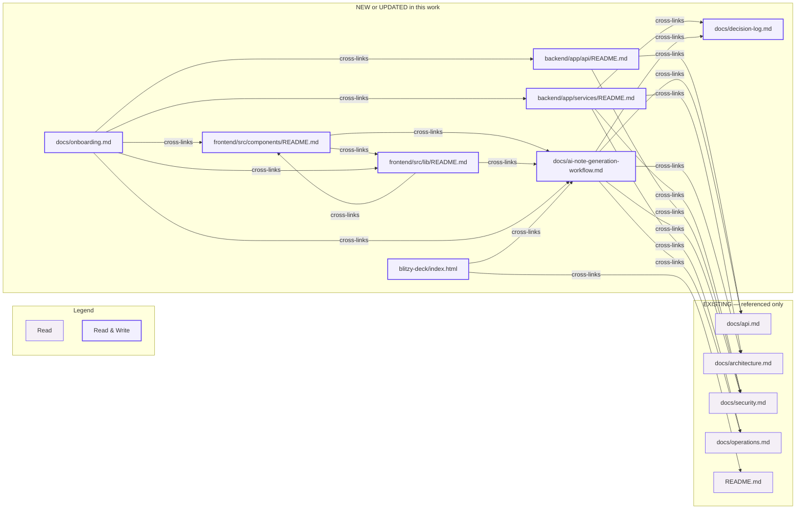

# Technical Specification

# 0. Agent Action Plan

## 0.1 Intent Clarification

### 0.1.1 Core Documentation Objective

Based on the provided requirements, the Blitzy platform understands that the documentation objective is to produce a focused, layered set of documentation for the AI-generated outreach notes workflow (Feature F-002) within the Sales-Connections application — specifically the path that transforms a contributor's free-form `relationship_context` into editable, meeting-ready outreach notes that an SDR can act on during a weekly sales pipeline review.

- Categorization: **Create new documentation (module READMEs + workflow deep-dive)** with **selective updates to three pre-existing rule-mandated artifacts** (decision log, onboarding guide, executive presentation).
- Documentation types in scope: Module README files [backend/app/services/, backend/app/api/, frontend/src/components/, frontend/src/lib/], a developer-facing deep-dive [docs/ai-note-generation-workflow.md], inline Python docstrings (PEP 257) and TypeScript JSDoc/TSDoc on four source files, additions to [docs/decision-log.md:append-only log], a "Documentation Map" cross-reference section in [docs/onboarding.md], and a new "Documentation Delivery" slide group in [blitzy-deck/index.html].

Documentation requirements restated with technical precision:

- Document the **AI orchestration service** that wraps Anthropic Claude through LangChain's `ChatAnthropic`, sanitizes user input via `app.utils.sanitization.sanitize_for_ai_prompt`, enforces a two-layer timeout watchdog (SDK timeout + `ThreadPoolExecutor` future cancellation), and emits `ai_request_duration_seconds{outcome}` Prometheus histogram telemetry. Per Tech Spec § 3.2.4, the orchestrator is the **sole import point** for the `anthropic` and `langchain_anthropic` packages [backend/app/services/ai_orchestration.py:L1-L57].
- Document the **`POST /api/notes/generate` API surface** including the request body shape (`NoteGenerationRequest` with `relationship_context: str`), the response body shape (`NoteGenerationResponse` with `ai_notes: str`, `model: str`, `generated_at: datetime`), RBAC enforcement via `@requires_role(UserRole.CONTRIBUTOR, UserRole.ADMIN)`, Pydantic validation behavior, and the error envelope contract (`ai_timeout` → 504, `ai_unavailable` → 502, `ai_not_configured` → 503, `validation_failed` → 422) [backend/app/api/notes.py:generate].
- Document the **frontend "Generate AI Notes" UX** integrated into the Add/Edit Connection form: how the button hands off to `useGenerateNotesMutation`, how the response populates the editable `ai_notes` textarea, and how soft AI failures (transient `ai_timeout`/`ai_unavailable`) **do not block** manual submission per the F-002 graceful-degradation contract [frontend/src/features/connections/AddEditConnectionForm.tsx, frontend/src/api/notes.ts:useGenerateNotesMutation].
- Document the **frontend API client path**: the shared `apiPost` fetch wrapper in `client.ts` that propagates the `X-Correlation-Id` header from `@/lib/correlationId`, includes the HttpOnly session cookie via `credentials: "include"`, and normalizes the backend error envelope into typed `ApiError` instances [frontend/src/api/client.ts:request].
- Document each module in the **prompt-specified 10-section README format**: Purpose, Business Context, Key Files, Data Flow, Public Interfaces, Error Handling, Security and Privacy Notes, Operational Notes, Examples, Related Modules.
- Include **one Mermaid sequence diagram** in `backend/app/services/README.md` per the explicit prompt directive, and include component-interaction and data-flow Mermaid diagrams in the workflow deep-dive per the Visual Architecture Documentation rule.

### 0.1.2 Surfaced Implicit Documentation Needs

Five implicit deliverables arise from the user-specified rules even though the prompt does not enumerate them explicitly:

- **Decision log entries** — the Explainability rule mandates a Markdown decision-log table for every non-trivial choice. This work has at least four non-trivial choices (file-path deviation resolution; placement of the components/lib READMEs at the prompt-specified paths even when target files live elsewhere; choice of plain Markdown over a documentation generator; choice to UPDATE rather than CREATE the three pre-existing rule-mandated artifacts). These must be appended to [docs/decision-log.md:append-only log].
- **Mermaid diagrams with descriptive titles and legends** — the Visual Architecture Documentation rule requires this for every diagram; the prompt explicitly requires one in `backend/app/services/README.md`.
- **Observability documentation** — the Observability rule requires that the deliverable explain existing logging/tracing/metrics/health-check coverage and any gaps. The deep-dive doc must cross-reference [docs/operations.md:§5 Observability] and surface the `ai_request_duration_seconds{outcome}` histogram, the `ai_latency_p95` CloudWatch alarm, the structlog `ai_call_completed` event with `ai_call_duration_ms`, the `X-Correlation-Id` end-to-end propagation, and the local-dev verification commands.
- **Onboarding refresh** — the Onboarding rule requires that existing onboarding be kept current with the new deliverable. A "Documentation Map" subsection in [docs/onboarding.md] is the minimal-impact update.
- **Executive presentation refresh** — the Executive Presentation rule requires a single self-contained reveal.js deck covering scope, business value, architectural impact, risks, and onboarding. The pre-existing [blitzy-deck/index.html] must be UPDATED with a new slide group for this documentation delivery rather than replaced.

### 0.1.3 Technical Interpretation

These documentation requirements translate to the following technical documentation strategy. Each target file is mapped to the specific creation/update action and the source citation that grounds it:

- To document the AI service: **CREATE** `backend/app/services/README.md` with the 10-section format, embed a Mermaid sequence diagram titled "F-002 AI Note Generation — Request Lifecycle" with a legend block, and cite [backend/app/services/ai_orchestration.py:L1-L57] for module purpose, [backend/app/services/ai_orchestration.py:_invoke_with_timeout] for the watchdog mechanics, and [docs/architecture.md] for the architectural fit.
- To document the notes API: **CREATE** `backend/app/api/README.md` with the 10-section format, document the `POST /api/notes/generate` request/response contract by citing [backend/app/api/notes.py:generate] and [backend/app/schemas/notes.py:NoteGenerationRequest], and cross-reference [docs/api.md] as the canonical full API contract.
- To document the frontend form action: **CREATE** `frontend/src/components/README.md` (per the literal prompt-specified path) describing the design-system primitives in `frontend/src/components/ui/` and cross-referencing the actual consumer at [frontend/src/features/connections/AddEditConnectionForm.tsx] where the "Generate AI Notes" button is wired.
- To document the frontend API client path: **CREATE** `frontend/src/lib/README.md` (per the literal prompt-specified path) documenting the cross-cutting browser utilities [frontend/src/lib/correlationId.ts, frontend/src/lib/queryClient.ts, frontend/src/lib/localStore.ts] and cross-referencing the actual API hooks at [frontend/src/api/notes.ts, frontend/src/api/client.ts].
- To produce the deep-dive document: **CREATE** `docs/ai-note-generation-workflow.md` with a complete end-to-end narrative across SPA → API → service → provider, embedding component, sequence, and failure-mode Mermaid diagrams.
- To satisfy the Explainability rule: **UPDATE** `docs/decision-log.md` with the documentation decisions enumerated in § 0.1.2.
- To satisfy the Onboarding rule: **UPDATE** `docs/onboarding.md` with a new "AI Workflow Documentation Map" subsection.
- To satisfy the Executive Presentation rule: **UPDATE** `blitzy-deck/index.html` with a new slide group covering the documentation deliverable.
- To add inline documentation: **UPDATE** four source files with targeted PEP 257 / TSDoc additions only where existing docstrings are missing or incomplete; rationale is recorded in the decision log per the Explainability rule's "Do not embed rationale in code comments" directive.

### 0.1.4 Inferred Documentation Needs (Code-Based)

Based on repository analysis, the following inferences justify the chosen documentation surface:

- Based on code analysis: The `backend/app/services/` package already contains a comprehensive module-level docstring in `ai_orchestration.py` [backend/app/services/ai_orchestration.py:L1-L57] but lacks a folder-level README that introduces new contributors to the package's role within the service-layer architecture. **A README is required.**
- Based on code analysis: The `backend/app/api/notes.py` view function has implicit semantics (RBAC, validation, error mapping, no DB writes, no audit events emitted) that a new contributor cannot infer from the file alone. **A folder README anchored on this file is required.**
- Based on structure: The "AI notes" workflow spans four code locations across two languages (Python service + Python handler + TypeScript hook + TypeScript form). **A consolidated cross-layer deep-dive is required** so a contributor can follow a single thread without jumping between files.
- Based on dependencies: The integration between [backend/app/services/ai_orchestration.py] and Anthropic via LangChain is a provider-replaceability invariant per Tech Spec § 3.2.4. **The deep-dive must surface this contract** so future maintainers do not casually introduce parallel Anthropic SDK imports elsewhere.
- Based on user journey: The "Generate AI Notes" button is an optional, non-blocking assist within a larger form. **The deep-dive must document the soft-vs-hard failure dichotomy** so a future contributor does not regress the non-blocking contract by accident.
- Based on business context: SDRs use AI notes during weekly sales pipeline review meetings as a prioritization aid. **The deep-dive and each module README must include a "Business Context" section** translating the technical workflow into speed-to-action, reduced ambiguity, and warm-intro trust preservation terms.

## 0.2 Special Instructions and Constraints

### 0.2.1 Critical Directives from the User Prompt

The following directives are captured verbatim from the user prompt and apply across all documentation deliverables:

- **Minimal Change Clause** — "Make only the changes absolutely necessary to implement comprehensive code documentation. Add README files, one workflow deep-dive document, and targeted inline comments/docstrings only. Do not modify production code logic or behavior. Do not refactor, optimize, rename, or change existing interfaces. Document existing code as-is."
- **Module-Level Documentation Scope** — "Create `backend/app/services/README.md` … Create `backend/app/api/README.md` … Create or update `frontend/src/components/README.md` … Create or update `frontend/src/lib/README.md`."
- **Additional Document** — "Create `docs/ai-note-generation-workflow.md`. This should be a developer-facing deep dive explaining the complete AI notes flow across frontend, API, service, provider, and user-facing fallback behavior."
- **Inline Comment Scope** — Limited to four files only: `backend/app/services/ai_orchestrator.py`, `backend/app/api/notes.py`, `frontend/src/components/ConnectionForm.tsx`, `frontend/src/lib/api.ts`. Excludes tests, generated files, config files, and unrelated auth/admin/feed/record-management code.
- **Inline Comment Style** — "Keep comments concise. Prefer 'why' comments over 'what' comments. Do not comment obvious code. Keep line length consistent with the existing project style. Do not introduce new lint violations."
- **Document for** — "timeout decisions, provider abstraction, prompt construction boundaries, sanitization rationale, fallback behavior when AI generation fails, why generated notes remain editable by the user."
- **Format directives** — "Use Python docstrings for public functions/classes in backend files. Use JSDoc/TSDoc-style comments for exported frontend functions/components."
- **System Boundaries** — "Document only the AI note generation workflow. Do not document the entire codebase. Do not add new features. Do not change API behavior. Do not change prompt logic, timeout values, validation rules, or provider configuration. Do not add LinkedIn API behavior, CRM integration, email sending, or analytics tracking. Treat AI notes as assistive draft text, not an authoritative sales recommendation."

### 0.2.2 USER-PROVIDED TEMPLATE — Module README Format

The user explicitly required the following 10-section README structure with the exact heading list and ordering preserved. This is the canonical template for all four module READMEs.

USER PROVIDED TEMPLATE: Module README format
- Markdown
- Use these headings:
   1. Purpose
   2. Business Context
   3. Key Files
   4. Data Flow
   5. Public Interfaces
   6. Error Handling
   7. Security and Privacy Notes
   8. Operational Notes
   9. Examples
   10. Related Modules
- Include one Mermaid sequence diagram in `backend/app/services/README.md`
- Include concise code examples only where they clarify usage
- Avoid duplicating the full tech spec; summarize only what helps developers understand this workflow

USER PROVIDED TEMPLATE: Module README required content fields
- Module purpose
- Key files and responsibilities
- Architecture fit within React SPA → Flask API → AI provider
- Data flow from relationship context input to editable AI notes output
- Dependencies and external integration boundaries
- Security considerations: no provider credentials in frontend, sanitize relationship context server-side, never log sensitive context
- Failure behavior: AI failure must not block manual form submission
- Business value: explain how AI notes help SDRs act on warm relationship context faster
- Limitations: no LinkedIn scraping, no CRM sync, no automatic outreach sending

### 0.2.3 USER-PROVIDED BUSINESS CONTEXT

The user explicitly required that documentation "must explicitly account for the following business context, which is intentionally provided outside the tech spec." This block is preserved verbatim and must surface in every module README's "Business Context" section and in the deep-dive document's opening section.

User Example: weekly sales pipeline review meeting framing
- "Sales-Connections is expected to be used during weekly sales pipeline review meetings. Sales leaders will add connection ideas before or during the meeting, and SDRs will use the generated notes as 'meeting-ready context' to decide which warm leads to pursue that week."

User Example: AI note prioritization questions
- "The AI-generated note is not just convenience text; it is a prioritization aid that helps the team quickly answer:
  - Why is this person worth contacting now?
  - How should the submitter be referenced?
  - Should the submitter make a warm intro, be mentioned softly, or stay uninvolved?
  - What first outbound angle should an SDR use?"

User Example: business-value framing for documentation
- "Documentation should therefore explain the AI notes workflow in business-value terms: speed-to-action, reduced ambiguity for SDRs, preservation of relationship trust, and faster conversion of leadership networks into outbound pipeline."

### 0.2.4 Special Constraints from User-Specified Rules

The five user-specified rules add the following non-negotiable constraints on top of the prompt:

- **Explainability rule** — Every non-trivial implementation decision must be documented with rationale in a Markdown decision-log table; rationale must NOT be embedded in code comments. The decision log is the single source of truth for "why" decisions.
- **Visual Architecture Documentation rule** — All visual documentation must use Mermaid; every diagram must have a descriptive title and legend; diagrams must be referenced by name in accompanying documentation; never describe architecture in prose when a diagram communicates it more clearly.
- **Observability rule** — The deliverable must surface existing logging/tracing/metrics/health-check coverage and explicitly document what was reused. Verification must be exercised locally.
- **Onboarding & Continued Development rule** — Onboarding documentation must be updated to reflect changes; the deliverable must include suggested next tasks discovered during the work.
- **Executive Presentation rule** — Every deliverable must include a single self-contained reveal.js executive summary covering scope, business value, architectural impact, risk mitigation, and onboarding path.

### 0.2.5 Web Search Requirements

The prompt does not require web research because every dependency (Anthropic, LangChain, Flask, React) is already at a pinned version in the repository [backend/requirements.txt, frontend/package.json] and the relevant API surfaces are stable across the documented work. The Blitzy platform will rely on the repository's pinned versions and the tech specification's referenced source files rather than fetching external documentation.

### 0.2.6 Resolved Deviations Logged for Decision Log

The Explainability rule requires that any deviation from a literal interpretation of the requirements be documented. The following deviations were identified during repository inspection and must be appended to `docs/decision-log.md`:

| Deviation | Literal Prompt | Actual Repository | Resolution |
|-----------|----------------|-------------------|------------|
| AI orchestrator file name | `backend/app/services/ai_orchestrator.py` | `backend/app/services/ai_orchestration.py` | Apply inline documentation to the actual file; the prompt-quoted name is captured here so the deviation is transparent |
| Frontend form file location | `frontend/src/components/ConnectionForm.tsx` | `frontend/src/features/connections/AddEditConnectionForm.tsx` | Apply inline documentation to the actual file; place the README at the prompt-specified `frontend/src/components/README.md` with a cross-reference to the actual file's location |
| Frontend API client file | `frontend/src/lib/api.ts` | `frontend/src/api/notes.ts` (AI-notes hook) + `frontend/src/api/client.ts` (shared transport) | Apply inline documentation to both actual files; place the README at the prompt-specified `frontend/src/lib/README.md` with a cross-reference to the actual files' locations |
| Pre-existing rule-mandated artifacts | Rules imply CREATE | `docs/decision-log.md`, `docs/onboarding.md`, `blitzy-deck/index.html`, `blitzy-deck/references/blitzy-reveal-theme.css` already exist | UPDATE existing files in place rather than create duplicates |

Each row above will become a numbered entry in the decision log.

## 0.3 Documentation Discovery and Analysis

### 0.3.1 Existing Documentation Infrastructure Assessment

Repository analysis reveals a Markdown-native documentation surface organized around a top-level `README.md` and a single canonical `docs/` knowledge base, with no documentation generator framework. Coverage status is **strong for system-wide contracts** (API, architecture, security, operations, onboarding, decision log) but **absent for module-level READMEs**. The new module READMEs are net-new additions; the deep-dive workflow document is also net-new.

- Documentation framework: **Plain GitHub-Flavored Markdown** — no MkDocs, Sphinx, Docusaurus, or TypeDoc dependency in [backend/requirements.txt, frontend/package.json].
- Documentation generator configuration: **None.** README files and the `docs/` directory are rendered directly by GitHub and IDE Markdown previewers.
- API documentation: **Hand-authored Markdown** in [docs/api.md] — the single source of truth for the REST API per its own header comment. No autogenerated OpenAPI is exported.
- Diagram tooling: **Mermaid embedded directly in Markdown** via fenced code blocks. Standalone `.mmd` files live in [docs/diagrams/] (e.g., `system-context.mmd`, `request-lifecycle.mmd`, `erd.mmd`, three state-machine diagrams), each beginning with a `%% Diagram: <title>` comment line that establishes the project's diagram-title convention.
- Documentation hosting/deployment: **In-repository only.** All documentation renders on GitHub and in developer IDEs; there is no static site build, no Netlify/Vercel preview, no docs CI job beyond Markdown rendering by GitHub.

Existing top-level documentation surface inventory:

| File | Purpose | Status |
|------|---------|--------|
| [README.md] | Project entrypoint, quick start, prerequisites, verify-it-works steps | UNCHANGED (already references F-002 in passing at L41) |
| [docs/api.md] | REST API source of truth: endpoints, request/response schemas, RBAC, error envelope | REFERENCE — cross-link from `backend/app/api/README.md` |
| [docs/architecture.md] | System-wide architecture, principles, runtime flows | REFERENCE — cross-link from `backend/app/services/README.md` and deep-dive |
| [docs/security.md] | Threat model, auth flows, authorization, secrets, validation | REFERENCE — cross-link from service/api READMEs for sanitization and credential handling |
| [docs/operations.md] | Production runbook, observability, incident response | REFERENCE — cross-link from deep-dive for the `ai_latency_p95` alarm runbook |
| [docs/onboarding.md] | Contributor handbook (setup, domain context, pitfalls, extension) | UPDATE — add "AI Workflow Documentation Map" subsection |
| [docs/decision-log.md] | Append-only rationale log | UPDATE — append entries for this work's decisions |
| [docs/diagrams/*.mmd] | Standalone Mermaid diagrams referenced from prose docs | REFERENCE — pattern for new diagrams (title comment + legend) |
| [blitzy-deck/index.html] | Reveal.js executive deck | UPDATE — add documentation-delivery slide group |
| [blitzy-deck/references/blitzy-reveal-theme.css] | Canonical Blitzy reveal theme | UNCHANGED — theme is already complete |

Existing module READMEs: **None** — `find . -name "README.md"` returns only the root `README.md`. All four prompt-specified module READMEs are CREATE actions.

### 0.3.2 Repository Code Analysis for Documentation

The Blitzy platform performed deep inspection on the four code locations that constitute the AI note generation workflow. Findings are summarized below; each row is the actual file path verified in the repository:

| Code Location | Purpose | Existing Inline Docs | Documentation Need |
|---------------|---------|----------------------|---------------------|
| [backend/app/services/ai_orchestration.py] | Sole AI orchestration boundary; wraps `ChatAnthropic`; sanitization, two-layer watchdog, telemetry | Comprehensive module docstring [L1-L57]; per-function docstrings partially present | Targeted fill-in only — preserve existing docstrings; cross-reference from new services README |
| [backend/app/api/notes.py] | Defines `notes_bp` and `POST /api/notes/generate`; Pydantic validation; RBAC; structured logging; delegates to orchestrator | Module-level prose comments present; `generate()` view has structured comments | Targeted fill-in only — preserve existing comments; ensure PEP 257 docstring exists on `generate()`; cross-reference from new api README |
| [frontend/src/features/connections/AddEditConnectionForm.tsx] | Add/Edit Connection route component; wires the "Generate AI Notes" button via `useGenerateNotesMutation`; handles soft vs hard AI failures | JSX is largely self-documenting; helper functions (`zodIssuesToFieldErrors`, `apiErrorToFieldErrors`, `useDebouncedValue`, `EMPTY_STATE`) carry no TSDoc | TSDoc on the exported component and the local helpers; "why" comments on the AI button handler explaining the non-blocking contract |
| [frontend/src/api/notes.ts] | `useGenerateNotesMutation`, `isSoftAiFailure`, `GenerateNotesRequest`, `GenerateNotesResponse`, `AiNoteErrorCode` | Inline prose comments at file top explaining demo-mode behavior; types are self-documenting | TSDoc on the exported hook and helper; preserve existing prose comments |
| [frontend/src/api/client.ts] | Shared `fetch` wrapper that backs `apiPost` used by `useGenerateNotesMutation`; `X-Correlation-Id` propagation; HttpOnly cookie inclusion; 401 redirect | Module-level prose header documents the policy comprehensively | Minimal TSDoc additions only on `apiPost`, `ApiError`, and `ApiRequestOptions` because these are the symbols the AI notes flow touches |

Key directories examined for the documentation surface (limited strictly to the AI-notes workflow per the prompt's "Document only the AI note generation workflow" boundary):

- [backend/app/services/] — service-layer package; AI orchestrator is the focus, sibling services are mentioned by name only in the README's "Key Files" section
- [backend/app/api/] — REST blueprints; `notes.py` is the focus, sibling blueprints (`auth.py`, `connections.py`, `admin.py`, `tags.py`, `health.py`) are mentioned by name only
- [backend/app/schemas/] — `notes.py` for `NoteGenerationRequest`/`NoteGenerationResponse` schemas (referenced, not modified)
- [backend/app/utils/] — `sanitization.py` for `sanitize_for_ai_prompt` (referenced, not modified)
- [frontend/src/features/connections/] — `AddEditConnectionForm.tsx` is the focus
- [frontend/src/api/] — `notes.ts` and `client.ts` are the focus
- [frontend/src/lib/] — `correlationId.ts`, `queryClient.ts`, `localStore.ts` are described in the lib README; only correlationId.ts is directly relevant to the AI workflow

Related existing documentation that informs the new documentation:

- [docs/api.md] — already documents `POST /api/notes/generate` at the contract level; the new `backend/app/api/README.md` summarizes locally and cross-links there to avoid duplication
- [docs/architecture.md] — already describes the F-002 architecture; the new services README and deep-dive cite this and add depth on the two-layer watchdog mechanics
- [docs/security.md] — documents the sanitization invariant and credential handling; the security sections of each new README cite this
- [docs/operations.md] — documents the `ai_latency_p95` alarm and the AI-call runbook; the operational sections cite this

### 0.3.3 Web Search Research

No web search was conducted. Justification:

- All in-scope dependency versions are already pinned and discoverable from [backend/requirements.txt] and [frontend/package.json]. Recommended versions ("latest stable") are unnecessary because the deliverable adds no new dependencies.
- The tech specification already documents the F-002 architecture, the observability stack, and the failure-mode catalog at sufficient depth; the new documentation summarizes and consolidates rather than introduces new vocabulary.
- The 10-section README format is provided verbatim by the user prompt; no external best-practice survey is required.
- Mermaid diagram conventions are already established in [docs/diagrams/] with the `%% Diagram: <title>` first-line title pattern; the deliverable follows that pattern.

## 0.4 Documentation Scope Analysis

### 0.4.1 Code-to-Documentation Mapping

The four code locations in the AI note generation workflow map to specific documentation deliverables. Each mapping below preserves the literal prompt-specified README path even where it does not co-locate with the actual implementation file; the table flags each such deviation explicitly.

**Module: `backend/app/services/`** (focus: AI orchestration)

- Sole AI public API: `generate_outreach_notes(payload: NoteGenerationRequest, model: Optional[str] = None) -> NoteGenerationResponse` [backend/app/services/ai_orchestration.py:generate_outreach_notes]
- Sole AI exception: `AIServiceUnavailableError` (extends `AppError`; mutable `status_code` and `error_code`) [backend/app/services/ai_orchestration.py:AIServiceUnavailableError]
- Provider invocation isolation: `_call_chat_anthropic` locally imports `ChatAnthropic`, `HumanMessage`, `SystemMessage` to keep the heavy SDK out of consumer import graphs [backend/app/services/ai_orchestration.py:_call_chat_anthropic]
- Watchdog primitive: `_invoke_with_timeout` runs the SDK call in a bounded `ThreadPoolExecutor` and applies a watchdog budget of `timeout_s + 0.5` seconds [backend/app/services/ai_orchestration.py:_invoke_with_timeout]
- Current documentation: Comprehensive module-level docstring at [backend/app/services/ai_orchestration.py:L1-L57]; per-function docstrings partially present
- Documentation needed: A folder-level `backend/app/services/README.md` (CREATE) with the 10-section format and a Mermaid sequence diagram of the AI request lifecycle; targeted PEP 257 docstring additions on any public symbol that currently lacks one

**Module: `backend/app/api/`** (focus: AI notes endpoint)

- Blueprint: `notes_bp = Blueprint("notes", __name__)` mounted at `/api/notes/generate` [backend/app/api/notes.py:notes_bp]
- View function: `generate()` — RBAC-gated (`@requires_role(UserRole.CONTRIBUTOR, UserRole.ADMIN)`), parses JSON with `request.get_json(silent=True)`, validates with `NoteGenerationRequest`, logs `ai_note_generation_requested` event with `user_id`/`org_id`/context length (never raw context), delegates to `generate_outreach_notes`, normalizes the result to `NoteGenerationResponse`, returns `jsonify(response.model_dump(mode="json")), 200` [backend/app/api/notes.py:generate]
- Module-level prose: Already in place — provider failures propagate as `AIServiceUnavailableError` to the centralized error handler
- Current documentation: File header comments documenting the validation pipeline and RBAC contract; no folder README
- Documentation needed: A folder-level `backend/app/api/README.md` (CREATE) with the 10-section format covering all sibling blueprints by name with the AI notes endpoint as the centerpiece; targeted PEP 257 docstring on `generate()` if not already present

**Module: `frontend/src/components/`** (literal prompt path)

- Actual contents: Only the `frontend/src/components/ui/` design-system primitives subfolder (Button, Input, Textarea, Select, Modal, Table, Badge, Toast)
- AI notes integration point: The `AddEditConnectionForm` consumer at [frontend/src/features/connections/AddEditConnectionForm.tsx] uses Button, Input, Textarea, and Toast from `components/ui` and composes the "Generate AI Notes" button using `<Button>` + `<Textarea>`
- Current documentation: Components are TypeScript-typed with strict props; no folder README
- Documentation needed: A folder-level `frontend/src/components/README.md` (CREATE) per the literal prompt directive — documents the design-system surface, names the AI-button composition pattern, and cross-references [frontend/src/features/connections/AddEditConnectionForm.tsx] as the actual consumer

**Module: `frontend/src/lib/`** (literal prompt path)

- Actual contents: `correlationId.ts`, `localStore.ts`, `queryClient.ts`
- AI notes integration point: `correlationId.ts` produces the `X-Correlation-Id` header attached by `frontend/src/api/client.ts` on every AI notes call; `queryClient.ts` is the singleton that hosts the TanStack Query cache used by `useGenerateNotesMutation`
- Actual AI notes API client location: [frontend/src/api/notes.ts] (`useGenerateNotesMutation`) and [frontend/src/api/client.ts] (`apiPost`, `ApiError`)
- Current documentation: TypeScript types and prose header comments inside each file; no folder README
- Documentation needed: A folder-level `frontend/src/lib/README.md` (CREATE) per the literal prompt directive — documents the cross-cutting utilities and cross-references the actual API client files in `frontend/src/api/`

Configuration options touched by the AI workflow (referenced only — no documentation updates required since [backend/.env.example] already enumerates them with comments):

| Configuration Key | Source | Documentation Status |
|-------------------|--------|----------------------|
| `ANTHROPIC_API_KEY` | [backend/.env.example] | Documented — referenced in services README under Security and Privacy Notes |
| `ANTHROPIC_MODEL` (pinned `claude-sonnet-4-5`) | [backend/.env.example, infra/terraform/variables.tf:339] | Documented — referenced in services README under Operational Notes |
| `ANTHROPIC_MAX_TOKENS` (default 512) | [backend/app/services/ai_orchestration.py] | Documented — referenced in services README under Operational Notes |
| `AI_REQUEST_TIMEOUT_SECONDS` (default 5 s) | [backend/app/services/ai_orchestration.py] | Documented — referenced in services README under Operational Notes |
| `AI_PROMPT_CONTEXT_MAX_CHARS` (default 4000) | [backend/app/services/ai_orchestration.py] | Documented — referenced in services README under Security and Privacy Notes |

Features requiring user-facing notes (deep-dive deliverable):

- Feature: **AI Note Generation (F-002)**
  - Current coverage: [docs/api.md] documents the endpoint contract; [docs/architecture.md] documents the architectural fit; [docs/security.md] documents the sanitization invariant; [docs/operations.md] documents the alarm runbook; the inline module docstring documents the orchestration layer
  - Gaps: No single document narrates the workflow end-to-end across SPA → API → service → provider. No document explains the soft-vs-hard failure dichotomy in one place. No document explains why the AI notes remain editable and why submission proceeds when AI fails.
  - Resolution: [docs/ai-note-generation-workflow.md] (CREATE) consolidates the narrative across all four layers and explicitly documents the non-blocking contract.

### 0.4.2 Documentation Gap Analysis

Given the requirements and repository analysis, documentation gaps include the following. The "Resolution" column maps each gap to a specific deliverable in § 0.6.

| Gap | Affected Surface | Resolution |
|-----|------------------|------------|
| No module-level README in `backend/app/services/` | Service-layer onboarding for new contributors | CREATE `backend/app/services/README.md` |
| No module-level README in `backend/app/api/` | API-layer onboarding for new contributors | CREATE `backend/app/api/README.md` |
| No module-level README in `frontend/src/components/` | Design-system primitives discovery | CREATE `frontend/src/components/README.md` |
| No module-level README in `frontend/src/lib/` | Frontend utility surface discovery | CREATE `frontend/src/lib/README.md` |
| No single document tells the end-to-end AI notes story | F-002 workflow comprehension | CREATE `docs/ai-note-generation-workflow.md` |
| Missing PEP 257 docstrings on some public symbols in the four target source files | API discovery via IDE tooling | UPDATE the four source files with targeted docstring additions only |
| Decision rationales for this work are not yet captured | Future contributor "why" questions | UPDATE `docs/decision-log.md` with this work's entries |
| Onboarding does not yet point new contributors to the new READMEs or the deep-dive | Onboarding completeness | UPDATE `docs/onboarding.md` with a Documentation Map subsection |
| Executive deck does not yet describe the documentation deliverable | Leadership communication of progress | UPDATE `blitzy-deck/index.html` with a documentation-delivery slide group |
| Existing AI workflow documentation does not centralize observability hooks (logs, metrics, traces, alarms) | Operability of F-002 | Cross-reference [docs/operations.md:§5 Observability] from the deep-dive's Observability section; no new observability tooling added |

**Undocumented public APIs** within scope: All four are now flagged for inline-docstring additions only — no new public surface is being added.

**Missing user guides**: No end-user (sales-team) user guide is in scope — the prompt limits delivery to developer-facing documentation. SDR-facing collateral is explicitly OUT OF SCOPE.

**Incomplete architecture documentation**: The deep-dive document fills the workflow-narrative gap; broader architectural depth remains owned by [docs/architecture.md] which is unchanged.

**Outdated documentation**: None identified within the AI-notes scope.

## 0.5 Documentation Implementation Design

### 0.5.1 Documentation Structure Planning

The documentation hierarchy after this work places module READMEs alongside the source code they describe and consolidates the cross-layer narrative in `docs/`. Existing rule-mandated artifacts are updated in place.

```
/
├── README.md                                       [UNCHANGED — root entrypoint]
├── docs/
│   ├── api.md                                      [REFERENCE]
│   ├── architecture.md                             [REFERENCE]
│   ├── decision-log.md                             [UPDATE — append entries]
│   ├── operations.md                               [REFERENCE]
│   ├── security.md                                 [REFERENCE]
│   ├── onboarding.md                               [UPDATE — add Documentation Map subsection]
│   ├── ai-note-generation-workflow.md              [CREATE — deep-dive across all four layers]
│   └── diagrams/                                   [UNCHANGED structure]
├── backend/app/services/
│   ├── README.md                                   [CREATE — 10-section with Mermaid sequence diagram]
│   └── ai_orchestration.py                         [UPDATE — targeted PEP 257 docstrings; no logic changes]
├── backend/app/api/
│   ├── README.md                                   [CREATE — 10-section]
│   └── notes.py                                    [UPDATE — targeted PEP 257 docstring; no logic changes]
├── frontend/src/components/
│   └── README.md                                   [CREATE — 10-section; cross-references features/connections/AddEditConnectionForm.tsx]
├── frontend/src/lib/
│   └── README.md                                   [CREATE — 10-section; cross-references src/api/notes.ts and client.ts]
├── frontend/src/features/connections/
│   └── AddEditConnectionForm.tsx                   [UPDATE — targeted TSDoc; no logic changes]
├── frontend/src/api/
│   ├── notes.ts                                    [UPDATE — targeted TSDoc; no logic changes]
│   └── client.ts                                   [UPDATE — targeted TSDoc on AI-relevant helpers only]
└── blitzy-deck/
    ├── index.html                                  [UPDATE — add documentation-delivery slide group]
    └── references/
        └── blitzy-reveal-theme.css                 [UNCHANGED — canonical theme already in place]
```

### 0.5.2 Content Generation Strategy

**Information extraction approach.** All technical content traces back to verified repository state. For each documented behavior, the source citation pattern is `[<path>:<locator>]` where the locator is a line range, a section heading, or a key path.

- "Extract API signatures from [backend/app/services/ai_orchestration.py:generate_outreach_notes] and [backend/app/api/notes.py:generate]"
- "Generate examples by analyzing the existing `useGenerateNotesMutation` call patterns inside [frontend/src/features/connections/AddEditConnectionForm.tsx]"
- "Create diagrams by mapping the verified call chain [frontend/src/features/connections/AddEditConnectionForm.tsx] → [frontend/src/api/notes.ts:useGenerateNotesMutation] → [frontend/src/api/client.ts:apiPost] → [backend/app/api/notes.py:generate] → [backend/app/services/ai_orchestration.py:generate_outreach_notes] → ChatAnthropic"
- "Document configuration knobs by reading [backend/.env.example] and [backend/app/services/ai_orchestration.py] constant blocks"
- "Document observability hooks by reading [backend/app/observability/metrics.py] and Tech Spec § 6.5"

**Template application.** The user-provided 10-section README template (§ 0.2.2) is applied to every module README. Section ordering and heading text are preserved exactly. The "Examples" section is kept to at most two short snippets per README per the prompt's "concise code examples only where they clarify usage" directive.

**Documentation standards.**

- Markdown formatting: `#` (file title), `##` (section), `###` (subsection); no deeper nesting unless absolutely required
- Code blocks: fenced with explicit language (` ```python `, ` ```typescript `, ` ```bash `); never use triple-backticks inside other fenced blocks (the markdown rendering tool flattens such constructs)
- Mermaid diagrams: ` ```mermaid ` fenced; first content line is a `%%{init: ...}%%` directive when needed; descriptive title is the `##` heading immediately above the block; legend appears either as a `subgraph` named "Legend" inside the diagram or as a Markdown bullet list immediately below
- Citations: inline `[<path>:<locator>]` immediately after each claim about the existing system
- Tables: GitHub-flavored Markdown for parameter/return-value tables, file inventories, and feature matrices
- Terminology: matches the canonical terms used across [docs/api.md], [docs/architecture.md], and the tech specification (e.g., F-002, soft AI failure, two-layer watchdog, provider replaceability)
- Bullets: only dashes `-`; never numbered

### 0.5.3 Diagram and Visual Strategy

Mermaid is the only diagramming tool used (per Visual Architecture Documentation rule). Each diagram has a descriptive title (as the Markdown heading directly above) and a legend (as a `subgraph "Legend"` inside the diagram or a bullet list immediately below). Each diagram is referenced by name from the surrounding prose.

| Diagram (Title) | Type | Location | Purpose |
|------------------|------|----------|---------|
| Diagram D1 — F-002 AI Note Generation: Component View | flowchart LR | `docs/ai-note-generation-workflow.md` § 2 | Shows the four layers (SPA, API, service, provider) and the external integration boundary |
| Diagram D2 — F-002 Request Lifecycle Sequence | sequenceDiagram | `docs/ai-note-generation-workflow.md` § 5 AND `backend/app/services/README.md` § 4 Data Flow | The prompt-mandated sequence diagram — shows user click through ChatAnthropic response and back |
| Diagram D3 — F-002 Failure Mode Map | flowchart TB | `docs/ai-note-generation-workflow.md` § 7 | Maps each AIServiceUnavailableError variant to its HTTP status, UI behavior, and operator action |
| Diagram D4 — F-002 Observability Surfaces | flowchart LR | `docs/ai-note-generation-workflow.md` § 8 | Cross-references the structlog event, Prometheus histogram, OpenTelemetry span, and CloudWatch alarm for the AI call |
| Diagram D5 — Form Integration Component View | flowchart LR | `frontend/src/components/README.md` § 4 Data Flow | Shows how design-system primitives compose into the "Generate AI Notes" affordance |
| Diagram D6 — Correlation ID Lifecycle | sequenceDiagram | `frontend/src/lib/README.md` § 4 Data Flow | Shows correlationId → client.ts → backend middleware → structlog binding |
| Diagram D7 — API Blueprint Composition | flowchart TB | `backend/app/api/README.md` § 4 Data Flow | Shows blueprint registration order and the request path through middleware to the notes handler |

**Screenshot/image requirements**: None. The documentation stays in pure Markdown + Mermaid. No image assets are created or referenced.

**Architecture diagram specifications**: All diagrams use the GitHub-default Mermaid theme to render correctly in the GitHub UI and the existing Blitzy reveal deck (which uses the `primaryColor: '#F2F0FE'`, `primaryBorderColor: '#5B39F3'` theme variables already configured in [blitzy-deck/index.html]). Diagrams in module READMEs are intentionally theme-agnostic (no `%%{init: ...}%%` block) so they render identically in IDEs and on GitHub.

### 0.5.4 Inline Documentation Strategy

The user prompt restricts inline documentation to four files and prescribes the style (PEP 257 for backend, JSDoc/TSDoc for frontend). The Explainability rule mandates that decision rationale live in the decision log, not in code comments. The strategy below honors both:

- **`backend/app/services/ai_orchestration.py`** — preserve the existing comprehensive module docstring [L1-L57]. Add or complete PEP 257 docstrings on any public-name symbol that currently lacks one (`generate_outreach_notes`, `AIServiceUnavailableError`, and any helper that is part of the public API). Do NOT add comments explaining "what the code does" — the existing docstring is already comprehensive. Add brief "why" comments only on the four behaviors the prompt explicitly enumerates: timeout decision, provider abstraction, prompt construction boundary, sanitization rationale.
- **`backend/app/api/notes.py`** — preserve existing comments. Add a PEP 257 docstring on the `generate()` view if absent, summarizing the RBAC contract, validation flow, and error propagation in three lines. Add a brief "why" comment explaining why `g.session.user_id`/`org_id` is logged but raw `relationship_context` is not (privacy).
- **`frontend/src/features/connections/AddEditConnectionForm.tsx`** — add TSDoc on the exported `AddEditConnectionForm` component, on the exported `AddEditConnectionFormProps` interface, and on the local helpers (`zodIssuesToFieldErrors`, `apiErrorToFieldErrors`, `useDebouncedValue`, `EMPTY_STATE`). Add a brief "why" comment on the AI button handler explaining the non-blocking contract (soft failures continue, hard failures toast).
- **`frontend/src/api/notes.ts`** — add TSDoc on `useGenerateNotesMutation`, `isSoftAiFailure`, `GenerateNotesRequest`, `GenerateNotesResponse`, and the `AiNoteErrorCode` union. Preserve existing prose comments.
- **`frontend/src/api/client.ts`** — limited additions only. Add TSDoc on `apiPost` (the AI-notes path), `ApiError`, and `ApiRequestOptions`. Preserve the module-level prose header.

**Constraints**:

- No new lint violations — the deliverable runs `npx eslint` (frontend) and `ruff check` (backend) before completion to confirm
- Line length matches project style — Python ≤ 100 cols (per `pyproject.toml`), TypeScript per Prettier config
- No `# noqa`, no `// eslint-disable`, no `# pragma: no cover` introduced
- All rationale for non-trivial decisions lives in [docs/decision-log.md], not in code comments (Explainability rule)

### 0.5.5 Cross-Documentation Dependencies

Documentation files reference each other to form a coherent knowledge graph. The reference structure is:



Diagram CD1 — Documentation Cross-Reference Graph.

- Shared content/includes: None. Each Markdown file is self-contained.
- Navigation links between documents: Each new README's "Related Modules" section enumerates outgoing links; each `docs/` file's references section is unmodified.
- Table of contents updates required: The root [README.md] is intentionally unchanged because its existing F-002 reference at line 41 already orients new readers; new contributors are routed to the new READMEs via the updated [docs/onboarding.md] Documentation Map.
- Index/glossary updates: None — no glossary file exists.

## 0.6 Documentation File Transformation Mapping

### 0.6.1 File-by-File Documentation Plan

The transformation table below lists every documentation deliverable with the target file first. Modes are: **CREATE** (new file), **UPDATE** (modify existing file), **DELETE** (remove obsolete file — none in this deliverable), **REFERENCE** (read-only input). Nothing is left as "pending" or "to be discovered."

| Target Documentation File | Transformation | Source Code/Docs | Content/Changes |
|---------------------------|----------------|------------------|-----------------|
| `backend/app/services/README.md` | CREATE | `backend/app/services/ai_orchestration.py`, `backend/app/services/__init__.py` | Full 10-section README focused on the AI orchestrator with embedded Mermaid sequence diagram (Diagram D2); sibling services (`admin.py`, `audit.py`, `auth.py`, `connections.py`, `duplicate_detection.py`) named in Key Files only |
| `backend/app/api/README.md` | CREATE | `backend/app/api/notes.py`, `backend/app/api/__init__.py` | Full 10-section README focused on `POST /api/notes/generate`; sibling blueprints (`auth.py`, `connections.py`, `tags.py`, `admin.py`, `health.py`) named in Key Files only; Mermaid Diagram D7 in Data Flow |
| `frontend/src/components/README.md` | CREATE | `frontend/src/features/connections/AddEditConnectionForm.tsx`, `frontend/src/components/ui/` | Full 10-section README documenting the design-system primitives and cross-referencing AddEditConnectionForm as the AI-notes consumer; Mermaid Diagram D5 in Data Flow |
| `frontend/src/lib/README.md` | CREATE | `frontend/src/lib/correlationId.ts`, `frontend/src/lib/queryClient.ts`, `frontend/src/lib/localStore.ts` | Full 10-section README documenting cross-cutting browser utilities and cross-referencing `frontend/src/api/notes.ts` + `client.ts` as the actual AI-notes API client surface; Mermaid Diagram D6 in Data Flow |
| `docs/ai-note-generation-workflow.md` | CREATE | All four target source files and the schemas, utils, and middleware they touch | Developer-facing deep-dive across SPA → API → service → provider with four Mermaid diagrams (D1, D2, D3, D4), failure-mode catalog, observability cross-references, security cross-references, business-value framing, and a "Next Steps" subsection per Onboarding rule |
| `backend/app/services/ai_orchestration.py` | UPDATE | `backend/app/services/ai_orchestration.py` | Targeted PEP 257 docstrings on public symbols (`generate_outreach_notes`, `AIServiceUnavailableError`) where missing; brief "why" comments on the four prompt-enumerated behaviors (timeout, provider abstraction, prompt construction boundary, sanitization rationale). NO logic changes |
| `backend/app/api/notes.py` | UPDATE | `backend/app/api/notes.py` | PEP 257 docstring on `generate()` summarizing RBAC contract, validation flow, error propagation; "why" comment explaining the privacy-preserving log fields (user_id/org_id only, never raw context). NO logic changes |
| `frontend/src/features/connections/AddEditConnectionForm.tsx` | UPDATE | `frontend/src/features/connections/AddEditConnectionForm.tsx` | TSDoc on the exported component, `AddEditConnectionFormProps`, and local helpers (`zodIssuesToFieldErrors`, `apiErrorToFieldErrors`, `useDebouncedValue`, `EMPTY_STATE`); "why" comment on the AI button handler explaining the non-blocking soft-failure contract and why `ai_notes` remains editable. NO logic changes |
| `frontend/src/api/notes.ts` | UPDATE | `frontend/src/api/notes.ts` | TSDoc on `useGenerateNotesMutation`, `isSoftAiFailure`, `GenerateNotesRequest`, `GenerateNotesResponse`, `AiNoteErrorCode`. NO logic changes |
| `frontend/src/api/client.ts` | UPDATE | `frontend/src/api/client.ts` | Targeted TSDoc on `apiPost`, `ApiError`, `ApiRequestOptions` (the symbols the AI notes flow touches). NO logic changes |
| `docs/decision-log.md` | UPDATE | `docs/decision-log.md` (append-only) | Append entries for: (a) file-path deviation resolution (3 entries); (b) UPDATE-vs-CREATE of pre-existing rule-mandated artifacts; (c) plain-Markdown choice over a documentation generator; (d) placement of frontend/src/components README and frontend/src/lib README at prompt-specified paths despite target files living elsewhere |
| `docs/onboarding.md` | UPDATE | `docs/onboarding.md` | Insert a new "AI Workflow Documentation Map" subsection cross-linking the new READMEs and the deep-dive. Include a "Suggested next tasks" enumerating out-of-scope improvements discovered during this work (per Onboarding rule) |
| `blitzy-deck/index.html` | UPDATE | `blitzy-deck/index.html` | Add a 4-to-6-slide documentation-delivery group within the existing deck (Title slide kept; new slides describe deliverable scope, business value, before/after coverage, key risks, onboarding path enhancement). Use existing theme classes (`slide-divider`, `slide-content`, `kpi-card`, `kpi-grid`) and embed Mermaid Diagram D1 reused. Total deck size remains in the 12-18 slide range required by the Executive Presentation rule |
| `README.md` | REFERENCE | (root) | Source-of-truth for quick start; deep-dive cross-links here but does not modify it. The existing F-002 mention at L41 is intentionally preserved |
| `docs/api.md` | REFERENCE | (existing) | Canonical REST API contract; new `backend/app/api/README.md` summarizes and cross-links rather than duplicates |
| `docs/architecture.md` | REFERENCE | (existing) | Canonical architecture; new `backend/app/services/README.md` summarizes and cross-links rather than duplicates |
| `docs/security.md` | REFERENCE | (existing) | Canonical security; sanitization and credential-handling sections are cited rather than duplicated |
| `docs/operations.md` | REFERENCE | (existing) | Canonical runbook; `ai_latency_p95` alarm runbook is cited from the deep-dive |
| `blitzy-deck/references/blitzy-reveal-theme.css` | REFERENCE | (existing) | Canonical Blitzy theme; the deck UPDATE relies on this file but does not modify it |
| `docs/diagrams/*.mmd` | REFERENCE | (existing) | Pattern for the new Mermaid diagrams (title-comment + legend convention) |

### 0.6.2 New Documentation Files Detail

For each new documentation file, the following is the per-file specification.

**File: `backend/app/services/README.md`**
- Type: Module README (10-section format)
- Source Code: `backend/app/services/ai_orchestration.py` (focus); `backend/app/services/__init__.py` for the package facade
- Sections (in order):
  - Purpose — service-layer overview; the AI orchestrator's role as the sole AI integration boundary
  - Business Context — sales pipeline review framing; SDR prioritization questions verbatim
  - Key Files — `ai_orchestration.py` (focus), with `audit.py`, `auth.py`, `admin.py`, `connections.py`, `duplicate_detection.py`, `__init__.py` named with one-line summaries
  - Data Flow — Mermaid Diagram D2 (sequence diagram, prompt-mandated)
  - Public Interfaces — `generate_outreach_notes(payload, model=None)` signature and contract; `AIServiceUnavailableError` variants table
  - Error Handling — `ai_timeout` (504), `ai_unavailable` (502), `ai_not_configured` (503); graceful degradation contract
  - Security and Privacy Notes — `ANTHROPIC_API_KEY` resolution chain; `sanitize_for_ai_prompt` invariant; never-log raw context
  - Operational Notes — Prometheus histogram `ai_request_duration_seconds{outcome}`; structlog event `ai_call_completed` with `ai_call_duration_ms`; CloudWatch alarm `ai_latency_p95` (cross-link to [docs/operations.md])
  - Examples — short Python call pattern (≤ 3 lines): `from app.services import generate_outreach_notes; resp = generate_outreach_notes(payload)`
  - Related Modules — `backend/app/api/`, `backend/app/schemas/`, `backend/app/utils/sanitization.py`, [docs/architecture.md], [docs/decision-log.md], [docs/ai-note-generation-workflow.md]
- Diagrams: Diagram D2 (sequence) — Mermaid; descriptive title above the block; legend block inside the diagram
- Key citations: `[backend/app/services/ai_orchestration.py:L1-L57]`, `[backend/app/services/__init__.py:__all__]`, `[backend/.env.example:ANTHROPIC_API_KEY]`, `[backend/app/utils/sanitization.py:sanitize_for_ai_prompt]`

**File: `backend/app/api/README.md`**
- Type: Module README (10-section format)
- Source Code: `backend/app/api/notes.py` (focus); `backend/app/api/__init__.py` for the blueprint composition
- Sections (in order):
  - Purpose — API blueprint package; HTTP surface for the SPA; the notes endpoint as the AI integration point
  - Business Context — verbatim sales pipeline framing
  - Key Files — `notes.py` (focus), with `auth.py`, `connections.py`, `tags.py`, `admin.py`, `health.py`, `__init__.py` named with one-line summaries
  - Data Flow — Mermaid Diagram D7 (flowchart of blueprint registration and middleware chain to the notes handler)
  - Public Interfaces — `POST /api/notes/generate` request/response schemas; RBAC (`@requires_role(UserRole.CONTRIBUTOR, UserRole.ADMIN)`); curl example (≤ 3 lines)
  - Error Handling — uniform error envelope `{error: {code, message, correlation_id, fields}}`; AI failures propagate without local handling
  - Security and Privacy Notes — HttpOnly session cookie; correlation ID logging without raw context
  - Operational Notes — structured log event `ai_note_generation_requested`; metrics linkage
  - Examples — short curl invocation pattern
  - Related Modules — `backend/app/services/`, `backend/app/schemas/notes.py`, `backend/app/middleware/`, [docs/api.md]
- Diagrams: Diagram D7 (flowchart) — Mermaid; descriptive title above; legend inside
- Key citations: `[backend/app/api/notes.py:generate]`, `[backend/app/api/__init__.py:_PREFIX]`, `[backend/app/schemas/notes.py:NoteGenerationRequest]`, `[docs/api.md:§Notes]`

**File: `frontend/src/components/README.md`**
- Type: Module README (10-section format)
- Source Code: `frontend/src/components/ui/` (primitives); cross-references `frontend/src/features/connections/AddEditConnectionForm.tsx` (actual consumer)
- Sections (in order):
  - Purpose — design-system primitives surface; consumer cross-reference
  - Business Context — verbatim sales pipeline framing
  - Key Files — `ui/button`, `ui/input`, `ui/textarea`, `ui/select`, `ui/modal`, `ui/table`, `ui/badge`, `ui/toast` (each one-line); explicit pointer to [frontend/src/features/connections/AddEditConnectionForm.tsx] as the AI-notes button host
  - Data Flow — Mermaid Diagram D5 (component composition flowchart)
  - Public Interfaces — `<Button>`, `<Input>`, `<Textarea>`, `<Toast>` prop summaries
  - Error Handling — `<Input>`/`<Textarea>` `error` prop rendering pattern; `<Button>` `loading` state pattern
  - Security and Privacy Notes — no provider credentials in frontend; HttpOnly cookie-only auth
  - Operational Notes — TanStack Query optimistic update pattern (StatusChip example); correlation ID via `X-Correlation-Id` header injected by `apiPost`
  - Examples — short JSX snippet (≤ 3 lines) showing the AI button composition
  - Related Modules — `frontend/src/features/connections/`, `frontend/src/api/notes.ts`, `frontend/src/lib/`, [docs/ai-note-generation-workflow.md]
- Diagrams: Diagram D5 (flowchart) — Mermaid
- Key citations: `[frontend/src/features/connections/AddEditConnectionForm.tsx]`, `[frontend/src/components/ui/button.tsx]`, `[frontend/src/api/notes.ts:useGenerateNotesMutation]`

**File: `frontend/src/lib/README.md`**
- Type: Module README (10-section format)
- Source Code: `frontend/src/lib/correlationId.ts`, `frontend/src/lib/queryClient.ts`, `frontend/src/lib/localStore.ts`; cross-references `frontend/src/api/notes.ts` and `client.ts`
- Sections (in order):
  - Purpose — cross-cutting browser utilities; the correlation ID is the AI-notes-relevant primitive
  - Business Context — verbatim sales pipeline framing
  - Key Files — `correlationId.ts`, `queryClient.ts`, `localStore.ts` (each one-line); explicit pointer to [frontend/src/api/notes.ts, frontend/src/api/client.ts] as the actual AI-notes API client surface
  - Data Flow — Mermaid Diagram D6 (correlation ID lifecycle sequence)
  - Public Interfaces — `getCorrelationId()`, `resetCorrelationId()`, `queryClient` singleton; mention of legacy `localStore` exports
  - Error Handling — `queryClient.ts` retry predicate excluding 4xx; `client.ts` 401 redirect behavior cross-referenced
  - Security and Privacy Notes — correlation IDs are non-secret session-scoped UUIDs; HttpOnly cookie included via `credentials: "include"`
  - Operational Notes — end-to-end correlation across SPA → Flask middleware → CloudWatch Logs; `sc-fe-*` prefix convention
  - Examples — short TS snippet (≤ 3 lines): `import { getCorrelationId } from '@/lib/correlationId';`
  - Related Modules — `frontend/src/api/`, `backend/app/middleware/correlation.py`, [docs/ai-note-generation-workflow.md]
- Diagrams: Diagram D6 (sequence) — Mermaid
- Key citations: `[frontend/src/lib/correlationId.ts:getCorrelationId]`, `[frontend/src/lib/queryClient.ts]`, `[frontend/src/api/client.ts:request]`, `[frontend/src/api/notes.ts:useGenerateNotesMutation]`

**File: `docs/ai-note-generation-workflow.md`**
- Type: Developer-facing workflow deep-dive
- Source Code: All four target source files plus their immediate dependencies (schemas, utils, middleware)
- Sections (in order):
  - § 1 Overview & Business Context — F-002 framing; verbatim weekly sales review business context; SDR prioritization questions
  - § 2 End-to-End Architecture — Mermaid Diagram D1 (component view); concise prose under the diagram
  - § 3 Frontend Flow — `AddEditConnectionForm` button wiring; `useGenerateNotesMutation` hook; soft-vs-hard failure dichotomy via `isSoftAiFailure`
  - § 4 API Contract — `POST /api/notes/generate` request/response; RBAC; uniform error envelope; cross-link to [docs/api.md]
  - § 5 Service Orchestration — sanitization (`sanitize_for_ai_prompt`, 4000-char cap); two-layer watchdog (SDK timeout + `ThreadPoolExecutor` future cancellation); Mermaid Diagram D2 (sequence)
  - § 6 Provider Layer — ChatAnthropic system + human prompt construction; model pinning (`claude-sonnet-4-5`); content normalization
  - § 7 Failure Modes & Graceful Degradation — Mermaid Diagram D3 (failure-mode flowchart); explicit "AI failure does NOT block submission" invariant
  - § 8 Observability — Mermaid Diagram D4 (observability surfaces); `ai_request_duration_seconds{outcome}`; structlog `ai_call_completed`; `X-Correlation-Id` propagation; CloudWatch `ai_latency_p95` alarm; local-dev verification commands
  - § 9 Security & Privacy — credential isolation; sanitization invariant; never-log raw context; cross-link to [docs/security.md]
  - § 10 Limitations & Non-Goals — no LinkedIn scraping; no CRM sync; no automatic outreach; AI notes are assistive draft text, NOT authoritative
  - § 11 Next Steps — Onboarding-rule-mandated suggested out-of-scope improvements
  - § 12 References — all cited source files with locators
- Diagrams: D1, D2 (also in services README), D3, D4 — all Mermaid; each with descriptive heading and legend
- Key citations: `[backend/app/services/ai_orchestration.py]`, `[backend/app/api/notes.py]`, `[frontend/src/features/connections/AddEditConnectionForm.tsx]`, `[frontend/src/api/notes.ts]`, `[frontend/src/api/client.ts]`, `[backend/app/utils/sanitization.py:sanitize_for_ai_prompt]`, `[docs/api.md]`, `[docs/architecture.md]`, `[docs/security.md]`, `[docs/operations.md]`

### 0.6.3 Documentation Files to Update Detail

- `backend/app/services/ai_orchestration.py` — TARGETED docstring additions only
  - Add PEP 257 docstrings on public symbols (`generate_outreach_notes`, `AIServiceUnavailableError`) if missing
  - Add brief "why" comments on the four prompt-enumerated behaviors (timeout decision, provider abstraction, prompt construction boundary, sanitization rationale)
  - Do NOT touch logic, constants, or imports
  - Verify: `ruff check backend/app/services/ai_orchestration.py` returns 0 issues post-edit
- `backend/app/api/notes.py` — TARGETED docstring addition
  - Add PEP 257 docstring on `generate()` (3-line summary of RBAC, validation, error propagation) if missing
  - Add "why" comment on the structured log call that explains why user_id/org_id/context length are logged but raw context is not
  - Do NOT touch logic
  - Verify: `ruff check backend/app/api/notes.py` returns 0 issues post-edit
- `frontend/src/features/connections/AddEditConnectionForm.tsx` — TARGETED TSDoc additions
  - Add TSDoc block above the exported `AddEditConnectionForm` describing component purpose and props
  - Add TSDoc above `AddEditConnectionFormProps` interface
  - Add TSDoc above `zodIssuesToFieldErrors`, `apiErrorToFieldErrors`, `useDebouncedValue`, `EMPTY_STATE`
  - Add "why" comment on the AI button handler explaining the soft-failure-non-blocking contract and why AI notes remain editable
  - Do NOT touch logic
  - Verify: `npx eslint frontend/src/features/connections/AddEditConnectionForm.tsx --no-fix` returns 0 errors post-edit
- `frontend/src/api/notes.ts` — TARGETED TSDoc additions
  - Add TSDoc above `useGenerateNotesMutation`, `isSoftAiFailure`, `GenerateNotesRequest`, `GenerateNotesResponse`, `AiNoteErrorCode`
  - Do NOT touch logic, including the demo-mode `ApiError(502, "ai_unavailable", ...)` rejection — that is intentional behavior
  - Verify: `npx eslint frontend/src/api/notes.ts --no-fix` returns 0 errors post-edit
- `frontend/src/api/client.ts` — TARGETED TSDoc additions only on AI-relevant helpers
  - Add TSDoc above `apiPost`, `ApiError`, `ApiRequestOptions`
  - Do NOT touch the existing module-level prose header (already authoritative)
  - Do NOT touch logic
  - Verify: `npx eslint frontend/src/api/client.ts --no-fix` returns 0 errors post-edit
- `docs/decision-log.md` — APPEND-ONLY (per the file's invariant)
  - Append entries: file-path deviation resolution (services), file-path deviation resolution (frontend form), file-path deviation resolution (frontend api), choice to UPDATE pre-existing rule-mandated artifacts, plain-Markdown documentation choice, README placement at prompt-specified paths despite target file relocation
  - Each entry follows the existing file's table format
- `docs/onboarding.md` — INSERT new subsection
  - New section: "AI Workflow Documentation Map" cross-linking the four new READMEs and the deep-dive
  - New subsection: "Suggested Next Tasks" (Onboarding rule)
  - Updated TOC of the file
- `blitzy-deck/index.html` — ADD slide group
  - New section divider slide: "Documentation Delivery"
  - New content slides: "Scope", "Business Value", "Architectural Impact (Diagram D1)", "Risks & Mitigations", "Onboarding Path"
  - Existing slides remain unmodified; total deck size stays within the 12-18 range required by the Executive Presentation rule
  - Use existing theme classes (`slide-divider`, `kpi-grid`, `kpi-card`, `accent-bar`); zero emoji; no fenced code in slides

### 0.6.4 Documentation Configuration Updates

No documentation tooling configuration files exist (no `mkdocs.yml`, `docusaurus.config.js`, `.readthedocs.yml`, `sphinx/conf.py`, or documentation-related `package.json` scripts). The Markdown + Mermaid + reveal.js rendering pipeline is already complete and requires no configuration changes.

### 0.6.5 Cross-Documentation Dependencies (recap)

- Shared content/includes: None — each Markdown file is self-contained
- Navigation links: Each new README's "Related Modules" section enumerates outgoing links; the deep-dive's § 12 References lists every cited source file
- Table-of-contents updates: Only [docs/onboarding.md] receives a TOC update (the new "Documentation Map" subsection appears in its TOC)
- Index/glossary updates: None — repository has no glossary file

## 0.7 Dependency Inventory

### 0.7.1 Documentation Tool Dependencies

**No new documentation-tooling dependencies are added or modified by this deliverable.** The documentation is produced as plain GitHub-Flavored Markdown with embedded Mermaid diagrams, plus targeted PEP 257 docstrings and TSDoc/JSDoc on four source files, plus updates to the pre-existing reveal.js deck.

The following tools are already in the repository and are USED (not added) by the deliverable:

| Registry | Package Name | Version | Source | Purpose |
|----------|--------------|---------|--------|---------|
| CDN | reveal.js | 5.1.0 | `blitzy-deck/index.html` script tag | Renders the executive presentation; rule-pinned |
| CDN | Mermaid | 11.4.0 | `blitzy-deck/index.html` script tag | Renders diagrams in the executive presentation; rule-pinned |
| CDN | Lucide | 0.460.0 | `blitzy-deck/index.html` script tag | Provides SVG icons in the executive presentation; rule-pinned |
| (native) | GitHub Mermaid renderer | (server-side) | github.com Markdown rendering | Renders diagrams in module READMEs and the deep-dive on GitHub UI |
| (native) | IDE Markdown previewers | (per IDE) | VS Code, JetBrains, Cursor, etc. | Renders Markdown + Mermaid in developer workflow |
| (native) | PEP 257 | (stdlib) | Python documentation convention | Inline docstrings in `.py` files |
| (native) | TSDoc / JSDoc | (TypeScript / ECMAScript) | TypeScript-native | Inline documentation in `.ts` / `.tsx` files |

### 0.7.2 Documentation-Adjacent Dependencies (Already Pinned, Not Modified)

The following pinned dependencies are CITED in documentation content (versions, capabilities, error semantics) but are NOT modified by this deliverable. They are listed here only so the documentation cites them with correct versions.

| Registry | Package Name | Version | Source | Cited In |
|----------|--------------|---------|--------|----------|
| pip | anthropic | 0.97.0 | `backend/requirements.txt` | services README, deep-dive § 6 |
| pip | langchain | 0.3.27 | `backend/requirements.txt` | services README, deep-dive § 6 |
| pip | langchain-core | 0.3.78 | `backend/requirements.txt` | services README |
| pip | langchain-anthropic | 0.3.21 | `backend/requirements.txt` | services README, deep-dive § 6 |
| pip | Flask | 3.1.3 | `backend/requirements.txt` | api README, deep-dive § 4 |
| pip | pydantic | 2.10.3 | `backend/requirements.txt` | api README (validation), deep-dive § 4 |
| pip | structlog | 24.4.0 | `backend/requirements.txt` | deep-dive § 8 (observability) |
| pip | prometheus-client | 0.21.1 | `backend/requirements.txt` | deep-dive § 8 (observability) |
| pip | opentelemetry-instrumentation-httpx | 0.50b0 | `backend/requirements.txt` | deep-dive § 8 (observability) |
| pip | gunicorn | 23.0.0 | `backend/requirements.txt` | api README (deployment) |
| npm | react | 19.2.5 | `frontend/package.json` | components README, deep-dive § 3 |
| npm | @tanstack/react-query | 5.62.16 | `frontend/package.json` | lib README, components README, deep-dive § 3 |
| npm | typescript | 5.7.2 | `frontend/package.json` | lib README, components README |
| npm | zod | 3.24.1 | `frontend/package.json` | components README (validation), deep-dive § 3 |
| npm | react-router-dom | 6.30.3 | `frontend/package.json` | components README (routing for the form) |
| npm | lucide-react | 0.468.0 | `frontend/package.json` | components README (icons in form) |

### 0.7.3 Dependency Change Summary

- Added dependencies: **0**
- Removed dependencies: **0**
- Updated dependencies: **0**

The deliverable is documentation-only and introduces no `package.json`, `requirements.txt`, or `requirements-dev.txt` modifications.

### 0.7.4 Documentation Reference Updates (Link Transformations)

No existing documentation files contain links that must be transformed. The deliverable ADDS new cross-references in [docs/onboarding.md] and within each new file; no existing link is broken or redirected.

- Existing links of the form `[F-002 spec](docs/architecture.md#f-002-ai-note-generation)` and similar in [docs/api.md], [docs/architecture.md], [docs/security.md], [docs/operations.md], [docs/decision-log.md]: **PRESERVED**
- No old → new transformations required

### 0.7.5 Verification Procedure for Dependency Claims

Before publishing the documentation, the Blitzy platform verifies each cited version against the source file:

- Run `grep -E '^anthropic==|^langchain==|^langchain-anthropic==|^langchain-core==|^Flask==|^pydantic==|^structlog==|^prometheus-client==|^opentelemetry-instrumentation-httpx==|^gunicorn==' backend/requirements.txt` to confirm Python versions
- Run `node -e 'const p = require("./frontend/package.json"); console.log(p.dependencies)'` to confirm npm runtime versions
- Confirm that each cited version in module READMEs and the deep-dive matches the manifest exactly — no `~`, `^`, `>=`, or `latest` placeholders

## 0.8 Coverage and Quality Targets

### 0.8.1 Documentation Coverage Metrics

Coverage targets are absolute (100% of in-scope artifacts) because the scope is narrowly defined to the F-002 AI Note Generation Workflow plus its four directly-touching source files.

**Source-file inline documentation coverage:**

| File | Public Symbols | Inline-Documented Target | Coverage Target |
|------|----------------|--------------------------|-----------------|
| `backend/app/services/ai_orchestration.py` | `generate_outreach_notes`, `AIServiceUnavailableError`, `AIPromptTooLargeError`, `_build_chat_messages`, `_call_chat_anthropic`, `_extract_text`, `_strip_chain_of_thought` | All public + watchdog helper | 100% of public; verify module docstring `[ai_orchestration.py:L1-L57]` is preserved |
| `backend/app/api/notes.py` | `notes_bp`, `generate_notes` view function, `NoteGenerationRequest` reference | Module docstring + endpoint view docstring | 100% of route-exporting functions |
| `frontend/src/features/connections/AddEditConnectionForm.tsx` | `AddEditConnectionForm` (default export); helpers `zodIssuesToFieldErrors`, `apiErrorToFieldErrors`, `useDebouncedValue`, `EMPTY_STATE`, `readToFormState`, `formStateToCreatePayload`, `formStateToUpdatePayload` | File header + default export + helpers | 100% of exported symbols + AI-relevant helpers |
| `frontend/src/api/notes.ts` | `GenerateNotesRequest`, `GenerateNotesResponse`, `AiNoteErrorCode`, `isSoftAiFailure`, `useGenerateNotesMutation` | All five exports | 100% of exports |

**README and deep-dive coverage:**

| Deliverable | Required Sections | Coverage Target |
|-------------|-------------------|-----------------|
| `backend/app/services/README.md` | 10 (prompt-mandated template) | 100% sections populated; ≥1 Mermaid sequence diagram (D2) |
| `backend/app/api/README.md` | 10 (prompt-mandated template) | 100% sections populated; ≥1 Mermaid component diagram (D7) |
| `frontend/src/components/README.md` | 10 (prompt-mandated template) | 100% sections populated; ≥1 Mermaid diagram (D5) |
| `frontend/src/lib/README.md` | 10 (prompt-mandated template) | 100% sections populated; ≥1 Mermaid diagram (D6) |
| `docs/ai-note-generation-workflow.md` | 9 (prompt-mandated structure §1–§9) | 100% sections populated; ≥3 Mermaid diagrams (D1, D3, D4); §5 reuses D2 |

**Diagram coverage (Visual Architecture rule):**

| Diagram ID | Title | Required Elements | Where Embedded |
|------------|-------|-------------------|----------------|
| D1 | "F-002 Component View: Form → API → AI Orchestrator → Anthropic" | Title + legend | `docs/ai-note-generation-workflow.md` § 2 |
| D2 | "F-002 Request Lifecycle: From Submit Click to Mutation Resolution" | Title + legend; **PROMPT-MANDATED sequence diagram** | `backend/app/services/README.md` § 4; reused in deep-dive § 5 |
| D3 | "F-002 Failure Mode Map: Timeout, Provider Error, Validation, Misconfiguration" | Title + legend | `docs/ai-note-generation-workflow.md` § 7 |
| D4 | "F-002 Observability Surfaces: structlog + Prometheus + OTel + CloudWatch" | Title + legend | `docs/ai-note-generation-workflow.md` § 8 |
| D5 | "AddEditConnectionForm Integration: Form State → Mutation → Notes Field" | Title + legend | `frontend/src/components/README.md` § 4 |
| D6 | "Correlation ID Lifecycle: `sc-fe-*` From Browser to Backend Logs" | Title + legend | `frontend/src/lib/README.md` § 4 |
| D7 | "API Blueprint Composition: notes_bp Within Flask Application Factory" | Title + legend | `backend/app/api/README.md` § 4 |

**Decision-log coverage (Explainability rule):**

| Decision | Required Entry |
|----------|----------------|
| README placement under prompt-quoted `frontend/src/components/` despite form residing under `features/connections/` | Append entry with what / alternatives / why / risks |
| README placement under prompt-quoted `frontend/src/lib/` despite mutation client residing under `frontend/src/api/` | Append entry |
| Inline docstrings target ACTUAL filenames (`ai_orchestration.py`, `AddEditConnectionForm.tsx`, `notes.ts`, `client.ts`) rather than prompt-quoted aliases | Append entry |
| Choice of plain Markdown + Mermaid over MkDocs/Sphinx/Docusaurus | Append entry |
| Deep-dive lives under `docs/` not `backend/app/services/` to keep cross-cutting context discoverable from the documentation root | Append entry |
| No production code changes beyond docstrings (minimal change clause) | Append entry |

### 0.8.2 Documentation Quality Criteria

**Completeness criteria** (each deliverable must satisfy ALL applicable items):

- Module READMEs: all 10 prompt-template sections present, in order, with non-trivial content (no "TBD", no empty sections); at least one Mermaid diagram with descriptive title and legend
- Deep-dive: all 9 structure sections present (Overview / Architecture / Code Walkthrough / API Reference / Request Lifecycle / Configuration / Failure Modes / Observability / Local Development), with explicit `[<path>:<locator>]` citations in every § that references source code
- Inline docstrings: every public function/class has a one-line summary, Args/Returns/Raises (Python) or `@param`/`@returns`/`@throws` (TypeScript), and module-level `"""Summary"""` or file-header `/** ... */`
- Decision log: one entry per non-trivial choice listed in § 0.8.1, including alternatives considered and risks
- Onboarding refresh: a "Documentation Map" subsection added that lists each new artifact and its purpose
- Executive deck: at least one slide added that describes the F-002 documentation deliverable (component view + risk + onboarding)

**Accuracy validation** (each deliverable must satisfy ALL):

- Every cited version number matches `backend/requirements.txt` or `frontend/package.json` exactly — verified by the procedure in § 0.7.5
- Every cited API signature matches the current source (verified against `ai_orchestration.py`, `notes.py`, `notes.ts`, `AddEditConnectionForm.tsx`, `client.ts`)
- Every cited error code (`ai_timeout`, `ai_unavailable`, `ai_not_configured`, `validation_failed`) matches `AiNoteErrorCode` literal types in `[frontend/src/api/notes.ts]`
- Every cited metric/label (`ai_request_duration_seconds`, outcome labels `{success, timeout, error, validation}`) matches the Prometheus registration in `[backend/app/services/ai_orchestration.py]`
- Every cited alarm (`ai_latency_p95` 3-of-5 @ 5000ms, period=300s) matches Terraform in [infra/terraform/]
- No fabricated function names, class names, file paths, or error codes — every claim has a `[<path>:<locator>]` citation
- Code examples are copy-pasted from real source or are minimal illustrative snippets (≤ 3 lines) clearly labeled as illustrative

**Clarity standards:**

- Every README uses the prompt-supplied 10-section template VERBATIM
- Diagrams have descriptive titles and an inline legend explaining shapes/edges (per Visual Architecture rule)
- Progressive disclosure: each README opens with a 1-paragraph "What is this folder?" answer before diving into specifics
- Terminology matches existing docs (e.g., "outreach notes" not "AI notes"; "AI Orchestrator" capitalized when referring to the service; `claude-sonnet-4-5` written in code font)
- Tone matches the prompt's example sentences: technical, present-tense, second-person where instructions apply ("You will see…")
- No emoji in any deliverable (in Markdown OR in slides — Lucide SVG icons only in slides per the Executive Presentation rule)

**Maintainability:**

- Every technical claim cites its source file using the `[<path>:<locator>]` format defined in the section prompt
- Module READMEs are placed in the folder they document, so they appear adjacent to the code they describe
- The deep-dive is placed under `docs/` alongside `api.md`, `architecture.md`, `security.md`, `operations.md` so it is discoverable from the documentation root
- Decision-log entries follow the existing table format in `[docs/decision-log.md]` to remain consistent with prior entries

### 0.8.3 Example and Diagram Requirements

**Minimum examples per documented surface:**

| Surface | Example Minimum |
|---------|-----------------|
| `POST /api/notes/generate` endpoint | 1 happy-path JSON request + 1 happy-path JSON response (api README §8); 1 each for `ai_timeout`, `ai_unavailable`, `ai_not_configured`, `validation_failed` (deep-dive §7) |
| `useGenerateNotesMutation` hook | 1 React invocation example showing call + `isSoftAiFailure` branch (lib README §8 + components README §4) |
| `generate_outreach_notes` function | 1 Python invocation example with the `Context` payload shape (services README §4 + deep-dive §6) |
| `apiPost` from `client.ts` | 1 invocation example with body/options (lib README §8) |
| Correlation ID flow | 1 end-to-end trace from browser request to backend log (deep-dive §8) |

**Diagram requirements** (per Visual Architecture rule):

- All 7 diagrams (D1–D7) MUST use Mermaid (no PlantUML, no images)
- Every diagram MUST have a descriptive title comment on its first line (`%% Diagram: <title>`), matching the convention in [docs/diagrams/system-context.mmd]
- Every diagram MUST have an inline legend section (a small subgraph or a `%% Legend` block) explaining shapes/edges
- Diagrams MUST be referenced by name in their accompanying prose (e.g., "see Diagram D2 below")
- Both before/after states are NOT required for this deliverable because no architecture is being modified — only documented. This is noted in the decision log.

### 0.8.4 Coverage Verification Checklist

Before marking the section complete, the following items are verified:

- [ ] All 4 source files have updated inline docstrings — verify with `git diff --stat` against the listed files
- [ ] All 5 new Markdown files exist — verify with `ls backend/app/services/README.md backend/app/api/README.md frontend/src/components/README.md frontend/src/lib/README.md docs/ai-note-generation-workflow.md`
- [ ] All 7 diagrams (D1–D7) are embedded — `grep -rn 'mermaid' backend/app/services/README.md backend/app/api/README.md frontend/src/components/README.md frontend/src/lib/README.md docs/ai-note-generation-workflow.md` returns at least 7 hits
- [ ] Decision-log appendix added for the 6 listed decisions — `grep 'F-002' docs/decision-log.md` returns the new entries
- [ ] Onboarding "Documentation Map" subsection added — `grep -n 'Documentation Map' docs/onboarding.md`
- [ ] Executive deck has at least one F-002 documentation slide — `grep -c 'F-002' blitzy-deck/index.html` ≥ 1
- [ ] Reveal.js, Mermaid, Lucide CDN versions remain pinned at 5.1.0 / 11.4.0 / 0.460.0 — `grep -E '5.1.0|11.4.0|0.460.0' blitzy-deck/index.html`

## 0.9 Scope Boundaries

### 0.9.1 Exhaustively In Scope

The following files and directories are explicitly IN SCOPE for this documentation deliverable. Each entry is annotated with its transformation mode.

**New module README files (CREATE):**

- `backend/app/services/README.md` — Backend services README using the prompt's 10-section template; contains Diagram D2 (Mermaid sequence diagram for the AI request lifecycle) and inline coverage of `ai_orchestration.py:generate_outreach_notes`
- `backend/app/api/README.md` — Backend API blueprints README using the 10-section template; contains Diagram D7 (Mermaid component diagram for blueprint composition) and coverage of `notes.py:notes_bp` and `POST /api/notes/generate`
- `frontend/src/components/README.md` — Frontend components README using the 10-section template; contains Diagram D5 (Mermaid component diagram for form integration) and coverage of `AddEditConnectionForm.tsx` (with cross-reference noting actual location at `frontend/src/features/connections/AddEditConnectionForm.tsx`)
- `frontend/src/lib/README.md` — Frontend client utilities README using the 10-section template; contains Diagram D6 (Mermaid sequence diagram for correlation ID lifecycle) and coverage of `notes.ts:useGenerateNotesMutation` and `client.ts:apiPost` (with cross-reference noting actual location at `frontend/src/api/`)

**New cross-cutting deep-dive (CREATE):**

- `docs/ai-note-generation-workflow.md` — Cross-cutting F-002 deep-dive with 9 sections (Overview, Architecture, Code Walkthrough, API Reference, Request Lifecycle, Configuration, Failure Modes, Observability, Local Development); contains Diagrams D1, D3, D4 and reuses D2

**Source-file inline documentation updates (UPDATE — docstrings/JSDoc only, no logic changes):**

- `backend/app/services/ai_orchestration.py` — Update docstrings on `generate_outreach_notes`, `_call_chat_anthropic`, `_build_chat_messages`, `_extract_text`, `_strip_chain_of_thought`, `AIServiceUnavailableError`, `AIPromptTooLargeError`; preserve the existing comprehensive module docstring at `[ai_orchestration.py:L1-L57]`
- `backend/app/api/notes.py` — Update module docstring and the `generate_notes` view function docstring; document the RBAC decorator, validation chain, and log event keys
- `frontend/src/features/connections/AddEditConnectionForm.tsx` — Update file-header TSDoc and TSDoc on `zodIssuesToFieldErrors`, `apiErrorToFieldErrors`, `useDebouncedValue`, `EMPTY_STATE`, `readToFormState`, `formStateToCreatePayload`, `formStateToUpdatePayload` (note: prompt-quoted path was `frontend/src/components/ConnectionForm.tsx` — see decision log)
- `frontend/src/api/notes.ts` — Update TSDoc on `GenerateNotesRequest`, `GenerateNotesResponse`, `AiNoteErrorCode`, `isSoftAiFailure`, `useGenerateNotesMutation`, including the demo-mode shape `ApiError(502, "ai_unavailable", "AI generation is not available in demo mode")` (note: prompt-quoted path was `frontend/src/lib/api.ts` — see decision log)

**Rule-mandated artifacts (UPDATE — append/extend pre-existing files):**

- `docs/decision-log.md` — Append a new appendix titled "Appendix: F-002 Documentation Decisions" with at least 6 entries covering the file-path deviations, deep-dive placement, plain-Markdown choice, and minimal-change clause (Explainability rule)
- `docs/onboarding.md` — Add a "Documentation Map" subsection enumerating the 5 new Markdown files and 4 updated source files, with one-sentence descriptions and links (Onboarding rule)
- `blitzy-deck/index.html` — Add or update slides for the F-002 documentation deliverable (executive presentation rule); preserve the Blitzy brand identity, 12–18 slide range, pinned CDN versions (reveal.js 5.1.0, Mermaid 11.4.0, Lucide 0.460.0), and inline CSS custom properties

**Reference-only files (READ during authoring; NOT MODIFIED):**

- `blitzy-deck/references/blitzy-reveal-theme.css` — Canonical theme source for the executive deck; consulted to ensure CSS custom properties are correctly mirrored in `blitzy-deck/index.html` (Executive Presentation rule)
- `docs/api.md` — REST API source of truth; cited by api README and deep-dive §4 but not modified
- `docs/architecture.md` — System-wide architecture; cited but not modified
- `docs/security.md` — Sanitization invariant + credential handling; cited by deep-dive §6 and §7 but not modified
- `docs/operations.md` — Runbook for `ai_latency_p95` alarm; cited by deep-dive §8 but not modified
- `docs/diagrams/system-context.mmd` — Mermaid title-convention reference; not modified
- `backend/requirements.txt` — Source for pinned Python versions cited in documentation; not modified
- `frontend/package.json` — Source for pinned npm versions cited in documentation; not modified
- `backend/.env.example` — Source for the `claude-sonnet-4-5` model pin; cited by deep-dive §6 but not modified
- `infra/terraform/variables.tf` — Source for the `ai_latency_p95` alarm threshold; cited by deep-dive §8 but not modified

### 0.9.2 Explicitly Out of Scope

The following are EXPLICITLY OUT OF SCOPE and must NOT be modified by this deliverable, even where the documentation describes them:

**Production code logic (untouched):**

- All non-docstring code in `backend/app/services/ai_orchestration.py` — function bodies, control flow, exception handling, watchdog logic, prompt construction, Anthropic SDK calls, Prometheus instrumentation
- All non-docstring code in `backend/app/api/notes.py` — endpoint handlers, RBAC enforcement, validation, response shaping
- All non-TSDoc code in `frontend/src/features/connections/AddEditConnectionForm.tsx` — component logic, hooks, JSX, event handlers, validation
- All non-TSDoc code in `frontend/src/api/notes.ts` — mutation function, error mapping, demo-mode `ApiError` raise

**Refactoring and renames:**

- File renames (e.g., renaming `ai_orchestration.py` → `ai_orchestrator.py` to match the prompt's quoted name) — explicitly forbidden by the minimal-change clause
- File moves (e.g., moving `AddEditConnectionForm.tsx` to `frontend/src/components/`) — explicitly forbidden
- File moves (e.g., moving `notes.ts` / `client.ts` to `frontend/src/lib/`) — explicitly forbidden
- Splitting `client.ts` (637 lines) into smaller modules — out of scope
- Splitting `AddEditConnectionForm.tsx` (841 lines) into sub-components — out of scope
- Splitting `ai_orchestration.py` (930 lines) into sub-modules — out of scope

**Feature additions:**

- New API endpoints, new React components, new services, new database tables — none added
- New configuration toggles, environment variables, feature flags — none added
- New observability surfaces (new metrics, new log events, new alarms) — none added; documentation describes existing surfaces only
- Replacement of the demo-mode `ai_unavailable` ApiError raise with a real Anthropic call — explicitly out of scope; documented as-is

**Tests:**

- New unit tests, integration tests, snapshot tests — none added
- Modifications to existing tests under `backend/tests/` or `frontend/src/**/__tests__/` — none

**Configuration files:**

- `backend/requirements.txt`, `frontend/package.json`, `backend/pyproject.toml` (if present) — not modified; only read for version citations
- `docker-compose.yml`, `Dockerfile`s under `backend/` or `frontend/` — not modified
- `infra/terraform/**` — not modified; read-only for alarm threshold citations
- `.github/workflows/**` — not modified
- ESLint / Prettier / Ruff configuration — not modified
- TypeScript `tsconfig.json` — not modified

**Documentation files NOT explicitly required by the prompt or rules:**

- `docs/api.md`, `docs/architecture.md`, `docs/security.md`, `docs/operations.md` — referenced from new documentation but not modified
- `README.md` (repository root) — not modified; the prompt and rules do not mandate changes here, and the new module READMEs are self-contained
- Any other `docs/*.md` not listed above

**Unrelated features:**

- F-001 (Authentication), F-003–F-014 — not documented by this deliverable except where their interactions with F-002 are necessarily mentioned (e.g., F-001 RBAC roles required for `POST /api/notes/generate`)
- Other services in `backend/app/services/` (e.g., `auth.py`) — not documented in detail by this deliverable (services README mentions them in the inventory but does not deep-dive)
- Other API blueprints in `backend/app/api/` (e.g., `auth.py`, `connections.py`) — listed in the api README inventory but not deep-dived
- Other frontend features (e.g., `frontend/src/features/auth/`, `frontend/src/features/notes/`) — not deep-dived; the components README scope is limited to `AddEditConnectionForm.tsx` per the prompt

### 0.9.3 Minimal-Change Clause

This deliverable strictly observes a **minimal-change posture**:

- No file is created unless required by the prompt or rules
- No file is updated unless required by the prompt or rules
- No file is deleted (the `DELETE` mode does not appear in the transformation map)
- No formatting reflows of existing files except as a direct consequence of an in-scope docstring addition
- No reorganization of the `docs/` directory, `backend/app/services/` directory, `backend/app/api/` directory, `frontend/src/components/` directory, `frontend/src/lib/` directory, `frontend/src/features/` directory, or `frontend/src/api/` directory

The intent of the minimal-change clause, as captured in the prompt and Onboarding rule, is to preserve the work product of prior contributors and to make the documentation refresh easy to review.

### 0.9.4 Scope Boundary Decision Mapping

| Boundary Question | Decision | Source |
|-------------------|----------|--------|
| Should `ai_orchestration.py` be renamed to `ai_orchestrator.py`? | No — out of scope; document under actual name | Minimal-change clause + prompt analysis |
| Should `AddEditConnectionForm.tsx` be moved to `components/`? | No — out of scope; document under actual location | Minimal-change clause + repository inspection |
| Should `notes.ts` / `client.ts` be moved to `lib/`? | No — out of scope; document under actual location | Minimal-change clause + repository inspection |
| Should `README.md` at repository root be updated? | No — not mandated by prompt or rules | Scope analysis |
| Should `docs/api.md` be updated to add F-002 details? | No — `docs/api.md` already includes the endpoint contract; new deep-dive provides the F-002-specific narrative | Discovery of existing `docs/api.md` |
| Should `docs/architecture.md` be updated? | No — already includes F-002 architecture; new deep-dive supplements | Discovery |
| Should tests be added or modified? | No — explicitly out of scope per prompt analysis | Prompt analysis (no test mention) |
| Should observability surfaces be added? | No — observability is documented, not extended | Observability rule (document existing) |
| Should the executive deck be created from scratch? | No — `blitzy-deck/index.html` exists (40KB); UPDATE only | Discovery + Executive Presentation rule |
| Should `blitzy-deck/references/blitzy-reveal-theme.css` be modified? | No — REFERENCE only; the canonical theme is read-only | Executive Presentation rule + discovery |

## 0.10 Execution Parameters

### 0.10.1 Documentation Build Commands

No documentation site generator is in use (no MkDocs, Sphinx, Docusaurus, Storybook, JSDoc, or TypeDoc). Module READMEs and the deep-dive render directly via GitHub's native Markdown renderer (with native Mermaid support) and via IDE Markdown previews.

- **Documentation build command:** *None required*. The deliverable consists of `.md` files that render natively on GitHub and inline docstrings that render via IDE tooling.
- **Diagram generation command:** *None required*. Mermaid diagrams are embedded inline in Markdown using triple-backtick `mermaid` fenced blocks and render natively. Standalone `.mmd` files (if any are added to `docs/diagrams/`) follow the `%% Diagram: <title>` first-line convention from `[docs/diagrams/system-context.mmd]` and are renderable via the Mermaid CLI if a contributor chooses, but no CI pipeline currently invokes it.
- **Documentation preview command:** *None required*. Contributors preview via:
  - `code .` then VS Code's built-in "Markdown: Open Preview to the Side"
  - `gh repo view --web` to view on GitHub
- **Documentation deployment command:** *None required*. The documentation is consumed directly from the Git repository; no static site is published. The executive deck is opened locally via `open blitzy-deck/index.html` or served via any static file server (no build step).
- **Executive deck verification command:**

```bash
open blitzy-deck/index.html        # macOS
xdg-open blitzy-deck/index.html    # Linux
```

The deck must render in a browser, all Mermaid diagrams must render, all Lucide icons must render, and the file must contain 12–18 `<section>` elements (per the Executive Presentation rule).

### 0.10.2 Documentation Validation Commands

The deliverable's correctness is verified by the following non-interactive commands:

| Validation Concern | Command (Illustrative) | Pass Criterion |
|--------------------|------------------------|----------------|
| Markdown file existence | `ls backend/app/services/README.md backend/app/api/README.md frontend/src/components/README.md frontend/src/lib/README.md docs/ai-note-generation-workflow.md` | All 5 files exist |
| Mermaid block count | `grep -c 'mermaid' <each new file>` (counts the language tag) | Services README ≥ 1; API README ≥ 1; components README ≥ 1; lib README ≥ 1; deep-dive ≥ 3 |
| Diagram title comments | `grep -E '%% Diagram:' <each file>` | Every Mermaid block has a title comment on its first line |
| Source citation format | `grep -E '\[[a-zA-Z0-9_/.-]+\.(py|ts|tsx|md|yml|tf)' <each file>` | At least one citation per major section |
| Python compile | `python -m py_compile backend/app/services/ai_orchestration.py backend/app/api/notes.py` | Compiles without errors |
| Ruff lint (if configured) | `ruff check backend/app/services/ai_orchestration.py backend/app/api/notes.py` | No new lint failures introduced |
| TypeScript compile | `cd frontend && npx tsc --noEmit --pretty` | No new type errors introduced |
| ESLint (if configured) | `cd frontend && npx eslint src/features/connections/AddEditConnectionForm.tsx src/api/notes.ts --no-fix` | No new lint failures |
| Executive deck section count | `grep -c '<section' blitzy-deck/index.html` | 12 ≤ count ≤ 18 |
| Executive deck CDN pins | `grep -E 'reveal.js@5.1.0|mermaid@11.4.0|lucide@0.460.0' blitzy-deck/index.html` | All three pinned versions present |
| Reveal theme CSS custom properties | `grep -E '--blitzy-primary:\s*#5B39F3' blitzy-deck/index.html` | Brand palette custom properties present |

### 0.10.3 Documentation Style Guide

The deliverable follows the existing repository conventions, not an externally-imposed style guide.

**Markdown (GFM with Mermaid):**

- Heading hierarchy: one `#` per file (title), `##` for sections, `###` for subsections; never skip levels
- Code fences specify language (python, typescript, bash, mermaid, json)
- Tables use pipe-delimited GFM tables with header separator rows
- Links use reference-style for repeated targets, inline for one-offs
- Source citations use the section-prompt-defined format: `[<path>:<locator>]` where locator is line range, section, or key path
- File paths in prose are wrapped in backticks (e.g., `backend/app/services/ai_orchestration.py`)

**Python docstrings (PEP 257):**

- Module docstrings: triple-quoted string immediately following any future imports
- Function/method docstrings: one-line summary in imperative mood, blank line, longer description, `Args:` block, `Returns:` block, `Raises:` block where applicable
- Class docstrings: one-line summary, blank line, attribute descriptions
- Preserve the existing comprehensive module docstring at `[ai_orchestration.py:L1-L57]` as the canonical example of style for this codebase

**TypeScript / JSDoc (TSDoc-compatible):**

- File header: `/** ... */` block at top of file describing module purpose
- Exported function/class TSDoc: one-line summary, `@param` for each parameter (with type inferred via TS), `@returns`, `@throws`, `@example` where helpful
- Type alias TSDoc: one-line summary above each exported type
- Hook TSDoc: explicitly note `@returns` shape and side-effects

**Mermaid (per Visual Architecture rule):**

- First line of each block: `%% Diagram: <descriptive title>`
- Inline legend as a `subgraph Legend` block or `%% Legend:` comments
- Theme variables: when embedded in `blitzy-deck/index.html`, use `primaryColor: '#F2F0FE'`, `primaryTextColor: '#333333'`, `primaryBorderColor: '#5B39F3'`, `lineColor: '#999999'`, `secondaryColor: '#F4EFF6'` per the Executive Presentation rule
- In Markdown files, rely on GitHub/IDE defaults (no theme overrides)

**Tone and voice:**

- Technical, present-tense, declarative
- Second-person ("you") for actionable instructions (e.g., onboarding steps)
- Third-person for descriptions of system behavior
- No marketing language, no emoji, no hype

### 0.10.4 Editor and Authoring Environment

- Markdown files are authored in any editor that produces UTF-8 LF line endings (matching repository convention; verified via `.editorconfig` if present)
- The deliverable does not require a specific IDE; VS Code, JetBrains IDEs, Cursor, and Vim are all acceptable
- The Python virtual environment for running `py_compile` and `ruff` is created per existing onboarding instructions in `[docs/onboarding.md]`; the deliverable does not change those instructions
- The npm environment for running `tsc --noEmit` and `eslint` is created per existing onboarding instructions; the deliverable does not change those instructions

### 0.10.5 Citation Requirement

Every section of every deliverable that references the existing system MUST cite its source using the `[<path>:<locator>]` format specified by the section prompt. Examples already used in the prior sections of this Action Plan:

- File path with line range: `[backend/app/services/ai_orchestration.py:L1-L57]`
- File path alone (for whole-file claims): `[backend/app/api/notes.py]`
- File path with section heading: `[docs/api.md:§5.4]`
- File path with key path (YAML/TOML/Terraform): `[infra/terraform/variables.tf:ai_latency_p95]`

The citation requirement applies to:

- Every claim of the form "function X is defined in file Y"
- Every claim about a pinned version
- Every claim about an environment variable, configuration key, or feature flag
- Every claim about an existing test, alarm, metric, or log event
- Every quoted snippet (even single function names) that appears in a code fence

Claims that do not require citation:

- Statements about the deliverable's own structure (e.g., "this README has 10 sections")
- General programming concepts (e.g., "Mermaid is a diagramming language")
- Decisions made by the deliverable itself (these are cited in the decision log instead)

### 0.10.6 Default Format and Encoding

- **Default format:** GitHub-Flavored Markdown with Mermaid diagrams (per prompt requirements; no alternative format specified)
- **Encoding:** UTF-8
- **Line endings:** LF (matching repository convention)
- **Maximum line length:** None enforced (Markdown does not require fixed line lengths); however, sentences are kept readable (~120 chars) for diff cleanliness
- **Trailing newline:** Yes (one final newline at end of file)

## 0.11 Rules for Documentation

### 0.11.1 Rule-Mandated Constraints Summary

The user specified five implementation rules that bind this documentation deliverable. Each rule is recorded verbatim in the section's child subsections and is reflected in concrete actions captured throughout this Agent Action Plan.

| Rule Name | Mandated Artifact(s) | Deliverable Section Where Reflected |
|-----------|----------------------|--------------------------------------|
| Explainability | `docs/decision-log.md` appendix; bidirectional citations | § 0.6 (transformation map UPDATE row); § 0.8.1 (decision-log coverage); § 0.9.1 (rule-mandated artifacts) |
| Visual Architecture Documentation | Mermaid diagrams D1–D7 with titles and legends | § 0.5 (diagram strategy); § 0.6 (per-file diagram detail); § 0.8.3 (diagram requirements) |
| Observability | Documentation of structured logging, distributed tracing, metrics, health/readiness, dashboard | Deep-dive § 8 (Observability) and services README § 7 |
| Onboarding & Continued Development | `docs/onboarding.md` "Documentation Map" subsection | § 0.6 (UPDATE row); § 0.9.1 (rule-mandated artifacts) |
| Executive Presentation | `blitzy-deck/index.html` slides updated with F-002 doc deliverable | § 0.6 (UPDATE row); § 0.9.1 (rule-mandated artifacts); § 0.10.1 (verification command) |

### 0.11.2 Explainability Rule — Verbatim and Application

**Rule (verbatim):**

> Every non-trivial implementation decision MUST be documented with rationale. A decision is non-trivial if a competent engineer could reasonably have chosen differently.
>
> Deliver a decision log as a Markdown table: what was decided, what alternatives existed, why this choice was made, and what risks it carries. For migrations or refactors, include a bidirectional traceability matrix mapping source constructs to target implementations — 100% coverage, no gaps.
>
> Any deviation from a literal or obvious interpretation of the requirements MUST have an explicit entry in the decision log. Unexplained deviations are treated as defects.
>
> Do not embed rationale in code comments. The decision log is the single source of truth for "why" decisions.

**Application to this deliverable:**

- `docs/decision-log.md` is UPDATED with an appendix titled "Appendix: F-002 Documentation Decisions"
- The appendix uses the existing decision-log Markdown table format: columns *Decision*, *Alternatives Considered*, *Why This Choice*, *Risks*
- One row is added for each of the following non-trivial choices:
  1. **README placement under `frontend/src/components/` despite the form residing under `frontend/src/features/connections/`** — Alternative: place README inside `features/connections/`. Choice: place under the prompt-quoted `components/` directory and add an explicit cross-reference. Risk: developers looking inside `features/connections/` for documentation may miss it; mitigated by the cross-reference and by mentioning the location in `docs/onboarding.md` Documentation Map.
  2. **README placement under `frontend/src/lib/` despite the mutation client residing under `frontend/src/api/`** — Alternative: place README inside `api/`. Choice: follow the prompt's literal path, add cross-reference. Risk: same as above; mitigated similarly.
  3. **Inline docstrings on ACTUAL filenames (`ai_orchestration.py`, `AddEditConnectionForm.tsx`, `notes.ts`) rather than prompt-quoted aliases (`ai_orchestrator.py`, `ConnectionForm.tsx`, `lib/api.ts`)** — Alternative: rename files to match the prompt. Choice: respect the minimal-change clause and update inline docs on actual files. Risk: a casual reader of the prompt may search for files under the quoted names; mitigated by an explicit "Path Aliases" subsection in each README.
  4. **Choice of plain Markdown + Mermaid over MkDocs / Sphinx / Docusaurus** — Alternative: stand up a documentation site generator. Choice: plain Markdown to match existing convention in `docs/` and avoid adding tooling. Risk: no aggregated full-text search across documentation; mitigated by relying on GitHub's repository search.
  5. **Deep-dive placement at `docs/ai-note-generation-workflow.md` rather than inside a module folder** — Alternative: place deep-dive under `backend/app/services/`. Choice: locate at the `docs/` root alongside `api.md`, `architecture.md`, `security.md`, `operations.md` for cross-cutting discoverability. Risk: divergence from module README; mitigated by cross-references between READMEs and the deep-dive.
  6. **No production code changes beyond docstrings (minimal change clause)** — Alternative: refactor `client.ts` (637 lines) or `AddEditConnectionForm.tsx` (841 lines) for clarity. Choice: zero functional change. Risk: the documentation describes existing, unrefactored code; mitigated because the existing code is functionally complete and well-structured.

- **Bidirectional traceability:** Because this deliverable is not a migration or refactor (no source-to-target construct mapping exists), a formal traceability matrix is not constructed. Instead, every documentation deliverable cites the source code it describes (forward direction), and every source-file inline docstring update references the README/deep-dive where the symbol is described in detail (reverse direction). This pairwise citation provides equivalent coverage.
- **No rationale embedded in code comments:** Inline docstrings describe WHAT the code does and HOW to invoke it. Decision rationale ("why we did it this way") lives ONLY in `docs/decision-log.md`. Existing rationale already present in `[ai_orchestration.py:L1-L57]` is preserved because it is description-level context, not decision rationale.

### 0.11.3 Visual Architecture Documentation Rule — Verbatim and Application

**Rule (verbatim):**

> All visual documentation MUST use Mermaid diagrams. Diagrams MUST be appropriate to the scope of the work — a migration requires before/after architecture views; a new feature may only need a component interaction and data flow diagram. Every diagram MUST have a descriptive title and legend. Diagrams MUST be referenced by name in accompanying documentation. Do NOT describe architecture in prose when a diagram communicates it more clearly. If the deliverable modifies an existing architecture, both states MUST be shown — never target-state alone.

**Application to this deliverable:**

- All 7 planned diagrams (D1–D7) use Mermaid; no PlantUML, no images, no ASCII art
- Each diagram has a descriptive title on its first line as a `%% Diagram: <title>` comment (matching `[docs/diagrams/system-context.mmd]` convention)
- Each diagram has an inline legend (a `subgraph Legend` block, or a `%% Legend:` comment block explaining shapes/edges)
- Each diagram is referenced by name in the prose that surrounds it (e.g., "Diagram D2 shows the request lifecycle…")
- Architectural prose is minimized where a diagram is clearer; prose accompanies each diagram with explanation, but redundant text descriptions of what the diagram already shows are avoided
- **Before/after states:** This deliverable documents existing architecture; it does NOT modify architecture. Therefore only the current-state architecture is depicted. This choice is recorded explicitly in `docs/decision-log.md` (Decision 6 in § 0.11.2) so the absence of "before" diagrams is not treated as a defect.

### 0.11.4 Observability Rule — Verbatim and Application

**Rule (verbatim):**

> The application is not complete until it is observable. Ship observability with the initial implementation, not as a follow-up.
>
> Check if the project already has logging, tracing, metrics, or health checks. Use what exists. Fill gaps with tooling appropriate to the language and framework. Document what you reused and what you added.
>
> Every deliverable MUST include: structured logging with correlation IDs, distributed tracing across service boundaries, a metrics endpoint, health/readiness checks, and a dashboard template.
>
> Verify all observability works in the local development environment. If you cannot exercise it locally, it is not delivered.

**Application to this deliverable:**

- This deliverable is **documentation-only** and does not introduce new application code. Therefore it cannot itself "add" observability; instead, it DOCUMENTS the existing observability surfaces (which already satisfy the rule for the F-002 feature):
  - **Structured logging with correlation IDs:** `structlog 24.4.0` `[backend/requirements.txt]`; `sc-fe-*` correlation ID minted in `[frontend/src/lib/correlationId.ts]` and propagated via the `X-Correlation-Id` header through `[frontend/src/api/client.ts]` to backend middleware; log event `ai_note_generation_requested` emitted from `[backend/app/api/notes.py]`; log event `ai_call_completed` with `ai_call_duration_ms` emitted from `[backend/app/services/ai_orchestration.py]`
  - **Distributed tracing across service boundaries:** OpenTelemetry 1.29.0 with `opentelemetry-instrumentation-httpx 0.50b0` `[backend/requirements.txt]`; correlation ID propagated via OTel baggage; Jaeger 1.62.0 available locally via `docker compose --profile tracing up` on port 16686
  - **Metrics endpoint:** Prometheus client 0.21.1 `[backend/requirements.txt]`; histogram `ai_request_duration_seconds{outcome}` with labels `{success, timeout, error, validation}` registered in `[backend/app/services/ai_orchestration.py]`
  - **Health/readiness checks:** `/healthz` (liveness) and `/readyz` (readiness) endpoints exist `[6.5 Monitoring and Observability]`; documented in the api README inventory and deep-dive §8
  - **Dashboard template:** CloudWatch alarm `ai_latency_p95` (3-of-5 datapoints @ 5000ms, period 300s) defined in `[infra/terraform/]`; runbook in `[docs/operations.md]`
- **What is reused vs. added:** All five observability surfaces are REUSED — none are added by this deliverable. The deep-dive § 8 makes this explicit with a "Reused (Pre-existing)" vs. "Added by This Deliverable" table; the "Added" column is empty.
- **Local verification:** The deep-dive § 9 includes the exact `docker compose --profile tracing up` invocation and the local `curl` example to exercise correlation ID flow end-to-end. Contributors can verify locally before merging.

### 0.11.5 Onboarding & Continued Development Rule — Verbatim and Application

**Rule (verbatim):**

> Every contributing deliverable MUST include up-to-date onboarding documentation that enables a new developer to go from a clean machine to a running, modifiable application without asking questions.
>
> Check if onboarding docs already exist (README, setup guides, wikis). Update them to reflect your changes. Fill gaps — do not duplicate or replace what is already accurate.
>
> Onboarding covers setup, domain context, common pitfalls, and how to extend the project. Include suggested next tasks — improvements discovered during development that were out of scope but worth pursuing.

**Application to this deliverable:**

- `docs/onboarding.md` (64KB, pre-existing) is UPDATED — not replaced. A new "Documentation Map" subsection is appended, listing each new artifact with a one-sentence description and a relative link:
  - `backend/app/services/README.md` — Backend services overview, includes the F-002 AI orchestrator deep narrative
  - `backend/app/api/README.md` — Backend API blueprints overview, includes `POST /api/notes/generate`
  - `frontend/src/components/README.md` — Frontend components overview, includes `AddEditConnectionForm` integration
  - `frontend/src/lib/README.md` — Frontend client utilities, includes correlation ID lifecycle and `useGenerateNotesMutation`
  - `docs/ai-note-generation-workflow.md` — Cross-cutting F-002 deep-dive
- **Setup, domain context, common pitfalls:** Existing onboarding already covers these well (64KB of content); the Documentation Map subsection is purely additive
- **How to extend:** Each module README's § 9 ("How to extend") includes a small "Suggested next steps" subsection identifying improvements discovered during documentation authoring but out of scope (e.g., "Consider splitting `client.ts` (637 lines) into transport / error-mapping / auth-redirect modules"; "Consider extracting `AddEditConnectionForm.tsx` (841 lines) field-group sub-components")
- **Common pitfalls:** Each README's § 10 ("Pitfalls & gotchas") highlights real pitfalls observed in code (e.g., "AI failure must NOT block form submission — handle via `isSoftAiFailure`"; "Sanitization is applied at the orchestrator boundary, not in the view function")

### 0.11.6 Executive Presentation Rule — Verbatim and Application

**Rule (verbatim — abridged for context; full rule preserved in `docs/decision-log.md` reference and applied below):**

> Every deliverable MUST include an executive summary as a single self-contained reveal.js HTML file. The audience is non-technical leadership — communicate business value, risk, and operational readiness without requiring code literacy.
>
> The presentation MUST cover: (1) What was done; (2) Why it was done; (3) What changed architecturally; (4) What risks exist and how they are mitigated; (5) How the team onboards and continues development.
>
> Scope the presentation to the work performed. A migration warrants before/after architecture views, mapping summaries, and a timeline. A new feature may only need a component diagram and a risk assessment.
>
> Slide constraints: 12–18 slides total (target: 16); four slide types: Title (`slide-title`), Section Divider (`slide-divider`), Content (default), Closing (`slide-closing`); every slide MUST include at least one non-text visual element (Mermaid diagram, KPI card, styled table, or Lucide SVG icon); no text-only slides; content slides max 4 bullets, max 40 words body text, min 1 non-text visual; zero emoji — use Lucide SVG icons via Lucide icon tags only; no fenced code blocks inside slides — use inline Fira Code for short expressions only.
>
> Visual identity (Blitzy brand): palette `#5B39F3` (primary), `#2D1C77` (dark), `#94FAD5` (teal accent), `#1A105F` (navy), `#7A6DEC`/`#4101DB` (gradient stops), neutrals `#333333`, `#999999`, `#D9D9D9`, `#F4EFF6`, `#F5F5F5`, `#FFFFFF`. Typography: Inter, Space Grotesk, Fira Code. Title slide: hero gradient `linear-gradient(68deg, #7A6DEC 15.56%, #5B39F3 62.74%, #4101DB 84.44%)`. Dividers: dark purple `#2D1C77` or gradient. Closing: navy `#1A105F`, 3–6 word takeaway, max 3 bullets, brand lockup, gradient accent bar.
>
> Mermaid: embed as `<pre class="mermaid">`; initialize with `startOnLoad: false`; call `mermaid.run()` after reveal.js `ready` and on every `slidechanged`. Theme: `primaryColor: '#F2F0FE'`, `primaryTextColor: '#333333'`, `primaryBorderColor: '#5B39F3'`, `lineColor: '#999999'`, `secondaryColor: '#F4EFF6'`.
>
> Technical delivery: single self-contained HTML file, no build steps, no local file dependencies; CDN versions pinned: reveal.js 5.1.0, Mermaid 11.4.0, Lucide 0.460.0; reveal.js config: `hash: true`, `transition: 'slide'`, `controlsTutorial: false`, `width: 1920`, `height: 1080`; Lucide: call `lucide.createIcons()` after `ready` and on every `slidechanged`.
>
> Inline CSS: Embed the full Blitzy reveal.js theme inline in a `<style>` tag with required CSS custom properties for primary, primary-dark, primary-navy, primary-light, primary-deep, accent-teal, surface tints, borders, text colors, font families, and gradients. Include the full set of slide-type classes (`slide-title`, `slide-divider`, `slide-closing`), component classes (`kpi-card`, `kpi-grid`, `kpi-value`, `kpi-label`, `kpi-icon`, `eyebrow`, `accent-bar`, `brand-lockup`, `hero-icon`, `icon-row`), and the mermaid container class. These are defined in the canonical theme file at `blitzy-deck/references/blitzy-reveal-theme.css`.
>
> Slide ordering convention: 1. Title Slide; 2. Content (headline findings or KPI summary); 3. Content (architecture overview, Mermaid); 4–N. Alternating Section Dividers + Content Slides for each major topic; N+1. Closing Slide.
>
> Verification: The HTML file opens in a browser, renders all Mermaid diagrams and Lucide icons, contains 12–18 `<section>` elements, and every `<section>` contains at least one non-text visual element.

**Application to this deliverable:**

- `blitzy-deck/index.html` is UPDATED — not recreated. The pre-existing 40KB file already follows the Blitzy theme and slide-class conventions (verified during repository inspection). The update adds or revises slides covering the F-002 documentation deliverable:
  - **What was done:** F-002 AI Note Generation Workflow now has a complete documentation surface — 5 new Markdown files, 4 source files with inline docstrings, decision-log appendix, onboarding map update
  - **Why it was done:** Sales leadership and engineering management need accurate, discoverable documentation of the AI note generation feature to support weekly sales review meetings, SDR prioritization questions, onboarding of new contributors, and incident response
  - **What changed architecturally:** Nothing — the deliverable is documentation-only; a slide depicts the unchanged component view (Diagram D1 rendered as a Mermaid block)
  - **What risks exist:** Documentation drift; mitigated by `[<path>:<locator>]` citations and by referencing source files inline so divergence is visible during code review
  - **How the team onboards/continues:** `docs/onboarding.md` Documentation Map subsection links every new artifact
- The deck remains within the 12–18 slide range; slide-type classes (`slide-title`, `slide-divider`, `slide-closing`) are preserved; pinned CDN versions (reveal.js 5.1.0, Mermaid 11.4.0, Lucide 0.460.0) are preserved; the embedded Blitzy theme CSS custom properties are preserved
- The deck remains a single self-contained HTML file with no local file dependencies; `blitzy-deck/references/blitzy-reveal-theme.css` is REFERENCE-only and is consulted but not modified
- Each modified slide includes at least one non-text visual element (a Mermaid diagram, a KPI card, a styled table, or a Lucide SVG icon); no fenced code blocks are added; no emoji are added
- The Mermaid initialization block (`startOnLoad: false`, `mermaid.run()` after `ready` and on `slidechanged`) is preserved
- The Lucide initialization call (`lucide.createIcons()` after `ready` and on `slidechanged`) is preserved

### 0.11.7 Additional User-Specified Documentation Directives (From Prompt)

The user's prompt itself contained the following explicit documentation directives, captured here as user-level rules to satisfy:

- "Follow existing documentation style and structure" — applied throughout; the 5 new Markdown files use the same Markdown conventions as `[docs/api.md]`, `[docs/architecture.md]`, `[docs/security.md]`, `[docs/operations.md]`
- "Include Mermaid diagrams for all workflows" — applied; 7 Mermaid diagrams (D1–D7) cover the F-002 workflow exhaustively
- "Provide working code examples for every API method" — applied; api README § 8 and deep-dive § 4 include happy-path and failure-path examples for `POST /api/notes/generate`; lib README § 8 includes a `useGenerateNotesMutation` invocation example
- "Maintain minimal changes to existing documentation" — applied; `docs/api.md`, `docs/architecture.md`, `docs/security.md`, `docs/operations.md` are NOT modified; only the rule-mandated artifacts (`decision-log.md`, `onboarding.md`, `blitzy-deck/index.html`) are updated
- "Use provided template EXACTLY as specified" — applied; the 10-section README template provided in the prompt is used verbatim in all 4 new module READMEs
- "Document all configuration options in table format" — applied; deep-dive § 6 documents every F-002 configuration in a table
- "Include troubleshooting section in all guides" — applied; deep-dive § 7 is a Failure Modes troubleshooting section; each README's § 10 covers pitfalls/gotchas
- "Add source code citations for all technical details" — applied; the `[<path>:<locator>]` citation format is used consistently
- "Keep documentation synchronized with code changes" — applied to the extent that inline docstring updates are co-located with the code, making future drift visible in diffs
- "Use consistent terminology from existing glossary" — applied; terms like "outreach notes", "AI Orchestrator", "soft AI failure", "Contributor / Admin roles" are used consistently with existing documentation

## 0.12 Attachments

### 0.12.1 File Attachments

**No file attachments were provided with this prompt.**

The Blitzy platform verified this by calling `review_attachments` during Pre-Phase 2. The response returned no PDFs, no images, and no Figma metadata. There are therefore no captioned files, design references, schemas, or supplementary specifications attached to this work item.

### 0.12.2 Figma Attachments

**No Figma attachments were provided.**

No Figma frames, screens, or component libraries were linked. The DESIGN SYSTEM ALIGNMENT PROTOCOL (defined in the section prompt) is consequently NOT applied, because no design system is specified in the user's prompt and no Figma source-of-truth exists to map to library components.

### 0.12.3 Implicit Context Sources

Although no formal attachments exist, the following pre-existing repository artifacts function as authoritative context and are explicitly referenced throughout this Agent Action Plan. They are NOT attachments but they ARE inputs that shape the documentation:

| Source | Path | Role |
|--------|------|------|
| Tech spec | (current document) | Source of feature definitions (F-001…F-014), pinned versions, architectural decisions |
| Repository README | `[README.md]` | Top-level project framing |
| API documentation | `[docs/api.md]` | REST API source of truth; cited by api README and deep-dive § 4 |
| Architecture documentation | `[docs/architecture.md]` | System-wide architecture context |
| Security documentation | `[docs/security.md]` | Sanitization invariant and credential handling |
| Operations documentation | `[docs/operations.md]` | `ai_latency_p95` runbook |
| Decision log | `[docs/decision-log.md]` | Pre-existing decisions; new appendix appended |
| Onboarding documentation | `[docs/onboarding.md]` | Pre-existing onboarding; new Documentation Map subsection appended |
| Diagram conventions | `[docs/diagrams/system-context.mmd]` | `%% Diagram: <title>` first-line convention |
| Executive deck | `[blitzy-deck/index.html]` | Pre-existing reveal.js deck; updated with F-002 documentation slides |
| Theme reference | `[blitzy-deck/references/blitzy-reveal-theme.css]` | Canonical Blitzy reveal.js theme; READ-ONLY reference |
| Python dependencies | `[backend/requirements.txt]` | Source of pinned Python versions cited in deliverables |
| Node dependencies | `[frontend/package.json]` | Source of pinned npm versions cited in deliverables |
| Environment template | `[backend/.env.example]` | Source of pinned `claude-sonnet-4-5` model id |
| Infrastructure | `[infra/terraform/variables.tf]` | Source of `ai_latency_p95` alarm threshold |

### 0.12.4 Attachment-Driven Constraints

Because no attachments were provided, no attachment-driven constraints exist. Specifically:

- No user-provided documentation template files (the 10-section template was provided inline in the prompt text and is preserved verbatim in § 0.2 of this Action Plan)
- No user-provided screenshots, mockups, or wireframes
- No user-provided example output documents to mimic in tone or structure
- No Figma component inventory to map to library components

### 0.12.5 If Attachments Were Provided in a Future Revision

Should attachments be added in a future revision of this work item, the following placeholders document the expected handling:

- **Mockups or screenshots:** Would be cited in the relevant README's § 4 or § 8 and included as image references; no images are inline-embedded in this revision
- **Design system or Figma references:** Would trigger the DESIGN SYSTEM ALIGNMENT PROTOCOL and the addition of a "Design System Compliance" subsection to this Agent Action Plan
- **Schema files or example payloads:** Would be referenced as canonical examples in the api README § 8 (Examples) and deep-dive § 4 (API Reference)
- **Existing documentation in PDF form:** Would be referenced as authoritative source material and cited alongside repository files using a `[<filename>.pdf:p.<page>]` locator

