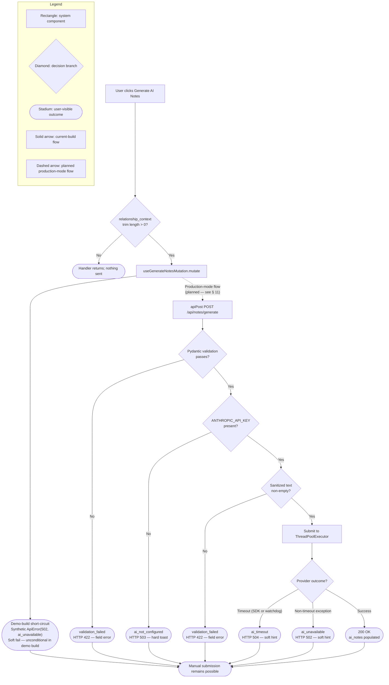
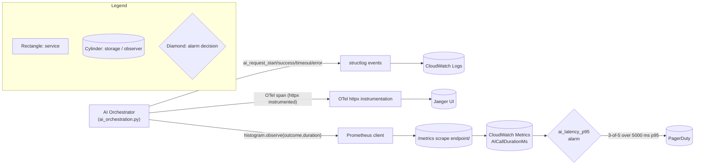

# F-002 AI Note Generation Workflow — Developer Deep-Dive

This document is the single-source developer narrative for the F-002 AI Note Generation workflow inside Sales-Connections. It explains the complete request path from a contributor clicking the "Generate AI Notes" button in the Add/Edit Connection form, through the Flask REST API, through the AI Orchestration service, and out to the Anthropic Claude provider via LangChain's `ChatAnthropic` wrapper — and back. The audience is backend engineers, frontend engineers, SREs, and contributors onboarding to the F-002 feature. The document is anchored to the actual source code on this branch via inline `[<path>:L<num>]` citations so that every behavioral claim can be traced to its definition.

The narrative is organized into twelve sections. Sections 1–2 frame the feature in business terms and lay out the end-to-end component architecture. Sections 3–6 walk one happy-path request through each of the four layers in turn. Sections 7–9 cover failure modes, observability, and security invariants. Sections 10–12 capture limitations, next-step opportunities, and references for further reading.

### Table of Contents

- [1. Overview & Business Context](#1-overview--business-context)
- [2. End-to-End Architecture](#2-end-to-end-architecture)
- [3. Frontend Flow](#3-frontend-flow)
- [4. API Contract](#4-api-contract)
- [5. Service Orchestration](#5-service-orchestration)
- [6. Provider Layer](#6-provider-layer)
- [7. Failure Modes & Graceful Degradation](#7-failure-modes--graceful-degradation)
- [8. Observability](#8-observability)
- [9. Security & Privacy](#9-security--privacy)
- [10. Limitations & Non-Goals](#10-limitations--non-goals)
- [11. Next Steps](#11-next-steps)
- [12. References](#12-references)

## 1. Overview & Business Context

F-002 is an AI-assisted outreach-note generation feature that transforms a contributor's free-form `relationship_context` string into editable, meeting-ready outreach notes for an SDR. The feature is exposed as `POST /api/notes/generate` and is documented at the contract level in `[backend/app/api/notes.py:L1-L76]`. The endpoint accepts a single string field, invokes Anthropic Claude through the AI Orchestration service, and returns three to five plain-text talking points that the SPA renders into an editable textarea on the Add/Edit Connection form.

The business framing is intentionally provided outside the technical specification because it shapes every design decision below — the timeout budget, the non-blocking contract, the soft-vs-hard failure classification, the privacy invariant, and the choice to keep AI output editable.

> "Sales-Connections is expected to be used during weekly sales pipeline review meetings. Sales leaders will add connection ideas before or during the meeting, and SDRs will use the generated notes as 'meeting-ready context' to decide which warm leads to pursue that week."

The AI-generated note is not a vanity feature. It exists to answer a small set of high-leverage questions in seconds rather than in minutes of manual triage.

> The AI-generated note is not just convenience text; it is a prioritization aid that helps the team quickly answer:
>
> - Why is this person worth contacting now?
> - How should the submitter be referenced?
> - Should the submitter make a warm intro, be mentioned softly, or stay uninvolved?
> - What first outbound angle should an SDR use?

The business value of F-002 is therefore measured in:

- **Speed-to-action**
- **Reduced ambiguity for SDRs**
- **Preservation of relationship trust**
- **Faster conversion of leadership networks into outbound pipeline**

Every architectural choice in this document — from the 5-second timeout budget at `[backend/app/services/ai_orchestration.py:L156]` to the editable textarea contract in the SPA — exists to serve that business outcome.

A load-bearing framing point: **Treat AI notes as assistive draft text, not an authoritative sales recommendation**. The contributor and the SDR retain full editorial control over the saved text. See § 10 for the explicit non-goals (no LinkedIn scraping, no CRM sync, no automatic outreach sending, no model-output enforcement).

## 2. End-to-End Architecture

The F-002 workflow spans four layers: the React + TanStack Query SPA in the browser, the Flask REST API running in ECS Fargate, the AI Orchestration service that owns the provider-replaceability boundary, and the Anthropic Claude API reached via LangChain's `ChatAnthropic` wrapper. Each layer has a single canonical entry point that the rest of this document references repeatedly.

> **Runtime mode note.** Diagram D1 below depicts the production-mode F-002 contract — the full Hook → `apiPost` → Flask → Anthropic path that the backend already implements end-to-end. In this branch's demo build, the frontend's `useGenerateNotesMutation` hook short-circuits at `[frontend/src/api/notes.ts:L245-L248]` with an unconditional `Promise.reject(new ApiError(502, "ai_unavailable", ...))` so demos never consume Anthropic credits while still exercising the soft-failure UI code path. Production-mode activation (the gated swap to a real `apiPost` call) is described in § 3 and enumerated as a Next Step in § 11. The diagrams in this document depict the production-mode design contract; the file-level demo-mode short-circuit is the only path currently exercised by the SPA at runtime.

```mermaid
%% Diagram: F-002 Component View — Form to API to AI Orchestrator to Anthropic
flowchart LR
    User((User))

    subgraph SPA["Browser SPA"]
        Form["AddEditConnectionForm.tsx<br/>(React component)"]
        Hook["useGenerateNotesMutation<br/>(TanStack Query hook)"]
        Client["apiPost<br/>(client.ts transport)"]
        Corr["getCorrelationId<br/>(correlationId.ts)"]
    end

    subgraph Flask["Flask Application"]
        MW["Correlation + Auth + RBAC<br/>middleware chain"]
        View["POST /api/notes/generate<br/>view (notes.py)"]
        Service["generate_outreach_notes<br/>(ai_orchestration.py)"]
        San["sanitize_for_ai_prompt<br/>(sanitization.py)"]
        LC["ChatAnthropic<br/>(LangChain wrapper)"]
    end

    Anthropic[("Anthropic Claude API<br/>External service")]

    User -->|"click Generate AI Notes"| Form
    Form -.->|"mutate({relationship_context})"| Hook
    Hook -.-> Client
    Corr -.->|"X-Correlation-Id header"| Client
    Client -->|"HTTPS POST + cookie"| MW
    MW -.-> View
    View -.->|"NoteGenerationRequest"| Service
    Service -.-> San
    Service -.-> LC
    LC -->|"HTTPS via langchain-anthropic"| Anthropic

    subgraph Legend["Legend"]
        L1["Code module"]
        L2[("External service")]
        L3["Solid arrow: HTTPS request"]
        L4["Dashed arrow: internal call"]
    end
```



Diagram D1 — F-002 Component View.

- Rectangles represent code modules inside the Sales-Connections repository.
- Cylinders represent external services or infrastructure boundaries.
- Solid arrows represent synchronous HTTPS requests that cross process or trust boundaries.
- Dashed arrows represent in-process function or method calls.

The canonical entry points in this diagram are: `AddEditConnectionForm` `[frontend/src/features/connections/AddEditConnectionForm.tsx:L328]`, `useGenerateNotesMutation` `[frontend/src/api/notes.ts:L233]`, `apiPost` `[frontend/src/api/client.ts:L572]`, the `generate()` view `[backend/app/api/notes.py:L247]`, `generate_outreach_notes` `[backend/app/services/ai_orchestration.py:L478-L679]`, and `_call_chat_anthropic` `[backend/app/services/ai_orchestration.py:L779-L903]`. Sections 3–6 walk each entry point in turn.

See also [docs/architecture.md § Surface 2 — Backend to Anthropic Claude API](architecture.md) for the system-wide architectural context that places this component view inside the four-surface integration model.

## 3. Frontend Flow

The frontend half of F-002 lives in the Add/Edit Connection form and a single TanStack Query mutation hook. The form is the AI button host; the hook is the only React surface that knows the AI endpoint exists.

### Form integration

The exported `AddEditConnectionForm` component at `[frontend/src/features/connections/AddEditConnectionForm.tsx:L328]` is the route component mounted at `/connections/new` and `/connections/:id/edit`. It owns the entire form-state machine (including the `ai_notes` textarea) and renders a "Generate AI Notes" button next to the `relationship_context` field. The button's click handler is `handleGenerateAi` at `[frontend/src/features/connections/AddEditConnectionForm.tsx:L380-L398]`. The handler reads the current `relationship_context` form value, calls `generateNotes.mutate(...)` with that value, and on success writes the response's `ai_notes` text into the form's `ai_notes` textarea via `setFormState`. The textarea is editable both before and after AI fills it, so the SDR can refine wording before saving the connection.

The editable-after-AI behavior is deliberate. F-002 is positioned as assistive draft text per AAP § 0.2.1; if the textarea were read-only, an SDR could not correct a misattributed warm intro or rephrase a talking point that does not match their voice. Keeping the textarea editable also makes the non-blocking contract complete: when AI fails, the user types into the same textarea the AI would have populated.

### TanStack Query mutation hook

The `useGenerateNotesMutation` hook at `[frontend/src/api/notes.ts:L233-L264]` is a thin wrapper around TanStack Query's `useMutation`. It is typed against the schemas declared in the same file: `GenerateNotesRequest` at `[frontend/src/api/notes.ts:L74]` and `GenerateNotesResponse` at `[frontend/src/api/notes.ts:L101]`. The hook configures three behaviors:

- `retry: 0` at `[frontend/src/api/notes.ts:L249]` — AI failures are not auto-retried by the client. The 5-second server-side timeout budget is the only retry trigger; a retry loop on top of that budget would compound the wait time and surprise the user. The user retries by clicking the button again, which is also the rate-limiting control of last resort.
- Demo-build short-circuit at `[frontend/src/api/notes.ts:L245-L248]` — in this demo build, the hook's `mutationFn` is implemented as an unconditional `Promise.reject(new ApiError(502, "ai_unavailable", "AI generation is not available in demo mode"))`. The `_payload` parameter is intentionally unused (underscore-prefixed) and the hook never calls the backend. The rejection is deliberate: demos never consume Anthropic credits while still exercising the same soft-failure UI code path operators see in production outages. Production-mode activation (a gated swap to a real `apiPost('/api/notes/generate', payload)` call) is enumerated as a Next Step in § 11.
- `onError` soft-failure branch at `[frontend/src/api/notes.ts:L250-L262]` — when `isSoftAiFailure(error)` returns true, the hook returns without toasting. The form component reads `mutation.error` and renders an inline banner instead. Hard failures (validation, auth, RBAC, server) get a toast so the user sees feedback that the click failed.

### Soft vs hard failure dichotomy

The classifier `isSoftAiFailure` at `[frontend/src/api/notes.ts:L181]` returns `true` for `ai_timeout` (HTTP 504) OR `ai_unavailable` (HTTP 502). Soft failures surface as an inline hint next to the button; the form's `aiSoftFailure` useMemo at `[frontend/src/features/connections/AddEditConnectionForm.tsx:L406-L409]` derives this flag from the mutation state. Hard failures (`ai_not_configured` HTTP 503, `validation_failed` HTTP 422) surface as a toast notification. In all four cases, the form's submit button remains enabled — this is the F-002 non-blocking contract enforced at the UI layer. **AI failure does NOT block manual form submission.**

### Illustrative call pattern

The code below is abridged from `[frontend/src/features/connections/AddEditConnectionForm.tsx:L362-L409]` and shows the canonical wiring between the hook, the soft-failure derivation, and the click handler. It is illustrative; consult the source for the complete and current shape.

```typescript
// Abridged from AddEditConnectionForm.tsx (L362-L409)
const generateNotes = useGenerateNotesMutation();

const aiSoftFailure = useMemo(
  () => generateNotes.isError && isSoftAiFailure(generateNotes.error),
  [generateNotes.isError, generateNotes.error],
);

function handleGenerateAi(): void {
  const trimmedContext = formState.relationship_context.trim();
  if (trimmedContext.length === 0) {
    return;
  }
  generateNotes.mutate(
    { relationship_context: trimmedContext },
    {
      onSuccess: (data) => {
        setFormState((prev) => ({ ...prev, ai_notes: data.ai_notes }));
      },
    },
  );
}
```

See `frontend/src/components/README.md` for the design-system primitives composing the form, and `frontend/src/lib/README.md` for the correlation-ID utility. The rationale for placing those READMEs at their prompt-specified paths despite the AI surfaces living in `features/connections/` and `frontend/src/api/` is recorded as DL-0060 and DL-0061 in `docs/decision-log.md`.

## 4. API Contract

The F-002 endpoint is `POST /api/notes/generate`. It is mounted by `notes_bp = Blueprint("notes", __name__)` at `[backend/app/api/notes.py:L208]` and decorated as a single POST route at `[backend/app/api/notes.py:L245]`. The view function is named `generate()` at `[backend/app/api/notes.py:L247]`; the blueprint and the view together are exported via `__all__ = ["notes_bp"]` at `[backend/app/api/notes.py:L227]`.

### Role-based access control

The endpoint is gated by `@requires_role(UserRole.CONTRIBUTOR, UserRole.ADMIN)` at `[backend/app/api/notes.py:L246]`. Only Contributors and Admins may call it; the Viewer role is rejected with HTTP 403 before the view body runs. Viewer-role accounts should never see the "Generate AI Notes" button in the SPA, but the server-side decorator is the authoritative defense — RoleGate on the client is presentation only.

### Request schema

The Pydantic schema `NoteGenerationRequest` at `[backend/app/schemas/note_generation.py:L108]` defines a SINGLE field:

- `relationship_context: str` with `min_length=1`, `max_length=4000` `[backend/app/schemas/note_generation.py:L147-L159]`.

The schema is configured with `extra="forbid"` (via `_STRICT_CONFIG`), which means any additional fields in the request body cause Pydantic validation to fail. This is the second-of-three defenses against client-side prompt-control attempts (the first is the SPA never sending other fields; the third is the orchestrator's own sanitization).

A documentation drift note: `docs/api.md` § Notes (around L702–L707) currently shows an older 4-field schema (`full_name`, `company`, `job_title`, `relationship_context`). The authoritative current schema is the single `relationship_context` field documented here. This deep-dive and the `backend/app/api/README.md` reflect the actual current code; a future `docs/api.md` reconciliation pass is left to a separately scoped documentation refresh because that file is out of scope for the F-002 deliverable per the minimal-change clause.

### Request example

```json
{
  "relationship_context": "Met Jane Doe (VP of Eng at Acme) at SaaStr 2025. Warm intro via Carlos who used to work with her at Acme."
}
```

### Response schema

The Pydantic schema `NoteGenerationResponse` at `[backend/app/schemas/note_generation.py:L167]` defines three fields:

- `ai_notes: str` with `max_length=8000` `[backend/app/schemas/note_generation.py:L203-L212]`. The text content of the AI-generated bullets, ready to render into a textarea.
- `model: str` with `min_length=1` `[backend/app/schemas/note_generation.py:L213-L224]`. The Claude model identifier actually used to generate the response (e.g., `claude-sonnet-4-5`); informational.
- `generated_at: AwareDatetime` `[backend/app/schemas/note_generation.py:L225]`. A timezone-aware UTC timestamp; the `AwareDatetime` annotation rejects naive datetimes at validation time per the project-wide convention.

### Response example

```json
{
  "ai_notes": "- Acme just closed a Series C; SDR follow-up timing aligns with their hiring ramp.\n- Reference Carlos as a soft mention rather than a warm intro.\n- First outbound angle: congratulate on funding; mention Carlos in the second touch.",
  "model": "claude-sonnet-4-5",
  "generated_at": "2026-05-27T17:43:21.193847+00:00"
}
```

### Validation pipeline

The view body runs the validation pipeline before any service-layer work:

- Step 1 at `[backend/app/api/notes.py:L370-L381]`: `request.get_json(silent=True)` parses the JSON body. If the body is missing, malformed, or carries a non-`application/json` content type, the parser returns `None`. The view raises `ValidationFailedError` with a `_root` field-scoped `invalid_json` code, which the centralized error handler converts to HTTP 422.
- Step 2 at `[backend/app/api/notes.py:L402-L429]`: `NoteGenerationRequest.model_validate(raw_body)` runs Pydantic validation. On `ValidationError`, the view converts Pydantic's structured `errors()` output to the canonical `{field, code, message}` envelope shape and raises `ValidationFailedError` (HTTP 422). The leading `body` segment that Pydantic adds during request-body validation is stripped so the SPA's field names match directly.

### Privacy-preserving request log

After successful validation, the view emits exactly one structured-log event at `[backend/app/api/notes.py:L447-L454]`. The event name is `ai_note_generation_requested`. Its `extra` payload carries only three fields:

- `user_id` (stringified UUID from `g.session.user_id`)
- `org_id` (stringified UUID from `g.session.org_id`)
- `context_chars` (the integer length of the validated `relationship_context`)

The raw `relationship_context` text is NEVER logged at any level. This is the privacy invariant: relationship context may carry PII about prospects, internal company gossip, or confidential intros, so it must not land in CloudWatch Logs. See § 9 for the broader privacy posture.

### Service delegation and success serialization

After logging, the view delegates to the AI orchestration service via `service_result = generate_outreach_notes(payload)` at `[backend/app/api/notes.py:L486]`. The service is the SOLE importer of `langchain` and `anthropic` across the entire backend per AAP § 0.4.4 (provider-replaceability invariant); the view never imports those packages and never knows their types. On the happy path the service returns a typed `NoteGenerationResponse`; on timeout/error/misconfiguration it raises `AIServiceUnavailableError` carrying per-instance `status_code` and `error_code`. The view does NOT catch `AIServiceUnavailableError` locally — the exception propagates to the centralized `_handle_app_error` handler in `app.middleware.error_handlers`, which converts it to the uniform error envelope. Letting it propagate preserves the thin-handler convention.

On success the view serializes the response at `[backend/app/api/notes.py:L499]` via `jsonify(response.model_dump(mode="json")), 200`. The `mode="json"` argument converts Pydantic-native types (e.g., the `AwareDatetime` `generated_at`) to JSON-serializable primitives so `jsonify` can produce a valid JSON response without a custom encoder.

### Error envelope shape

All errors emitted by this endpoint share the uniform shape used everywhere in the API:

```json
{
  "error": {
    "code": "ai_timeout",
    "message": "AI provider did not respond within the configured timeout.",
    "correlation_id": "sc-fe-3f50bd51-2d0a-4b3a-9f4f-1e25c6fdc5cf",
    "fields": []
  }
}
```

The complete error-code catalog and standard HTTP status codes are owned by [docs/api.md § Error envelope](api.md). Section 7 of this document covers the four F-002-specific error codes (`ai_timeout`, `ai_unavailable`, `ai_not_configured`, `validation_failed`) with the UI consequences and operator runbooks.

See [docs/api.md § Notes — /api/notes blueprint](api.md) for the canonical REST contract surface that includes this endpoint and its siblings.

## 5. Service Orchestration

The AI Orchestration service is the heart of F-002. Its public API is exactly two symbols: the function `generate_outreach_notes` at `[backend/app/services/ai_orchestration.py:L478-L679]` and the exception `AIServiceUnavailableError` at `[backend/app/services/ai_orchestration.py:L257-L356]`. Both are listed in `__all__` at `[backend/app/services/ai_orchestration.py:L246-L249]`. Every other symbol in the module is private (underscore-prefixed). Per AAP § 3.2.4, this module is the SOLE import point for the `anthropic` and `langchain_anthropic` packages across the backend; future maintainers MUST NOT introduce parallel Anthropic imports elsewhere in the codebase.

### Configuration resolution

The service reads its operating parameters from Flask config via five private accessors. Each accessor encapsulates one configuration key and one documented default so the complete configuration surface is auditable in one place.

- `_get_ai_timeout_seconds()` at `[backend/app/services/ai_orchestration.py:L379]` reads `AI_REQUEST_TIMEOUT_SECONDS`, defaulting to 5 (sourced in `.env` from `[backend/.env.example:L138]`).
- `_get_ai_max_tokens()` at `[backend/app/services/ai_orchestration.py:L396]` reads `ANTHROPIC_MAX_TOKENS`, defaulting to 512 (sourced from `[backend/.env.example:L135]`).
- `_get_ai_model()` at `[backend/app/services/ai_orchestration.py:L411]` reads `ANTHROPIC_MODEL`, defaulting to `claude-sonnet-4-5` (sourced from `[backend/.env.example:L131]`).
- `_get_ai_prompt_context_max_chars()` at `[backend/app/services/ai_orchestration.py:L428]` reads `AI_PROMPT_CONTEXT_MAX_CHARS`, defaulting to 4000.
- `_get_anthropic_api_key()` at `[backend/app/services/ai_orchestration.py:L446]` reads `ANTHROPIC_API_KEY` (sourced from `[backend/.env.example:L127]`). An empty value raises `AIServiceUnavailableError(code="ai_not_configured", status_code=503)` immediately — no provider round-trip is attempted.

All five accessors must be called from within a Flask application context. The thread-pool worker thread spawned by the watchdog (below) does NOT have an app context, so callers MUST resolve all values in the calling thread before submitting the SDK call to the pool. This invariant is enforced by passing the resolved values as plain arguments into `_invoke_with_timeout` and `_call_chat_anthropic`.

### Sanitization

Before any prompt construction, the service runs the validated `relationship_context` through `sanitize_for_ai_prompt` at `[backend/app/utils/sanitization.py:L188]`. The sanitizer:

- Coerces `None` and non-string inputs to the empty string.
- Strips ASCII control characters (0x00–0x08, 0x0B, 0x0C, 0x0E–0x1F, 0x7F) while preserving tab/newline/carriage-return.
- Applies Unicode NFC normalization.
- Strips zero-width, bidi, and other invisible Unicode characters that could smuggle hidden instructions.
- Collapses runs of whitespace and trims leading/trailing whitespace.
- Truncates to `_DEFAULT_AI_MAX_CHARS = 4000` (`[backend/app/utils/sanitization.py:L48]`) with a visible `... [truncated]` suffix when truncation occurs.

Sanitization runs at the ORCHESTRATOR boundary, not at the view layer. The rationale is defense in depth: a future internal caller (a batch job, a back-office tool) could invoke `generate_outreach_notes` directly without re-running view-layer validation, and the orchestrator must be self-defending. Sanitization belongs at the AI boundary, not the HTTP boundary.

If sanitization reduces the input to an empty string (the input contained ONLY control characters, bidi marks, zero-width characters, or whitespace), the orchestrator observes a `validation` outcome on the Prometheus histogram with a 0.0 duration and raises `ValidationFailedError`. No provider round-trip is attempted; the request would be both pointless and billable.

### Two-layer timeout watchdog

The two-layer timeout watchdog is the load-bearing reliability mechanism for F-002. It guarantees that a slow Anthropic upstream cannot starve the Flask worker beyond approximately 5.5 seconds.

- **Layer 1 (SDK timeout)** — `ChatAnthropic` is instantiated with `timeout=sdk_timeout`, where `sdk_timeout` is the resolved `_get_ai_timeout_seconds()` value floored at 100 ms. Under normal conditions this layer fires first and raises an SDK-internal timeout exception that the caller maps to `AIServiceUnavailableError(code="ai_unavailable")`. The floor defends against config typos (e.g., `AI_REQUEST_TIMEOUT_SECONDS=0`) that would otherwise look like a global outage.
- **Layer 2 (watchdog)** — `_invoke_with_timeout` at `[backend/app/services/ai_orchestration.py:L687-L776]` submits the SDK call to the bounded `_AI_THREAD_POOL` at `[backend/app/services/ai_orchestration.py:L188-L191]` (`max_workers=8`, `thread_name_prefix="ai-orch"`) and waits via `future.result(timeout=timeout_s + _WATCHDOG_GRACE_SECONDS)`. The grace period `_WATCHDOG_GRACE_SECONDS = 0.5` at `[backend/app/services/ai_orchestration.py:L179]` ensures the SDK timeout fires first under normal conditions; the watchdog only kicks in for pathological cases (stuck sockets, half-open TCP connections, DNS hangs).

When the watchdog fires, the calling thread calls `future.cancel()` at `[backend/app/services/ai_orchestration.py:L767]` as a best-effort cancellation. If the SDK call has already started in the worker thread, `cancel()` returns `False` and the work continues in the background (the result is discarded). The watchdog still re-raises a `FuturesTimeoutError`, which the caller maps to `AIServiceUnavailableError(code="ai_timeout", status_code=504)`.

The total wall-clock budget for a single AI request is therefore bounded by `timeout_s + _WATCHDOG_GRACE_SECONDS` (= ~5.5 seconds for the default 5-second SDK timeout). Bounding the worker count at 8 prevents a flood of slow AI requests from exhausting threads and starving other endpoints; the Gunicorn worker process retains its other request-serving threads regardless of AI-call congestion.

### Prompt construction

Prompt construction lives entirely inside the orchestrator. The view layer NEVER sees the prompt text.

- `_SYSTEM_PROMPT` at `[backend/app/services/ai_orchestration.py:L204-L220]` is a static module-level constant. It is plain ASCII (no smart quotes, no emoji) so the encoded byte representation is stable across editors and CI environments. The directive aligns the model output with the four SDR prioritization questions in § 1: three to five short bullets, one or two sentences each, grounded only in the provided context, no greetings/sign-offs/boilerplate.
- `_build_user_prompt` at `[backend/app/services/ai_orchestration.py:L906-L930]` wraps the sanitized `relationship_context` into a `HumanMessage` body with a short instruction reinforcing the expected output format.

Per AAP § 0.7.5 (Explainability rule), changes to the system prompt MUST be accompanied by a decision-log entry in `docs/decision-log.md` because the prompt is a behavioral contract observable to end users.

### Request lifecycle sequence

The sequence diagram below traces one happy-path request and two error fanouts (watchdog timeout, provider error) through all seven participants. The `alt` blocks show the divergence from the happy path; control returns to the form with an inline soft-failure hint in each error case.

```mermaid
%% Diagram: F-002 Request Lifecycle — From Submit Click to Mutation Resolution
sequenceDiagram
    autonumber
    participant User as User
    participant Form as Form<br/>(AddEditConnectionForm.tsx)
    participant Hook as Hook<br/>(useGenerateNotesMutation)
    participant ApiPost as apiPost<br/>(client.ts)
    participant Flask as Flask<br/>(middleware + view)
    participant Service as Service<br/>(generate_outreach_notes)
    participant Provider as Provider<br/>(ChatAnthropic + Anthropic)

    User->>Form: click "Generate AI Notes"
    Form->>Hook: mutate({relationship_context})
    Hook->>ApiPost: POST /api/notes/generate (JSON)
    ApiPost->>Flask: HTTPS + X-Correlation-Id + session cookie
    Flask->>Flask: correlation + auth + RBAC middleware
    Flask->>Flask: pydantic validate NoteGenerationRequest
    Flask->>Service: generate_outreach_notes(payload)
    Service->>Service: sanitize_for_ai_prompt(text, 4000)
    Service->>Service: bind structlog (model, prompt_chars)
    Service->>Service: emit ai_request_start
    Service->>Provider: submit to ThreadPoolExecutor (watchdog)

    alt happy path
        Provider->>Provider: ChatAnthropic.invoke (system + human msgs)
        Provider-->>Service: BaseMessage with content
        Service->>Service: emit ai_request_success (elapsed, response_chars)
        Service->>Service: observe outcome=success on histogram
        Service-->>Flask: NoteGenerationResponse
        Flask-->>ApiPost: 200 + JSON body
        ApiPost-->>Hook: GenerateNotesResponse
        Hook-->>Form: onSuccess(data)
        Form->>Form: setFormState({...prev, ai_notes: data.ai_notes})
    end

    alt watchdog fires
        Service->>Service: future.result timeout (5.0 + 0.5 s)
        Service->>Service: future.cancel()
        Service->>Service: emit ai_request_timeout (elapsed)
        Service->>Service: observe outcome=timeout on histogram
        Service-->>Flask: raise AIServiceUnavailableError(ai_timeout, 504)
        Flask-->>ApiPost: 504 + error envelope
        ApiPost-->>Hook: ApiError(504, "ai_timeout")
        Hook-->>Form: onError; isSoftAiFailure==true
        Form->>Form: render inline soft-failure hint (submit stays enabled)
    end

    alt provider error
        Provider->>Service: raises non-timeout exception
        Service->>Service: emit ai_request_error (elapsed, error_class)
        Service->>Service: observe outcome=error on histogram
        Service-->>Flask: raise AIServiceUnavailableError(ai_unavailable, 502)
        Flask-->>ApiPost: 502 + error envelope
        ApiPost-->>Hook: ApiError(502, "ai_unavailable")
        Hook-->>Form: onError; isSoftAiFailure==true
        Form->>Form: render inline soft-failure hint (submit stays enabled)
    end
```

Diagram D2 — F-002 Request Lifecycle.

**Legend:** Mermaid `sequenceDiagram` does not support `subgraph` blocks, so the diagram's legend is provided here as a Markdown list immediately after the closing fence (per the Visual Architecture Documentation rule's requirement that every diagram have a title and a legend):

- *Participants* — `User`, `Form` (AddEditConnectionForm.tsx), `Hook` (useGenerateNotesMutation), `apiPost` (client.ts), `Flask` (middleware + view), `Service` (generate_outreach_notes), `Provider` (ChatAnthropic + Anthropic) — run left to right in the request order.
- *`alt` blocks* — show alternative execution paths. The first `alt` block is the happy path; the second and third are the two soft-failure fanouts (watchdog timeout, provider error) that map to the inline UI hint.
- *Exit paths* — the three terminal states are: form populates `ai_notes` (happy path), form renders inline soft-failure hint (timeout or provider error). In all three terminal states the form's submit button remains enabled (the F-002 non-blocking contract).
- *Out-of-scope paths* — the `ai_not_configured` (HTTP 503) and `validation_failed` (HTTP 422) paths are not depicted here because they exit BEFORE the provider call (see § 7 Diagram D3 for the full failure-mode map).

## 6. Provider Layer

The provider layer is the thinnest possible adapter between the orchestrator and the Anthropic Claude API. It lives entirely inside `_call_chat_anthropic` at `[backend/app/services/ai_orchestration.py:L779-L903]`. The function is private (underscore-prefixed) and is the ONLY function in the entire backend codebase that imports the LangChain provider packages.

### Local imports for provider isolation

The provider-layer imports are deliberately performed LOCALLY inside the function body at `[backend/app/services/ai_orchestration.py:L834-L838]`:

```python
from langchain_anthropic import ChatAnthropic  # noqa: PLC0415
from langchain_core.messages import (  # noqa: PLC0415
    HumanMessage,
    SystemMessage,
)
```

Function-scope imports keep the heavy LangChain and Anthropic SDK out of the module-import graph for any consumer that only needs the orchestrator's public surface. The `noqa: PLC0415` comments document the deliberate departure from the "imports at top of file" lint rule.

### Provider replaceability invariant

Per AAP § 3.2.4, this function is the SOLE import point for the `anthropic` and `langchain_anthropic` packages across the backend. Future maintainers MUST NOT introduce parallel Anthropic imports anywhere else — doing so breaks the replaceability contract and complicates future provider swaps (OpenAI, Google Gemini, an in-house model, etc.). The orchestrator function `generate_outreach_notes` and the exception `AIServiceUnavailableError` are stable public symbols; a future provider swap will replace the body of `_call_chat_anthropic` without changing those signatures, and every feature handler (`notes.py`, `connections.py`, future modules) will require zero changes.

### `ChatAnthropic` instantiation

The LangChain client is constructed at `[backend/app/services/ai_orchestration.py:L860-L870]` with five parameters:

- `model=model` — resolved via `_get_ai_model()` at `[backend/app/services/ai_orchestration.py:L411]`, defaulting to `claude-sonnet-4-5` from `[backend/.env.example:L131]`.
- `api_key=api_key` — resolved via `_get_anthropic_api_key()` at `[backend/app/services/ai_orchestration.py:L446]`, defaulting from `[backend/.env.example:L127]` and ultimately sourced from AWS Secrets Manager in production.
- `max_tokens=max_tokens` — resolved via `_get_ai_max_tokens()` at `[backend/app/services/ai_orchestration.py:L396]`, defaulting to 512 from `[backend/.env.example:L135]`. 512 tokens translates to roughly 2000 English characters in practice — enough room for the three-to-five bullet response shape mandated by the system prompt.
- `timeout=sdk_timeout` — the SDK-level per-request timeout, the first of the two-layer watchdog described in § 5.
- `max_retries=0` at `[backend/app/services/ai_orchestration.py:L869]` — this is load-bearing. The orchestrator owns the retry policy via the watchdog and the SPA's manual-retry button. Allowing LangChain to retry would compound the latency budget invisibly and surprise the user.

### Pinned dependency versions

The provider layer is pinned to the following versions in `backend/requirements.txt`:

- `anthropic==0.97.0` at `[backend/requirements.txt:L72]`
- `langchain==0.3.27` at `[backend/requirements.txt:L73]`
- `langchain-core==0.3.78` at `[backend/requirements.txt:L74]`
- `langchain-anthropic==0.3.21` at `[backend/requirements.txt:L75]`

These versions are managed as a coordinated set. A future advisory-driven upgrade is out of scope for this documentation-only deliverable per the AAP Minimal Change Clause (§ 0.2.1) and the AAP § 0.7.3 dependency-update budget; when it is undertaken, the upgrade SHOULD be exercised via the existing test suite before merging.

### System and user prompts

The provider call sends two messages: a `SystemMessage` carrying `_SYSTEM_PROMPT` from `[backend/app/services/ai_orchestration.py:L204-L220]`, and a `HumanMessage` whose body is constructed by `_build_user_prompt` from `[backend/app/services/ai_orchestration.py:L906-L930]`. Splitting the framing (system) from the content (user) follows Anthropic's documented best practice and lets a future provider swap reuse the same context string with a different framing layer. The system prompt is ASCII-only and instructs the model to produce three to five short bullets, grounded only in the provided context, without greetings or sign-offs.

### Response normalization

LangChain's `BaseMessage.content` is documented as `str | list`. Older SDK versions returned plain strings; newer versions return a list of structured content blocks (e.g., `[{"type": "text", "text": "..."}]`) to support multi-modal responses. The provider layer handles both shapes defensively at `[backend/app/services/ai_orchestration.py:L883-L903]`. Non-text blocks (e.g., tool calls) are ignored because the F-002 contract is plain-text bullets. The text is then stripped of leading/trailing whitespace and returned. The `model` field of the response is the resolved environment value rather than a hardcoded constant, so a config-driven model change surfaces in the response payload without code changes.

## 7. Failure Modes & Graceful Degradation

The F-002 non-blocking contract is the load-bearing UX invariant of this feature: **AI failure does NOT block manual form submission. The user always retains the ability to type or paste outreach notes directly into the `ai_notes` textarea.** The four failure variants below all preserve this contract; the only difference is the UI affordance the user sees (inline hint vs toast vs field error).

### Failure variant table

| `error_code` | HTTP | Trigger | UI Behavior | Operator Action |
|---|---|---|---|---|
| `ai_timeout` | 504 | `_invoke_with_timeout` watchdog fires or `ChatAnthropic` SDK timeout `[backend/app/services/ai_orchestration.py:L687-L776]` | **Soft fail** — inline hint near the button; manual submission still allowed | Inspect `ai_latency_p95` CloudWatch alarm; check Anthropic provider latency |
| `ai_unavailable` | 502 | Non-timeout exception from Provider (network error, 5xx from Anthropic, malformed content, invalid API key) `[backend/app/services/ai_orchestration.py:L646-L655]` | **Soft fail** — inline hint near the button; manual submission still allowed | Check Anthropic status page; inspect `ai_request_error` log events |
| `ai_not_configured` | 503 | `_get_anthropic_api_key` returns empty `[backend/app/services/ai_orchestration.py:L446]` | **Hard fail** — toast notification; manual submission still allowed | Verify `ANTHROPIC_API_KEY` in AWS Secrets Manager `[backend/.env.example:L183]` |
| `validation_failed` | 422 | `NoteGenerationRequest` Pydantic validation OR empty-after-sanitization `[backend/app/api/notes.py:L402-L429]`, `[backend/app/services/ai_orchestration.py:L573-L578]` | Field-level error display next to the input | User corrects input |

### Soft-vs-hard classification

The classifier `isSoftAiFailure` at `[frontend/src/api/notes.ts:L181]` returns `true` ONLY for `ai_timeout` and `ai_unavailable`. All other failures (`ai_not_configured`, `validation_failed`, and any forward-compatible code surfaced through the `AiNoteErrorCode` union at `[frontend/src/api/notes.ts:L140]`) bubble up as hard failures and surface via the global toast handler. The mapping reflects user intent: temporary issues (timeout, transient upstream error) are recoverable by clicking the button again; configuration or validation issues require corrective action elsewhere (operator updates the secret; user fixes the input).

### Why the non-blocking contract exists

F-002 is an ASSISTIVE feature, not a critical-path feature. Manual outreach notes are perfectly valid — the SDR can type their own talking points into the `ai_notes` textarea any time. Hard-blocking submission on AI failures would degrade UX during Anthropic outages and would defeat the F-002 business intent by reducing the feature to "broken when AI is broken." The `ai_notes` textarea remains editable both before and after AI fills it, so the soft-failure inline hint is a hint, not a wall.

### Failure-mode flow

The diagram below traces all four error paths from the button click downward, exits each path with its `error_code` + HTTP status + UI consequence, and reinforces the non-blocking contract by routing every terminal back to the "Manual submission remains possible" footer.



Diagram D3 — F-002 Failure Mode Map.

- Solid arrows = control flow.
- Diamond nodes = decision branches in the request pipeline.
- Stadium-shaped nodes = user-visible outcomes (whether soft, hard, or success).
- Every terminal node connects to the "Manual submission remains possible" footer to reinforce the non-blocking contract.

## 8. Observability

F-002 reuses ALL pre-existing observability infrastructure. This documentation deliverable adds NO new observability surfaces — every log event, metric, header, alarm, and runbook referenced below already exists in the codebase. The table that follows accounts for the complete surface area so a contributor can verify nothing is missing without re-walking the code.

### Reused vs Added surfaces

The table below has two explicit columns — `Reused (Pre-existing)` and `Added by This Deliverable` — per the Observability rule's requirement to make the reuse-vs-add split unambiguous. Every entry under `Reused (Pre-existing)` is marked `Yes`; every entry under `Added by This Deliverable` is marked `—` because this is a documentation-only deliverable and adds zero new observability surfaces.

| Surface | Mechanism | Citation | Reused (Pre-existing) | Added by This Deliverable |
|---|---|---|---|---|
| Structured logging | `structlog 24.4.0` | `[backend/requirements.txt:L112]` | Yes | — |
| API request event | `ai_note_generation_requested` (user_id, org_id, context_chars) | `[backend/app/api/notes.py:L447-L454]` | Yes | — |
| Service start event | `ai_request_start` | `[backend/app/services/ai_orchestration.py:L607]` | Yes | — |
| Service timeout event | `ai_request_timeout` | `[backend/app/services/ai_orchestration.py:L621]` | Yes | — |
| Service error event | `ai_request_error` | `[backend/app/services/ai_orchestration.py:L646-L650]` | Yes | — |
| Service success event | `ai_request_success` | `[backend/app/services/ai_orchestration.py:L663-L667]` | Yes | — |
| Correlation ID (frontend mint) | `getCorrelationId` (prefix `sc-fe-`) | `[frontend/src/lib/correlationId.ts:L101]` | Yes | — |
| Correlation ID (header) | `X-Correlation-Id` injected by `apiPost` | `[frontend/src/api/client.ts:L455]` | Yes | — |
| Metrics | `ai_request_duration_seconds{outcome}` Histogram | `[backend/app/observability/metrics.py:L263-L272]` | Yes | — |
| Outcome labels | `success`, `timeout`, `error`, `validation` | `[backend/app/services/ai_orchestration.py:L232-L235]` | Yes | — |
| Distributed tracing | OpenTelemetry 1.29.0 + `opentelemetry-instrumentation-httpx 0.50b0` | `[backend/requirements.txt:L123]` | Yes | — |
| Liveness | `/healthz` | `[docs/operations.md § 5]` | Yes | — |
| Readiness | `/readyz` | `[docs/operations.md § 5]` | Yes | — |
| Alarm | `ai_latency_p95` (3 of 5 datapoints, period 300 s, threshold 5000 ms p95) | `[infra/terraform/modules/observability/main.tf:L446-L468]` | Yes | — |

### Correlation ID flow

A correlation ID is the operational glue that ties a single user click to its log entries across all layers. The flow is:

- The browser mints `sc-fe-<uuid>` lazily on first call via `getCorrelationId()` at `[frontend/src/lib/correlationId.ts:L101]`. The prefix is read from `VITE_CORRELATION_ID_PREFIX` (default `sc-fe-`) at `[frontend/src/lib/correlationId.ts:L56]`. The value is cached for the lifetime of the page load.
- `apiPost` at `[frontend/src/api/client.ts:L572]` delegates to the shared `request` helper, which injects the value as the `X-Correlation-Id` request header at `[frontend/src/api/client.ts:L455]` on every backend call.
- The Flask correlation middleware reads the header, binds it to the `structlog` context, and propagates it via OpenTelemetry baggage so the same ID appears on every downstream log line and span.
- All five F-002 structured-log events (the API-layer `ai_note_generation_requested` plus the four service-layer events) carry the correlation ID, enabling end-to-end traces in CloudWatch Logs Insights and Jaeger.

### Metrics

The single F-002 metric is the Prometheus `Histogram` `ai_request_duration_seconds` declared at `[backend/app/observability/metrics.py:L263-L272]` with `labelnames=("outcome",)`. The orchestrator observes one of four outcome labels — `success`, `timeout`, `error`, `validation` — on every AI request via `histogram.labels(outcome=...).observe(duration_seconds)` at the four service-layer exit points. The cardinality is bounded at 4 outcomes, so the histogram remains lightweight in scrape volume and storage. Operators can alert on each failure mode independently (for example, "AI timeout rate > 1% over 5 minutes").

### CloudWatch alarm `ai_latency_p95`

The single F-002 alarm is `ai_latency_p95` defined as a Terraform resource at `[infra/terraform/modules/observability/main.tf:L446-L468]`. Its parameters are:

- `metric_name = "AICallDurationMs"` `[infra/terraform/modules/observability/main.tf:L453]`
- `extended_statistic = "p95"` `[infra/terraform/modules/observability/main.tf:L456]`
- `period = 300` (5 minutes) `[infra/terraform/modules/observability/main.tf:L455]`
- `evaluation_periods = 5` `[infra/terraform/modules/observability/main.tf:L450]`
- `datapoints_to_alarm = 3` `[infra/terraform/modules/observability/main.tf:L451]`
- `threshold = var.alarm_threshold_p95_ms_ai_call` (default 5000 ms) `[infra/terraform/modules/observability/main.tf:L457]`
- `treat_missing_data = "notBreaching"` `[infra/terraform/modules/observability/main.tf:L458]` — when no AI traffic flows (for example, during demos or low-utilization periods), the alarm treats the missing data as a healthy state. This parameter implements F-002's "AI failure does NOT block submission" invariant at the alarm layer: zero AI traffic equals zero alarms, so an outage of the AI integration cannot manifest as a paging incident when no one is exercising the feature.

The alarm fires when 3 of the last 5 five-minute datapoints exceed 5000 ms p95. The 3-of-5 evaluation pattern smooths over single-period spikes; a real upstream degradation will sustain elevated p95 across multiple periods. The runbook lives in [docs/operations.md § 5 Observability](operations.md).

**Known mapping gap — alarm metric and emitted log events.** The CloudWatch alarm filters on the `AICallDurationMs` metric, which is populated by a log metric filter whose pattern and value extraction are declared in Terraform at `[infra/terraform/modules/observability/main.tf:L388-L399]`. That filter's expected event-name string and expected duration-field key (both literals appear in the Terraform source at the cited line range) do NOT match what the current AI orchestrator at `[backend/app/services/ai_orchestration.py]` emits — the orchestrator emits a richer four-event taxonomy (`ai_request_start`, `ai_request_success`, `ai_request_timeout`, `ai_request_error`) carrying `elapsed_seconds` (seconds, not milliseconds). Under the current event taxonomy, the metric filter that backs `ai_latency_p95` will not populate the metric, so the alarm cannot fire today against live AI traffic. This is a documented mapping gap, not a deliverable defect — the alarm resource and its runbook are still the canonical operational shape for F-002, and reconciliation belongs to a separately scoped infra-or-service change (either align the metric filter's expected event-name and duration-field key with the four-event taxonomy and the `elapsed_seconds` field, or add a rollup event to the orchestrator matching the filter's expected shape). The full literal event-name and field-name strings expected by the metric filter, the bounded reconciliation scope, and the minimal-change rationale for documenting (not closing) the gap in this deliverable are out of scope for the F-002 documentation deliverable per the AAP Minimal Change Clause (§ 0.2.1); operators retain a one-click path from this paragraph to the filter shape at the cited Terraform line range.

### Observability surface diagram

The diagram below shows the four observability outputs of the AI orchestrator and how they flow into operator-visible destinations.



Diagram D4 — F-002 Observability Surfaces.

- Rectangles = in-process services emitting telemetry.
- Cylinders = storage destinations or downstream observers.
- The diamond is the CloudWatch alarm decision node.

### Local-dev verification

The Observability rule requires that every observability surface be exercisable locally. The commands below run inside the docker-compose dev environment and demonstrate the end-to-end correlation and metric path.

```bash
# Bring up Jaeger UI on http://localhost:16686
docker compose --profile tracing up -d

# Exercise the AI endpoint with a known correlation ID
curl -X POST http://localhost:5000/api/notes/generate \
  -H "Content-Type: application/json" \
  -H "X-Correlation-Id: sc-dev-$(uuidgen)" \
  --cookie "session_id=<your-dev-session>" \
  --data '{"relationship_context": "VP of Eng at Acme; met at SaaStr 2025"}'

# Inspect logs (containerized Flask)
docker compose logs api | grep ai_request

# Inspect Prometheus scrape endpoint
curl http://localhost:5000/metrics | grep ai_request_duration_seconds
```

If the dev environment does not have an `ANTHROPIC_API_KEY` set, the structured-log chain still emits the full sequence (`ai_note_generation_requested` from the API layer, then `ai_request_start` from the service layer, then an `AIServiceUnavailableError(code="ai_not_configured")` that propagates back through the centralized error handler). The Prometheus histogram records nothing for the `ai_not_configured` path because the call exits before observation, but the log chain alone demonstrates end-to-end correlation propagation without consuming any Anthropic credits.

See [docs/operations.md § 5 Observability](operations.md) for the canonical alarm runbook and dashboard links.

## 9. Security & Privacy

F-002 inherits the system-wide security posture documented in [docs/security.md](security.md) and adds four feature-specific invariants. None of these invariants are novel to F-002; they are the security shape inherent to any AI-provider integration that handles user-supplied text.

### Credential isolation

The Anthropic API key is resolved server-side ONLY, via `_get_anthropic_api_key` at `[backend/app/services/ai_orchestration.py:L446]`. The frontend NEVER sees, transports, or stores any AI provider credential. There is no SPA-visible Anthropic key, no client-side base64 token, no proxy-passthrough that could leak the secret in browser developer tools. The key crosses no trust boundary outside the Flask worker process.

- In production, `ANTHROPIC_API_KEY` is sourced from AWS Secrets Manager at process startup via `SECRETS_MANAGER_ANTHROPIC_KEY_ID` at `[backend/.env.example:L183]`. The cached value lives for the lifetime of the Gunicorn worker.
- In local development, `ANTHROPIC_API_KEY` is read directly from `.env` via the canonical environment-variable name at `[backend/.env.example:L127]`.

The key is never logged: the orchestrator's structured-log binding at `[backend/app/services/ai_orchestration.py:L601-L606]` carries `ai_model`, `prompt_chars`, `timeout_seconds`, and `caller_thread` — nothing else.

See [docs/security.md](security.md) for the full credential-handling posture across all secrets (`ANTHROPIC_API_KEY`, `GOOGLE_OAUTH_CLIENT_SECRET`, `JWT_SIGNING_KEY`, `DB_PASSWORD`).

### Sanitization invariant

User-supplied text is sanitized BEFORE prompt construction via `sanitize_for_ai_prompt` at `[backend/app/utils/sanitization.py:L188]`. The sanitization pipeline (described in detail in § 5):

- Strips ASCII control characters except tab/newline/carriage-return.
- Applies Unicode NFC normalization.
- Strips zero-width, bidi, format, and private-use Unicode characters that could smuggle hidden instructions into the prompt.
- Truncates to `_DEFAULT_AI_MAX_CHARS = 4000` at `[backend/app/utils/sanitization.py:L48]`, appending a visible `... [truncated]` suffix when truncation occurs.

Sanitization runs at the orchestrator boundary, not at the HTTP view boundary. This is deliberate: a future internal caller (a batch job, a back-office admin tool) could invoke `generate_outreach_notes` directly without re-running view-layer validation, and the orchestrator must remain self-defending. The Pydantic schema's `max_length=4000` constraint at `[backend/app/schemas/note_generation.py:L147-L159]` is the first defense; the orchestrator's sanitizer is the second; the SDK's `max_tokens=512` budget is the third.

The current authoritative name is `sanitize_for_ai_prompt` as used here and in the actual `__all__` list at `[backend/app/utils/sanitization.py:L111-L114]`. Any divergence found in older companion docs is tracked for reconciliation in `docs/decision-log.md`.

### Privacy-preserving logging

The privacy invariant is the strongest cross-layer rule in F-002: **the raw `relationship_context` text is NEVER logged at any level.**

- The API-layer event `ai_note_generation_requested` at `[backend/app/api/notes.py:L447-L454]` carries only `user_id`, `org_id`, and `context_chars` (the integer length).
- The service-layer events `ai_request_start`, `ai_request_success`, `ai_request_timeout`, `ai_request_error` at `[backend/app/services/ai_orchestration.py:L607,L621,L645-L649,L662-L666]` carry structural fields only — `ai_model`, `prompt_chars`, `timeout_seconds`, `elapsed_seconds`, `response_chars`, `error_class`, `outcome`. They do NOT carry the prompt text or the generated response text.

Why: relationship context may contain personally identifiable details about prospects (names, employers, deal context), internal company gossip ("Carlos is being sidelined"), or confidential intros that would be inappropriate to retain in CloudWatch Logs. The same reasoning applies to the AI-generated response text, which may incorporate fragments of the input. Storing this content in operator-readable logs would breach the project's privacy posture without business justification.

### HttpOnly session authentication

The AI endpoint uses the same HttpOnly cookie-based session as every other authenticated API call. The frontend's `apiPost` at `[frontend/src/api/client.ts:L572]` delegates to the shared `request` helper, which applies `credentials: "include"` at `[frontend/src/api/client.ts:L464]` so the browser sends the HttpOnly session cookie automatically. No bearer tokens, no localStorage, no sessionStorage for auth state — this eliminates the XSS-exfiltration class of attacks against the session credential.

The `X-Correlation-Id` header is non-secret and safe to log. It is a pseudo-random UUID minted by the browser per `[frontend/src/lib/correlationId.ts:L78-L82]` and serves observability purposes only. It MUST NOT be reused as a session token, anti-CSRF token, or any other security-bearing identifier.

### Role-based access control

The endpoint is gated by `@requires_role(UserRole.CONTRIBUTOR, UserRole.ADMIN)` at `[backend/app/api/notes.py:L246]`. The Viewer role (read-only) is rejected with HTTP 403 BEFORE the view body runs. This prevents low-privilege accounts from consuming AI quota (each call is billable) or exfiltrating model behavior via systematic prompts. The decorator is the authoritative defense; the SPA's RoleGate component that hides the button is presentation only.

## 10. Limitations & Non-Goals

F-002 is deliberately scoped narrowly. The following items are explicitly OUT OF SCOPE for the current feature; do not infer them from this documentation.

- **No LinkedIn scraping.** The system does not fetch profile data from LinkedIn, X/Twitter, or any social network. The only input to AI generation is the contributor's own free-form `relationship_context` string.
- **No CRM sync.** The system does not push or pull data from Salesforce, HubSpot, or any external CRM. Connections live in the Sales-Connections database and nowhere else.
- **No automatic outreach sending.** The system does not send emails, LinkedIn messages, calendar invitations, or any outbound communication. The `ai_notes` text is draft material for a human SDR to copy, paste, edit, and act on.
- **No analytics or attribution tracking.** The system does not measure conversion of AI-suggested notes into actual outreach activity. There is no "did the SDR follow up" event, no "did this lead close" tracking.
- **No model-output enforcement.** **Treat AI notes as assistive draft text, not an authoritative sales recommendation** (per AAP § 0.2.1). The SDR retains full editorial control via the editable `ai_notes` textarea. The model has no authority over the connection record's final saved text.
- **No multi-model A/B testing.** The system pins to a single Anthropic model identifier (`claude-sonnet-4-5`) resolved from `ANTHROPIC_MODEL`. A model swap is a configuration change governed by `docs/decision-log.md` per AAP § 0.7.5 (Explainability rule).
- **No automatic retry on AI failure.** The TanStack Query hook is configured with `retry: 0` at `[frontend/src/api/notes.ts:L249]` (in the `useGenerateNotesMutation` mutation options block). Failures surface to the user immediately so the user can decide whether to retry (click the button again) or proceed with manually typed notes.
- **No per-user or per-org quota tracking.** The orchestrator does not currently track Anthropic spend per organization. Cost-control behavior beyond the per-request `max_tokens` budget is out of scope; § 11 lists it as a future improvement.

The non-blocking contract documented in § 7 is what makes F-002 safe to ship under all these constraints: even total AI failure leaves users with a fully functional manual workflow.

## 11. Next Steps

During the documentation pass that produced this deep-dive, the following non-trivial improvement opportunities were identified. They are out of scope for the current documentation deliverable (per the minimal-change clause captured in `docs/decision-log.md` DL-0065) but are recommended for future contributors. Each item names the file or symbol it would touch so the work can be scoped quickly.

- **Production-mode hook activation gated on a `VITE_AI_DEMO_MODE` environment variable** — the `useGenerateNotesMutation` hook at `[frontend/src/api/notes.ts:L233-L264]` currently rejects unconditionally with the demo-build synthetic `ApiError(502, "ai_unavailable", "AI generation is not available in demo mode")` short-circuit at `[frontend/src/api/notes.ts:L245-L248]`. To enable production-mode AI generation, introduce a new `VITE_AI_DEMO_MODE` build flag: declare it as `readonly VITE_AI_DEMO_MODE: "true" | "false"` in `[frontend/src/vite-env.d.ts]`, document its default (`"true"` for safety) in `[frontend/.env.example]`, and replace the unconditional `Promise.reject` with a conditional that swaps to `apiPost<GenerateNotesResponse, GenerateNotesRequest>('/api/notes/generate', payload)` when the flag is falsy. The Flask backend already implements the full F-002 flow described in §§ 4–6 of this document and requires no companion change.
- **Grafana dashboard for `ai_request_duration_seconds`** — overlay p50/p95/p99 lines alongside the `outcome` label split so operators can see the latency distribution per failure mode at a glance. The histogram is already registered at `[backend/app/observability/metrics.py:L263-L272]`; only the dashboard configuration is missing.
- **Refactor `frontend/src/features/connections/AddEditConnectionForm.tsx` into smaller field-group sub-components** — the file currently mixes form-state machinery, AI button orchestration, validation helpers, and JSX in a single large module. Extraction would improve reviewability without changing behavior.
- **Split `frontend/src/api/client.ts` into transport / error-mapping / auth-redirect modules** — the current file bundles three concerns. Splitting would improve discoverability and reduce review surface area for future changes.
- **Introduce a dedicated `AIPromptTooLargeError` exception** — the over-4000-character case is currently subsumed under `ValidationFailedError` with `code="validation_failed"` (via the orchestrator's empty-after-sanitization guard plus the schema's `max_length` constraint). A dedicated exception class would give callers a more specific signal and let the UI render a more targeted hint (e.g., "Your relationship context exceeds the 4000-character budget; please shorten it before retrying").
- **Extend Prometheus labels to break out `model` dimension** — the histogram currently has only `outcome`. Adding a `model` label would enable per-model latency tracking when multi-model support is introduced. The cardinality cost is small (one new dimension with a handful of values).
- **Per-org AI quota budgeting** — the orchestrator does not currently track per-org Anthropic spend. A per-org budget guard would enable predictable cost ceilings before quotas are reached. The guard would likely live alongside the existing accessors in `[backend/app/services/ai_orchestration.py]` and would require a small database table mapping `org_id` to monthly budget and current spend.
- **OpenAPI export for `/api/notes/generate`** — there is currently no generated OpenAPI spec; the contract lives in `docs/api.md`, this deep-dive, and the Pydantic schemas. A generated spec would enable contract testing and SDK generation.

These items are also captured in `docs/onboarding.md` (Suggested Next Tasks subsection) for visibility during onboarding.

## 12. References

### Source code cited in this document

- `backend/app/services/ai_orchestration.py` — AI orchestration service (930 lines; sole AI provider boundary)
- `backend/app/api/notes.py` — `POST /api/notes/generate` Flask blueprint (499 lines)
- `backend/app/schemas/note_generation.py` — Pydantic request/response schemas (`NoteGenerationRequest`, `NoteGenerationResponse`)
- `backend/app/utils/sanitization.py` — `sanitize_for_ai_prompt` and the underlying invisible-Unicode strip pipeline
- `backend/app/observability/metrics.py` — Prometheus histogram registration for `ai_request_duration_seconds{outcome}`
- `backend/.env.example` — environment variable template with the AI integration block at L120-L138
- `backend/requirements.txt` — pinned Python dependencies (Flask 3.1.3, anthropic 0.97.0, langchain 0.3.27, langchain-anthropic 0.3.21, structlog 24.4.0, prometheus-client 0.21.1)
- `frontend/src/api/notes.ts` — `useGenerateNotesMutation` TanStack Query hook with type definitions and `isSoftAiFailure` classifier
- `frontend/src/api/client.ts` — `apiPost` transport, `ApiError` class, `X-Correlation-Id` propagation
- `frontend/src/features/connections/AddEditConnectionForm.tsx` — Add/Edit Connection form (AI button host)
- `frontend/src/lib/correlationId.ts` — `getCorrelationId` browser primitive (lazy, cached per page load)
- `infra/terraform/modules/observability/main.tf` — `ai_latency_p95` CloudWatch alarm resource

### Related documentation

- [docs/api.md](api.md) — canonical REST API contract for all endpoints
- [docs/architecture.md](architecture.md) — system-wide architecture (see § Surface 2 — Backend to Anthropic Claude API)
- [docs/security.md](security.md) — threat model, sanitization invariant, credential handling, session posture
- [docs/operations.md](operations.md) — runbook for the `ai_latency_p95` alarm and other observability surfaces
- [docs/decision-log.md](decision-log.md) — Explainability log; the F-002 documentation-deliverable decisions are captured as entries DL-0060 (components README placement at the prompt-quoted path), DL-0061 (lib README placement at the prompt-quoted path), DL-0062 (inline docs target the actual source filenames rather than the prompt-quoted aliases), DL-0063 (plain GitHub-Flavored Markdown + Mermaid over a documentation generator), DL-0064 (deep-dive placement under `docs/` rather than inside a module folder), and DL-0065 (no production code changes beyond docstrings and TSDoc per the minimal-change clause). These six entries are the authoritative resolvers of every documentation-shape decision recorded during this work
- [docs/onboarding.md](onboarding.md) — onboarding handbook (consult the AI Workflow Documentation Map subsection for the index of F-002 documentation artifacts)

### Sibling module READMEs

- [backend/app/services/README.md](../backend/app/services/README.md) — Service-layer README; contains a Mermaid sequence diagram analogous to Diagram D2 above
- [backend/app/api/README.md](../backend/app/api/README.md) — API blueprint README; documents `POST /api/notes/generate` and the blueprint composition surface
- [frontend/src/components/README.md](../frontend/src/components/README.md) — Design-system primitives README; cross-references `AddEditConnectionForm` as the AI-notes consumer (path rationale: DL-0060)
- [frontend/src/lib/README.md](../frontend/src/lib/README.md) — Cross-cutting browser utilities README; documents the correlation-ID lifecycle and cross-references the actual mutation hook in `frontend/src/api/` (path rationale: DL-0061)

### External references

- Anthropic Python SDK (`anthropic==0.97.0`) — used transitively by LangChain; never imported directly by Sales-Connections code outside the orchestrator
- LangChain (`langchain==0.3.27`, `langchain-anthropic==0.3.21`, `langchain-core==0.3.78`) — provider abstraction; the import boundary lives entirely inside `_call_chat_anthropic`
- reveal.js 5.1.0, Mermaid 11.4.0, Lucide 0.460.0 — used in the executive deck at `blitzy-deck/index.html` for leadership-visible communication about this documentation deliverable (out of scope for this deep-dive)
