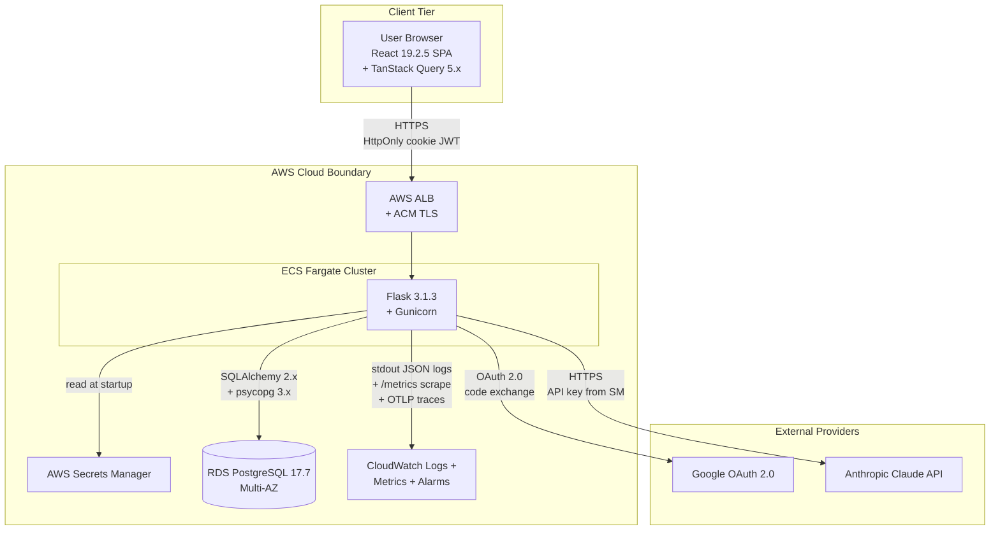
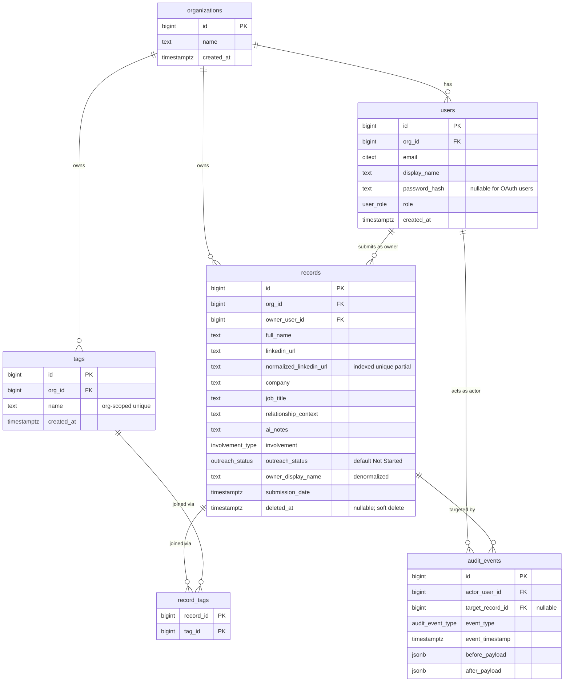
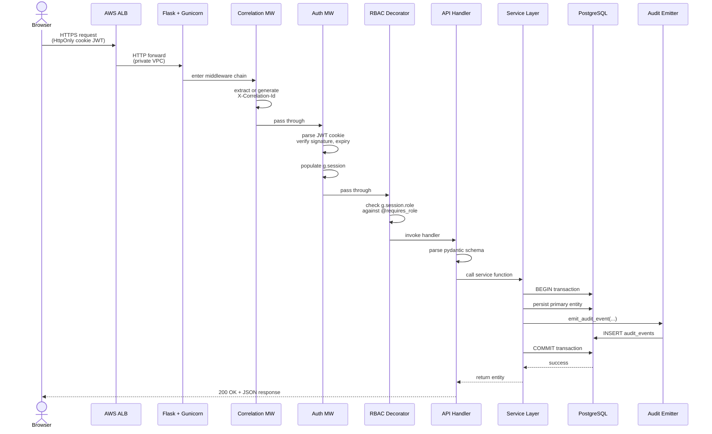
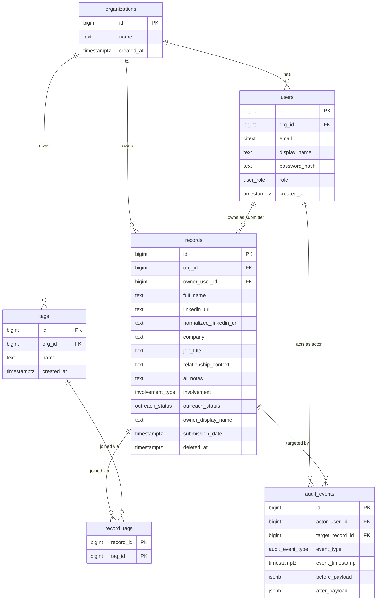
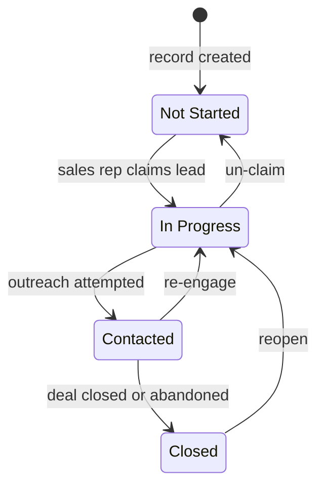
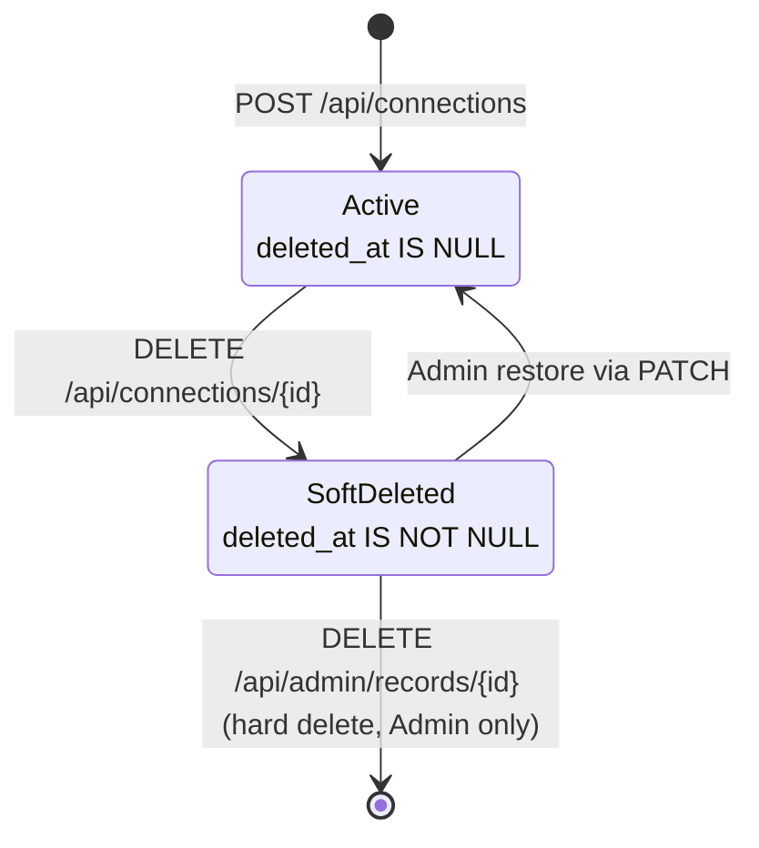
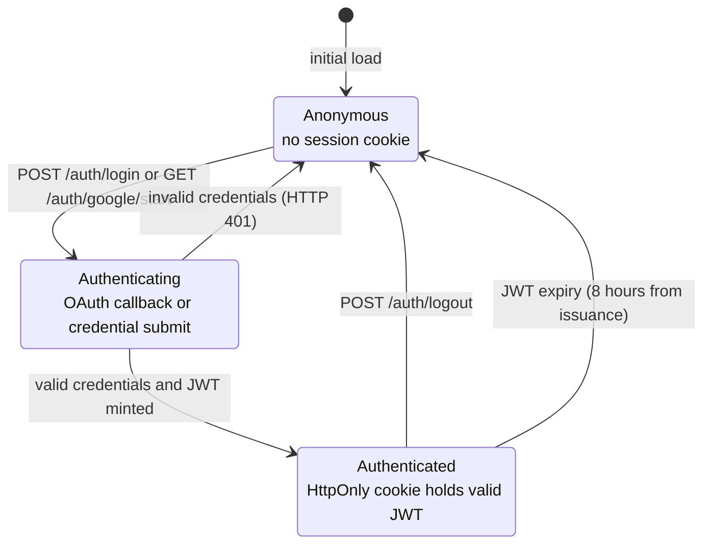

# Sales-Connections Architecture

This document describes the system architecture of the Sales-Connections platform: the three-tier component layout, the four integration surfaces, the six-entity data model, and the cross-cutting concerns (authentication, RBAC, audit, observability). All architectural diagrams referenced here are sourced from `docs/diagrams/` and rendered inline as Mermaid blocks. Decision rationale is documented separately in `docs/decision-log.md` per the user-supplied Explainability rule; this document describes WHAT and HOW only.

## Document Map

| Section | Topic |
|---------|-------|
| 1. System Context | The seven-node landscape: browser, ALB, Fargate, RDS, Secrets Manager, Anthropic, Google OAuth, CloudWatch |
| 2. Architectural Principles | The eight non-negotiable invariants that govern every code path |
| 3. Component Architecture | The three tiers (frontend, backend, database) and their internal layouts |
| 4. Request Lifecycle | The middleware pipeline traversed by every authenticated request |
| 5. Integration Surfaces | The four synchronous bind points (SPA-API, API-Anthropic, API-Google OAuth, API-AWS) |
| 6. Data Model | The six tables, four enum types, seven indexes, and append-only audit invariant |
| 7. State Machines | Three documented state diagrams: outreach status, record lifecycle, authentication session |
| 8. RBAC Permission Matrix | The canonical role-by-endpoint admission matrix |
| 9. Audit Event Catalog | The eight audit event types and the emission contract |
| 10. Cross-Cutting Concerns | Configuration, secrets, observability, error handling, testing posture |
| 11. Performance Budgets | The seven hard latency targets and how each is enforced |
| 12. Build and Deployment | Local dev, CI pipeline, CD pipeline, image strategy |
| 13. See Also | Links to sibling documents and the canonical Mermaid sources |

## 1. System Context

Sales-Connections is a three-tier web application — a React 19 SPA, a Flask 3.1.3 REST API, and a PostgreSQL 17.7 RDS Multi-AZ database — deployed on AWS ECS Fargate with TLS terminating at an Application Load Balancer. External integrations are limited to Anthropic Claude (for AI note generation) and Google OAuth 2.0 (for SSO). All inter-service communication is synchronous; there are no message queues, event buses, or async drivers. Observability flows to CloudWatch via the `awslogs` Docker driver, the Prometheus `/metrics` scrape endpoint, and an OTLP tracing exporter.

The system context is documented in `docs/diagrams/system-context.mmd`. Rendered below:



The diagram shows the seven runtime nodes plus the client browser. The platform never exposes the Flask API directly to the public Internet; all client traffic terminates at the ALB and is reverse-proxied to ECS tasks within private subnets. RDS PostgreSQL is reachable only from the Fargate task security group; Secrets Manager is reachable only from the same security group via the AWS Secrets Manager VPC endpoint. CloudWatch ingestion is automatic via the ECS task definition's `awslogs` driver.

## 2. Architectural Principles

The following eight principles are non-negotiable invariants. Every code path in the platform — every API handler, every service function, every middleware, every test — must respect them. Code review uses these eight principles as the primary checklist.

### Principle 1 — Stateless backend workers

Backend workers maintain no in-process caches, no in-process session state, and no shared mutable globals beyond the SQLAlchemy engine and connection pool. Any worker can be terminated and replaced without data loss. Sessions live in HttpOnly cookies (server-validated JWTs); cache lives in the client (TanStack Query) or in the database. This invariant enables horizontal scaling by raising the Gunicorn worker count or the ECS task count without coordination.

### Principle 2 — Single-page application delivery

All HTML returned by the frontend is the single Vite-bundled `index.html`. Server-rendered fragments are not introduced. Routing is client-side via `react-router-dom` 6.x. The backend serves only JSON over `/api/*` and `/auth/*`; it never returns HTML in the request-response cycle except for OAuth redirects (which are 302s, not document responses).

### Principle 3 — Org-scoped multi-tenancy at the data model layer

Every entity in the schema (excluding the association table `record_tags`, which inherits scope through `records`) carries a non-null `org_id` foreign key. Every read and every write injects `WHERE org_id = g.session.org_id`. Cross-organization access returns HTTP 403 from the API and HTTP 404 from the frontend when surfaced as a navigation result. The MVP runtime serves a single organization, but the data model is engineered for the multi-organization runtime documented as a post-MVP extension.

### Principle 4 — Soft-delete-aware queries by default

Every read on `records` injects `WHERE deleted_at IS NULL`. Admin-only soft-deleted views explicitly opt out by passing `include_deleted=true` to the service layer. The composite index on `(org_id, deleted_at, submission_date DESC)` is engineered to keep this filter free at 10K-record scale. Hard delete is reserved to the Admin role and emits a distinct `audit_event_type = hard_delete`.

### Principle 5 — Append-only audit table

No code path issues `UPDATE` or `DELETE` against `audit_events`. The application database role has only `INSERT` privilege on the table; `UPDATE` and `DELETE` are revoked at the database privilege layer. A separate elevated migrations role retains full privileges for schema evolution. The append-only invariant is verified by an integration test that attempts a direct `UPDATE` from the application role and asserts the database refuses with an insufficient-privilege error.

### Principle 6 — Atomic state-change and audit pair

Every state change persists itself and emits its audit event inside a single PostgreSQL transaction. Failure of either rolls back both. The pattern is: open transaction, persist primary entity, call `services/audit.py:emit_audit_event()` inside the same transaction, commit. The audit emitter raises if no transaction is active; tests verify that no orphaned audit row exists without a corresponding state change, and no orphaned state change exists without a corresponding audit row.

### Principle 7 — API-layer authorization is authoritative

The frontend `<RoleGate>` component in `frontend/src/auth/RoleGate.tsx` is a UX courtesy that hides forbidden controls; it is never the only defense. The backend `@requires_role(*roles)` decorator in `backend/app/middleware/rbac.py` is the only authoritative gate. The platform never relies on the absence of a UI control to prevent an action; every state-changing endpoint is decorated with the appropriate role check, and every test exercises the forbidden role and asserts HTTP 403.

### Principle 8 — Server-side validation is authoritative

Every payload is re-validated by pydantic on the server, regardless of Zod success on the client. Zod schemas in `frontend/src/schemas/` mirror pydantic schemas in `backend/app/schemas/` for UX-only feedback (inline field errors, submit-button disablement). The pydantic layer rejects malformed payloads with HTTP 422 and an `error.fields` array that the frontend surfaces as field-scoped errors. Database `CHECK` constraints serve as the third and last line of defense.

## 3. Component Architecture

The platform is structured into three tiers — frontend, backend, database — each owned by a distinct deployable artefact and each enforcing a distinct boundary. The tiers communicate exclusively via the four integration surfaces documented in §5.

### Frontend tier

The frontend is a React 19.2.5 SPA written in TypeScript 5.x and built with Vite 5.x. Styling is TailwindCSS 3.x utility classes; icons are `lucide-react`; server-state caching is `@tanstack/react-query` 5.x; client-side validation is `zod` 3.x; routing is `react-router-dom` 6.x. The entry point `frontend/src/main.tsx` mounts the React 19 root and wraps the application in `<QueryClientProvider>`, `<AuthProvider>`, and `<RouterProvider>`. There is no server-side rendering; the entire SPA ships as static assets bundled by Vite.

The folder layout mirrors the architectural responsibilities:

| Path | Responsibility |
|------|----------------|
| `src/main.tsx` | React 19 root mount; provider composition |
| `src/App.tsx` | Top-level layout shell |
| `src/router.tsx` | Route table for all SPA URLs |
| `src/api/client.ts` | The single fetch wrapper (correlation header, 401 redirect, typed `ApiError`) |
| `src/api/connections.ts`, `notes.ts`, `auth.ts`, `admin.ts` | TanStack Query hooks per feature surface |
| `src/auth/AuthProvider.tsx` | React context exposing `useSession()` and `useRole()` |
| `src/auth/ProtectedRoute.tsx` | Route guard redirecting unauthenticated users to `/login` |
| `src/auth/RoleGate.tsx` | Component-level UI hiding for forbidden actions (secondary defense only) |
| `src/features/connections/` | Connection-specific feature components (form, feed, detail, status chip, badge, history) |
| `src/features/auth/` | Login screen |
| `src/features/admin/` | Admin Panel sub-views (users, records, analytics) |
| `src/components/ui/` | Tailwind-styled primitives: Button, Input, Select, Table, Badge, Modal, Toast |
| `src/schemas/` | Zod schemas mirroring backend pydantic schemas |
| `src/lib/queryClient.ts` | TanStack Query 5.x client configuration |
| `src/lib/correlationId.ts` | Per-request correlation ID generation |
| `src/styles/index.css` | Tailwind directives and global styles |

Each feature component composes UI primitives from `components/ui/` and consumes a TanStack Query hook from `api/`. Feature components do not call `fetch` directly; all HTTP traffic flows through `src/api/client.ts` so that correlation ID propagation and 401 redirect are uniform across the codebase. Cross-cutting concerns are mounted once at the root: `<QueryClientProvider>` (cache configuration), `<AuthProvider>` (session hydration via `GET /api/me`), `<RouterProvider>` (route table), and inside the route table individual routes are wrapped in `<ProtectedRoute>` and admin-specific routes in `<RoleGate role="Admin">`.

### Backend tier

The backend is a Python 3.12 application running Flask 3.1.3 on Gunicorn pre-fork workers. The application uses SQLAlchemy 2.x for ORM, pydantic 2.x for validation, Authlib for OAuth, PyJWT for session token mint and verify, bcrypt for password hashing, structlog for structured logging, prometheus-client for metrics, and OpenTelemetry for tracing. Anthropic SDK access is wrapped by Langchain in a single service module; the provider-replaceability invariant constrains the Anthropic SDK import to that module alone.

The folder layout follows the handler-service-model pattern:

| Path | Responsibility |
|------|----------------|
| `app/__init__.py` | Application factory `create_app(config_object)` registering blueprints, extensions, middleware, error handlers |
| `app/config.py` | `BaseConfig`, `DevelopmentConfig`, `TestingConfig`, `ProductionConfig` |
| `app/extensions.py` | `db = SQLAlchemy()`, `oauth = OAuth()`, `logger = structlog.get_logger()` singletons |
| `app/models/` | SQLAlchemy declarative models; declarations only, no behavior |
| `app/schemas/` | pydantic request/response schemas |
| `app/api/` | Flask blueprints; thin handlers (parse → gate → service → format) |
| `app/services/` | Business logic; transaction owners; audit emission |
| `app/middleware/` | Correlation, auth, RBAC decorator, error handlers |
| `app/utils/` | URL normalization, sanitization helpers |
| `app/observability/` | structlog config, prometheus registry, OTLP tracer |
| `migrations/` | Alembic environment and versioned migrations |
| `tests/` | pytest suite mirroring the source layout |

The handler-service-model pattern is enforced by convention and verified in code review:

- A handler in `app/api/*.py` is responsible only for: parsing input via pydantic, gating via the `@requires_role` decorator, calling the service layer with `g.session`, and formatting the response. Handlers do not open transactions, do not query the database directly, and do not call external APIs directly.
- A service function in `app/services/*.py` that performs a state change opens an explicit transaction (`with db.session.begin():`), invokes the audit emitter inside it, and surfaces a clean exception class to the handler. Service functions own all business logic.
- Models in `app/models/*.py` contain only column declarations, relationships, and `__repr__`. Behavior lives in services, never in models.

The middleware stack registers in this order on every `/api/*` request:

| Order | Middleware | Source |
|-------|-----------|--------|
| 1 | Correlation | `app/middleware/correlation.py` |
| 2 | CORS (preflight short-circuit + allowlist) | `app/middleware/cors.py` |
| 3 | Security headers (defensive HTTP response headers) | `app/middleware/security_headers.py` |
| 4 | Auth (JWT validation) | `app/middleware/auth.py` |
| 5 | RBAC decorator (per-handler) | `app/middleware/rbac.py` |
| Last | Error handlers | `app/middleware/error_handlers.py` |

### Database tier

The database tier is a single PostgreSQL 17.7 LTS instance running on AWS RDS in a Multi-AZ configuration. Synchronous standby replication is enabled; the standby is in a different Availability Zone from the primary; read replicas are not used in MVP. The database is reachable only from the Fargate task security group; the Application Load Balancer cannot reach the database directly.

The schema comprises six tables, four PostgreSQL enum types, and seven indexes:

- Tables: `organizations`, `users`, `records`, `tags`, `record_tags`, `audit_events`.
- Enum types: `involvement_type` (values `Warm Intro`, `Soft Reference`, `Target Only`); `outreach_status` (values `Not Started`, `In Progress`, `Contacted`, `Closed`); `audit_event_type` (values `create`, `status_change`, `edit`, `soft_delete`, `hard_delete`, `role_change`, `authentication`, `admin_op`); `user_role` (values `Admin`, `Contributor`, `Viewer`).
- Indexes: composite `(org_id, deleted_at, submission_date DESC)` on `records`; single-column on `records.involvement`; single-column on `records.outreach_status`; unique partial `(org_id, normalized_linkedin_url) WHERE deleted_at IS NULL`; composite on `(record_id, tag_id)` for `record_tags`; composite `(target_record_id, event_timestamp)` on `audit_events`; unique composite `(org_id, email)` on `users`.

Database-level audit immutability is enforced by privilege grants applied in the initial migration: the application role has only `INSERT` on `audit_events`; `UPDATE` and `DELETE` are revoked. A separate migrations role retains full privileges so schema evolution and forensic operations remain possible under elevated identity.

The full entity-relationship diagram is in `docs/diagrams/erd.mmd`. Rendered below:



## 4. Request Lifecycle

Every authenticated request traverses the same middleware pipeline: TLS terminates at the ALB; the request is reverse-proxied to a Fargate task; Flask receives the request; the correlation middleware injects `correlation_id` into the structlog and OpenTelemetry contexts; the CORS middleware short-circuits OPTIONS preflight or attaches `Access-Control-*` headers to the response; the security-headers middleware attaches the defensive HTTP response headers (`X-Content-Type-Options`, `X-Frame-Options`, `Referrer-Policy`, `Permissions-Policy`, plus `Cache-Control` on `/api/*` and `/auth/*` and `Strict-Transport-Security` in production); the auth middleware validates the JWT cookie and populates `g.session = Session(user_id, org_id, role)`; the per-handler RBAC decorator gates the handler against the permission matrix; the handler parses the request body via pydantic; the handler calls a service-layer function which opens a transaction, executes the state change, emits the audit event inside the same transaction, and commits; the handler formats the response; the error handler maps any exception to the uniform error envelope; the response returns through the ALB to the browser.

The full request-lifecycle sequence is in `docs/diagrams/request-lifecycle.mmd`. Rendered below:



### Middleware contract

The middleware stack is defined in `backend/app/__init__.py::create_app()` and applied in this order. Each middleware has a single responsibility and executes in-process.

| Middleware | Responsibility | Order |
|-----------|----------------|-------|
| Correlation | Extract `X-Correlation-Id` header if present; otherwise generate `uuid4()`; bind into structlog context vars and OpenTelemetry baggage | 1 |
| CORS | Short-circuit OPTIONS preflight with 204 and the `Access-Control-*` allowlist headers; attach `Access-Control-Allow-Origin` and `Access-Control-Allow-Credentials` to non-preflight responses for allowlisted origins | 2 |
| Security headers | Attach `X-Content-Type-Options: nosniff`, `X-Frame-Options: DENY`, `Referrer-Policy: strict-origin-when-cross-origin`, and `Permissions-Policy: geolocation=(), microphone=(), camera=()` on every response; attach `Cache-Control: no-store, no-cache, must-revalidate, private` on `/api/*` and `/auth/*` non-OPTIONS responses; attach `Strict-Transport-Security: max-age=31536000; includeSubDomains` only when `SESSION_COOKIE_SECURE` is True (production over HTTPS) | 3 |
| Auth | Extract JWT from the HttpOnly session cookie; validate signature and expiry against `JWT_SIGNING_KEY`; populate `g.session = Session(user_id, org_id, role)`; reject with HTTP 401 if absent or invalid on any `/api/*` endpoint | 4 |
| RBAC (decorator) | `@requires_role(*roles)` on each handler; checks `g.session.role` against the decorator argument list; raises `PermissionError` on mismatch | 5 (per-handler) |
| Error handlers | Map `pydantic.ValidationError` → 422; map `AuthError` → 401; map `PermissionError` → 403; map `NotFound` → 404; map `ConflictError` → 409; map fallback `Exception` → 500; emit the uniform error envelope | last |

### Error envelope

Every non-2xx response from the backend uses the same JSON envelope. The frontend `api/client.ts` wrapper consumes this envelope and dispatches typed `ApiError` exceptions or surfaces a global toast.

```json
{
  "error": {
    "code": "validation_error",
    "message": "Request body failed validation.",
    "correlation_id": "8b21d4f2-1e72-4fbe-9f66-8a10cb1e1d6a",
    "fields": [
      { "name": "linkedin_url", "message": "Invalid LinkedIn URL format." }
    ]
  }
}
```

The `error.code` is a stable machine-readable identifier; the `error.message` is a human-readable string suitable for surfacing as a toast; the `error.correlation_id` is the same value that appears in all log entries for the request and in the OpenTelemetry trace; the `error.fields` array is populated only for validation errors and lists per-field errors keyed by JSON Pointer.

## 5. Integration Surfaces

The platform has exactly four integration surfaces. Every cross-process communication flows through one of these four surfaces; nothing else is permitted. All four are synchronous, per the architectural principle that excludes message queues, event buses, and async drivers.

### Surface 1 — SPA to Backend REST

The bind point is `frontend/src/api/client.ts` on the SPA side and `backend/app/api/__init__.py` on the backend side. Transport is REST/JSON over HTTPS terminated at the ALB. The session JWT travels in an `HttpOnly; Secure; SameSite=Lax` cookie; the SPA never sees the token contents. There is one fetch wrapper that all five frontend API modules consume; this wrapper is the only place where `fetch()` is called and the only place where the correlation ID header (`X-Correlation-Id`) is attached and a 401 redirect to `/login` is dispatched.

The endpoint catalog reproduced verbatim from AAP §0.4.3:

| Method | Path | Feature | Handler File |
|--------|------|---------|--------------|
| `POST` | `/api/connections` | F-001 | `backend/app/api/connections.py` |
| `GET` | `/api/connections` | F-004 | `backend/app/api/connections.py` |
| `GET` | `/api/connections/:id` | F-011 | `backend/app/api/connections.py` |
| `GET` | `/api/connections/:id/history` | F-011 | `backend/app/api/connections.py` |
| `PATCH` | `/api/connections/:id` | F-007 | `backend/app/api/connections.py` |
| `PATCH` | `/api/connections/:id/status` | F-005 | `backend/app/api/connections.py` |
| `DELETE` | `/api/connections/:id` | F-007 (soft) | `backend/app/api/connections.py` |
| `GET` | `/api/connections/duplicate-check` | F-010 | `backend/app/api/connections.py` |
| `POST` | `/api/notes/generate` | F-002 | `backend/app/api/notes.py` |
| `GET` | `/api/tags` | F-008 | `backend/app/api/tags.py` |
| `POST` | `/api/tags` | F-008 | `backend/app/api/tags.py` |
| `GET` | `/api/admin/users` | F-014 | `backend/app/api/admin.py` |
| `PATCH` | `/api/admin/users/:id` | F-009, F-014 | `backend/app/api/admin.py` |
| `GET` | `/api/admin/records` | F-014 | `backend/app/api/admin.py` |
| `DELETE` | `/api/admin/records/:id` (hard delete) | F-007, F-014 | `backend/app/api/admin.py` |
| `GET` | `/api/admin/analytics` | F-014 | `backend/app/api/admin.py` |
| `POST` | `/auth/login` | F-012 | `backend/app/api/auth.py` |
| `POST` | `/auth/logout` | F-012 | `backend/app/api/auth.py` |
| `GET` | `/auth/google/start` | F-012 | `backend/app/api/auth.py` |
| `GET` | `/auth/google/callback` | F-012 | `backend/app/api/auth.py` |
| `GET` | `/healthz` | Observability | `backend/app/api/health.py` |
| `GET` | `/readyz` | Observability | `backend/app/api/health.py` |
| `GET` | `/metrics` | Observability | `backend/app/observability/metrics.py` |

The canonical request and response shapes for each endpoint live in `docs/api.md`; this catalog is the at-a-glance summary.

### Surface 2 — Backend to Anthropic Claude API

The bind point is `backend/app/services/ai_orchestration.py`. Transport is HTTPS to the public Anthropic endpoint; the `ANTHROPIC_API_KEY` is read from AWS Secrets Manager at process startup and injected into a Langchain `ChatAnthropic` client. The sole caller of this service module is `backend/app/api/notes.py` (the `POST /api/notes/generate` handler). The Anthropic SDK is never imported from any feature handler — only from `services/ai_orchestration.py` via Langchain — preserving the provider-replaceability invariant from AAP §0.1.2.

Failure mode: a 5-second timeout watchdog wraps the Langchain call. On timeout the handler returns HTTP 504 with `error.code = "ai_timeout"`. AI failure is non-blocking: the frontend renders a "AI unavailable; you can still submit" affordance and the contributor can submit the connection record with empty `ai_notes` or with text typed manually. The two-call flow is (1) optional `POST /api/notes/generate`, (2) `POST /api/connections` with the (optionally edited) `ai_notes` payload.

### Surface 3 — Backend to Google OAuth

The bind point is `backend/app/api/auth.py` for the HTTP endpoints and `backend/app/services/auth.py` for the OAuth state machine and JWT mint logic. Transport is the OAuth 2.0 authorization-code flow via the Authlib client registered in `backend/app/extensions.py` with `client_id` and `client_secret` sourced from AWS Secrets Manager. The flow uses PKCE and a state value persisted in a short-lived signed cookie.

Endpoints:

- `GET /auth/google/start` — issues a 302 redirect to Google's authorization URL with `state` and PKCE parameters.
- `GET /auth/google/callback` — validates state, exchanges the authorization code for an ID token, validates the ID token signature against Google's JWKS, upserts the user (matching by email within the configured organization), creates an `audit_events` row with `event_type = authentication`, mints a PyJWT session token, and sets it as an HttpOnly + Secure + SameSite=Lax cookie.

The OAuth tokens themselves (Google's access and refresh tokens) are never persisted nor exposed to the SPA. Only the locally minted session JWT crosses the SPA boundary. The session JWT carries three claims relevant to authorization: `user_id`, `org_id`, and `role`; the JWT is signed with the symmetric `JWT_SIGNING_KEY` using HS256.

### Surface 4 — Backend to AWS Managed Services

The bind points are `backend/app/extensions.py` (SQLAlchemy engine, Authlib OAuth client) and `backend/app/config.py` (Secrets Manager retrieval at startup). Four AWS managed services are integrated:

| Service | Purpose | Mechanism |
|---------|---------|-----------|
| RDS PostgreSQL | F-001/F-004/F-005/F-006/F-007/F-008/F-009/F-013 persistence | SQLAlchemy 2.x engine over psycopg 3.x; DSN constructed from Terraform output for host plus Secrets Manager value for password |
| Secrets Manager | Secret storage with rotation hooks | `boto3.client('secretsmanager')` read at process startup; values cached for worker lifetime; secrets accessed: `ANTHROPIC_API_KEY`, `GOOGLE_OAUTH_CLIENT_SECRET`, `JWT_SIGNING_KEY`, `DB_PASSWORD` |
| CloudWatch | Log aggregation, metric ingestion, alarms | Logs delivered automatically by the `awslogs` Docker driver in the ECS task definition; metrics scraped from the `/metrics` Prometheus endpoint by an AWS Distro for OpenTelemetry collector sidecar |
| ECR | Container image registry | Images pulled by the ECS task definition; images pushed by `.github/workflows/cd.yml` after CI passes |

No secret is ever logged. The structlog processor explicitly filters keys named `*_key`, `*_secret`, `password`, `token`, and `authorization` from the log line before serialization.

### Excluded surfaces

The following integration patterns are explicitly excluded from MVP, per AAP §0.4.9:

- No message queue (SQS, RabbitMQ, Kafka).
- No event bus or pub/sub broadcasting.
- No async DB driver (asyncpg-style); concurrency is achieved by raising the Gunicorn worker count.
- No saga or compensation patterns.
- No multi-region active-active topology.
- No server-side cache (Redis, ElastiCache); the only cache is the client-side TanStack Query cache.
- No LinkedIn API or scraping integration.
- No CRM bidirectional sync (Salesforce, HubSpot, Pipedrive).
- No calendar or inbox integrations (Google Calendar, Gmail, Outlook).

## 6. Data Model

The complete entity-relationship diagram is in `docs/diagrams/erd.mmd`. Rendered below:



### Entity inventory

| Table | Primary Key | Foreign Keys | Notable Columns | Cardinality |
|-------|-------------|--------------|-----------------|-------------|
| `organizations` | `id` | — | `name`, `created_at` | 1 (MVP single-org) → many users, records, tags |
| `users` | `id` | `org_id → organizations` | `email`, `display_name`, `password_hash` (nullable for OAuth users), `role`, `created_at` | 1 → many records (as owner), 1 → many audit events (as actor) |
| `records` | `id` | `org_id → organizations`, `owner_user_id → users` | nine business fields plus `normalized_linkedin_url`, `deleted_at`, `involvement` enum, `outreach_status` enum, denormalized `owner_display_name`, `submission_date` | many → many tags via `record_tags`; 1 → many audit events (as target) |
| `tags` | `id` | `org_id → organizations` | `name` (org-scoped unique), `created_at` | many → many records via `record_tags` |
| `record_tags` | composite (`record_id`, `tag_id`) | `record_id → records`, `tag_id → tags` | — | association table |
| `audit_events` | `id` | `actor_user_id → users`, `target_record_id → records` (nullable) | `event_type` enum, `event_timestamp`, `before_payload jsonb`, `after_payload jsonb` | append-only |

### Indexes

The schema defines seven indexes, each engineered for a specific query pattern at the 10K-record-per-organization scale ceiling:

| Index | Columns | Purpose |
|-------|---------|---------|
| `ix_records_org_deleted_submission` | `(org_id, deleted_at, submission_date DESC)` on `records` | Composite index that powers the Connection Feed (F-004); covers the org-scope filter, the soft-delete filter, and the default sort by submission date |
| `ix_records_involvement` | `involvement` on `records` | Single-column index supporting feed filter by involvement type |
| `ix_records_outreach_status` | `outreach_status` on `records` | Single-column index supporting feed filter by outreach status |
| `uq_records_org_normalized_linkedin_url_active` | `(org_id, normalized_linkedin_url) WHERE deleted_at IS NULL` (unique partial) | Powers F-010 duplicate-LinkedIn-URL detection in sub-second time at 10K-record scale |
| `ix_record_tags_composite` | `(record_id, tag_id)` (composite primary key) on `record_tags` | Supports the join in feed tag filtering |
| `ix_audit_events_target_record_event_timestamp` | `(target_record_id, event_timestamp)` on `audit_events` | Powers F-011 edit-history feed via `GET /api/connections/:id/history` |
| `uq_users_org_email` | `(org_id, email)` (unique composite) on `users` | Enforces email uniqueness within an organization; supports OAuth user upsert lookup |

### Soft-delete pattern

Records are soft-deleted by setting `deleted_at = NOW()`. Default queries inject `WHERE deleted_at IS NULL` so soft-deleted records are invisible to standard read paths. Admin-only views opt out by passing `include_deleted=true` to the service layer (the `GET /api/admin/records?include_deleted=true` endpoint is the only such opt-out in MVP). The composite index on `(org_id, deleted_at, submission_date DESC)` keeps the soft-delete filter free for the feed query.

Hard delete is implemented as a true `DELETE FROM records WHERE id = ?` issued by `DELETE /api/admin/records/:id`. Hard delete is reserved to the Admin role and emits a distinct `audit_event_type = hard_delete` whose `before_payload` captures the full record for forensic recovery.

### Audit immutability

Audit immutability is enforced at the database privilege layer, not at the application layer. The initial migration applies the following grant pattern:

- `GRANT INSERT ON audit_events TO sales_connections_app;`
- `REVOKE UPDATE, DELETE ON audit_events FROM sales_connections_app;`

The `sales_connections_app` role is the role that the Flask application connects as. A separate `sales_connections_migrations` role retains full privileges (INSERT, UPDATE, DELETE, plus DDL) so that schema evolution and ad-hoc forensic operations remain possible under elevated identity. An integration test verifies that a direct `UPDATE audit_events SET ...` statement issued by the application role fails with a PostgreSQL insufficient-privilege error.

The SQLAlchemy model `app/models/audit_event.py` mirrors the database invariant: `__mapper_args__ = {"confirm_deleted_rows": False}` and the model defines no `update()` or `delete()` helpers. The audit emitter `services/audit.py:emit_audit_event()` only ever issues `INSERT`.

### Multi-tenancy

Every entity except the association table `record_tags` (which inherits scope through `records`) carries an `org_id` foreign key. Every read and every write injects `WHERE org_id = g.session.org_id`. Cross-organization access returns HTTP 403 from the API layer; the frontend surfaces the 403 as a 404 navigation result so cross-organization existence is not even disclosed. The MVP runtime serves a single organization, but the data model is engineered for the post-MVP multi-organization runtime.

The `audit_events` table does not carry `org_id` directly; it inherits scope through `actor_user_id` (which has an `org_id`) and `target_record_id` (which has an `org_id`). Forensic queries that span organizations use the elevated `sales_connections_migrations` role; application queries always join through one of the foreign keys.

## 7. State Machines

Three state machines are formally documented. Each diagram is the canonical reference for the legal transitions; the implementation in `backend/app/services/` enforces the same transitions and rejects illegal mutations with HTTP 409 `conflict_error`.

### Outreach status state machine (F-005)

The outreach status field on `records` carries one of four values: `Not Started`, `In Progress`, `Contacted`, `Closed`. The default value on record creation is `Not Started`. All transitions require the Sales Rep (`Viewer`) or `Admin` role; `Contributor` cannot mutate status, even on records they own. Every transition emits `audit_events.event_type = status_change` with `before_payload` and `after_payload` capturing the prior and new status values.

See `docs/diagrams/state-outreach.mmd`. Rendered below:



### Record lifecycle state machine (F-007)

The record lifecycle is governed by the `deleted_at` column on `records`. A record is `Active` when `deleted_at IS NULL` and `SoftDeleted` when `deleted_at IS NOT NULL`. Transitions are `DELETE /api/connections/:id` for soft delete (Admin or owner-Contributor or owner-Viewer), `PATCH /api/connections/:id` with `deleted_at = null` for restore (Admin only), and `DELETE /api/admin/records/:id` for hard delete (Admin only).

See `docs/diagrams/state-record-lifecycle.mmd`. Rendered below:



### Authentication session state machine (F-012)

The authentication session is governed by the presence and validity of the HttpOnly session cookie. An anonymous client has no cookie; an authenticating client is mid-flow (either submitting credentials to `POST /auth/login` or completing the OAuth callback at `GET /auth/google/callback`); an authenticated client has a valid signed JWT in the cookie; on logout or token expiry the client returns to anonymous.

See `docs/diagrams/state-auth-session.mmd`. Rendered below:




## 8. RBAC Permission Matrix

The platform defines three roles: `Admin`, `Contributor`, and `Viewer`. The `Viewer` role is the Sales Rep population — the team that works leads but does not capture them. Every state-changing endpoint is decorated with `@requires_role(*roles)` from `backend/app/middleware/rbac.py`; the decorator is the only authoritative gate. The frontend `<RoleGate>` component is a UX courtesy; it never substitutes for the backend gate.

The matrix below is canonical. Sibling documents (`docs/security.md`, `docs/api.md`) reference this matrix.

| Endpoint | Admin | Contributor | Viewer | Anonymous |
|----------|-------|-------------|--------|-----------|
| `POST /api/connections` | ✓ | ✓ | ✗ | ✗ |
| `GET /api/connections` | ✓ | ✓ | ✓ | ✗ |
| `GET /api/connections/:id` | ✓ | ✓ | ✓ | ✗ |
| `GET /api/connections/:id/history` | ✓ | ✓ | ✓ | ✗ |
| `PATCH /api/connections/:id` | ✓ (any) | ✓ (own only) | ✗ | ✗ |
| `PATCH /api/connections/:id/status` | ✓ | ✗ | ✓ | ✗ |
| `DELETE /api/connections/:id` (soft) | ✓ (any) | ✓ (own only) | ✓ (own only) | ✗ |
| `GET /api/connections/duplicate-check` | ✓ | ✓ | ✓ | ✗ |
| `POST /api/notes/generate` | ✓ | ✓ | ✗ | ✗ |
| `GET /api/tags` | ✓ | ✓ | ✓ | ✗ |
| `POST /api/tags` | ✓ | ✓ | ✗ | ✗ |
| `GET /api/admin/users` | ✓ | ✗ | ✗ | ✗ |
| `PATCH /api/admin/users/:id` | ✓ | ✗ | ✗ | ✗ |
| `GET /api/admin/records` | ✓ | ✗ | ✗ | ✗ |
| `DELETE /api/admin/records/:id` (hard) | ✓ | ✗ | ✗ | ✗ |
| `GET /api/admin/analytics` | ✓ | ✗ | ✗ | ✗ |
| `POST /auth/login` | ✓ | ✓ | ✓ | ✓ |
| `POST /auth/logout` | ✓ | ✓ | ✓ | ✗ |
| `GET /auth/google/start` | ✓ | ✓ | ✓ | ✓ |
| `GET /auth/google/callback` | ✓ | ✓ | ✓ | ✓ |
| `GET /healthz`, `/readyz`, `/metrics` | ✓ | ✓ | ✓ | ✓ |

### Owner-scoped semantics

The "any" versus "own only" distinction in the table is enforced by the service layer, not by the decorator alone. The decorator admits a role; the service then verifies ownership where required. The pattern is:

1. The handler is decorated with `@requires_role('Admin', 'Contributor')` (admits both roles).
2. The handler calls `services/connections.py:update_record(record_id, payload, actor)`.
3. The service loads the record. If `actor.role == 'Admin'`, the update proceeds. Otherwise (`Contributor`), the service compares `record.owner_user_id == actor.user_id` and raises `PermissionError` on mismatch, which the error handler maps to HTTP 403.

The same pattern governs soft delete: `Admin` deletes any record; `Contributor` and `Viewer` delete only records they own.

### Status mutation specificity

The status mutation endpoint `PATCH /api/connections/:id/status` admits `Admin` and `Viewer` but rejects `Contributor` — even on records the contributor owns. The role contract is documented as: contributors capture leads, sales reps work them. The rule is enforced at the decorator layer alone; no service-layer ownership check is involved because no role is partially admitted. The decision rationale for excluding contributors from status mutation is recorded in `docs/decision-log.md`.

## 9. Audit Event Catalog

The `audit_events` table stores eight enum-constrained event types covering every state-changing operation in the platform. The table is append-only; the application database role has only `INSERT` privilege. Every state-changing endpoint emits exactly one audit event in the same transaction as the state change.

| Event Type | Trigger | Before Payload | After Payload | Actor |
|------------|---------|----------------|---------------|-------|
| `create` | New record submitted via `POST /api/connections` | null | full record snapshot | submitter |
| `status_change` | `PATCH /api/connections/:id/status` | `{ "outreach_status": "..." }` | `{ "outreach_status": "..." }` | sales rep / admin |
| `edit` | `PATCH /api/connections/:id` | partial old fields | partial new fields | owner / admin |
| `soft_delete` | `DELETE /api/connections/:id` | `{ "deleted_at": null }` | `{ "deleted_at": "..." }` | owner / admin |
| `hard_delete` | `DELETE /api/admin/records/:id` | full record | null | admin |
| `role_change` | `PATCH /api/admin/users/:id` (role mutation) | `{ "role": "..." }` | `{ "role": "..." }` | admin |
| `authentication` | OAuth callback or email/password login | null | `{ "method": "google" \| "password" }` | self |
| `admin_op` | Generic admin action not covered above | varies | varies | admin |

### Audit emission contract

The audit emitter signature is fixed:

```python
def emit_audit_event(
    session_db: Session,
    event_type: AuditEventType,
    actor: User,
    target: Record | None = None,
    before: dict | None = None,
    after: dict | None = None,
) -> AuditEvent:
    ...
```

The contract:

- The function is invoked inside the caller's open transaction. It does not open a new transaction. It does not commit. The caller commits.
- The function raises if no transaction is active. This is verified by an integration test that calls `emit_audit_event()` outside any `with db.session.begin():` block and asserts `RuntimeError`.
- The function inserts a single row into `audit_events` with the supplied fields. `event_timestamp` is set to `func.now()` so the database, not the Python clock, is the source of truth for timing.
- The function returns the persisted `AuditEvent` so the caller can include the audit ID in the API response if desired.

A pytest fixture `assert_audit_emitted(event_type, target_id)` is shared across the test suite. Every state-changing test invokes this fixture at the end and asserts that exactly one matching audit row exists. This convention enforces the atomic state-change-and-audit pair invariant from §2 Principle 6.

## 10. Cross-Cutting Concerns

### Configuration

The configuration system is a class hierarchy in `backend/app/config.py`:

| Class | Use | Source of values |
|-------|-----|------------------|
| `BaseConfig` | Common defaults | Hard-coded in source |
| `DevelopmentConfig` | Local Docker Compose stack | `.env` file via `python-dotenv` |
| `TestingConfig` | pytest test runs | Ephemeral values; in-memory or per-test PostgreSQL database |
| `ProductionConfig` | ECS Fargate deployment | AWS Secrets Manager via `boto3` at process startup |

The application factory `create_app(config_object)` accepts a dotted path to one of these classes. Production deployments pass `ProductionConfig`; tests pass `TestingConfig`; the local dev stack passes `DevelopmentConfig`.

### Secrets management

Four secrets are sourced from AWS Secrets Manager in production: `ANTHROPIC_API_KEY`, `GOOGLE_OAUTH_CLIENT_SECRET`, `JWT_SIGNING_KEY`, and `DB_PASSWORD`. Secrets are read at process startup and cached for the worker lifetime; there is no per-request fetch from Secrets Manager. The caching reduces API calls to a single read per worker per restart.

The structlog redaction processor filters keys named `*_key`, `*_secret`, `password`, `token`, and `authorization` from log lines before serialization. Test cases verify the redaction by emitting a structured log with a sentinel secret value and asserting the value does not appear in the captured output.

In the local Docker Compose stack, secrets come from `backend/.env` (the file is git-ignored; `backend/.env.example` is committed as a template). Tests use ephemeral values constructed in `conftest.py`.

### Observability

The observability stack consists of three signals plus two health surfaces:

| Signal | Implementation | Endpoint |
|--------|----------------|----------|
| Structured logs | `structlog` 24.x emitting JSON; correlation ID, user ID, org ID bound on every log record; secret redaction processor; output to stdout for capture by the `awslogs` Docker driver | (stdout) |
| Metrics | `prometheus-client`; counters for HTTP requests by status; histograms for handler duration and AI latency; gauges for active sessions | `GET /metrics` |
| Distributed tracing | OpenTelemetry SDK with OTLP HTTP exporter; service name `sales-connections-api`; auto-instrumentation for Flask and SQLAlchemy | (OTLP exporter) |
| Liveness probe | Returns 200 unconditionally if the Flask process is up | `GET /healthz` |
| Readiness probe | Returns 200 only if a `SELECT 1` round-trip to RDS succeeds within 1 second; otherwise 503 | `GET /readyz` |

Correlation IDs are generated in `backend/app/middleware/correlation.py` if absent on the inbound request and propagated on outbound calls (Anthropic, Google) so a single request is traceable end-to-end. The CloudWatch dashboard template lives in `infra/terraform/modules/observability/main.tf`; the dashboard is exported as a Terraform-managed resource so it never drifts from the alarm definitions.

The full observability runbook (alarms, dashboards, on-call rotation) lives in `docs/operations.md`.

### Error handling

Errors from any handler are caught by the error-handler middleware in `backend/app/middleware/error_handlers.py` and mapped to the uniform error envelope. The mapping table:

| Exception Class | HTTP Status | `error.code` |
|-----------------|-------------|--------------|
| `pydantic.ValidationError` | 422 | `validation_error` |
| `AuthError` (custom) | 401 | `unauthorized` |
| `PermissionError` (custom) | 403 | `forbidden` |
| `NotFound` (custom; raised by services on org-scoped lookup miss) | 404 | `not_found` |
| `ConflictError` (custom; raised by services on illegal state transition or unique violation) | 409 | `conflict_error` |
| `AITimeoutError` (custom; raised by `services/ai_orchestration.py` on watchdog fire) | 504 | `ai_timeout` |
| Fallback `Exception` | 500 | `internal_error` |

The 500 fallback emits a structured log at error level with the full traceback and the correlation ID; the response body deliberately omits the traceback to avoid information disclosure.

### Testing posture

Backend tests use pytest 8.x with factory-boy 3.x factories under `backend/tests/factories.py`. Coverage is enforced at 85% via `pytest --cov-fail-under=85` in CI. Every state-changing test asserts an audit row exists at the end via the shared `assert_audit_emitted` fixture. AI orchestration tests use `responses` to mock the Anthropic HTTP API; OAuth tests use `responses` to mock Google's authorization and JWKS endpoints.

Frontend tests use vitest 2.x with `@testing-library/react` 16.x and `msw` 2.x for API mocking. Coverage is enforced via vitest coverage thresholds in `vite.config.ts`. Component tests assert the rendered DOM against role-conditioned UI expectations (for example, the `<StatusChip>` mutation control mounts only for `Viewer` and `Admin`).

## 11. Performance Budgets

The platform engineers to seven hard performance budgets. Each budget is enforced by a corresponding metric and alarm; the AAP §0.7.3 reproduction below is canonical.

| Operation | Budget | Enforcement |
|-----------|--------|-------------|
| AI note generation | ≤ 5 s P95 end-to-end | Timeout watchdog in `services/ai_orchestration.py`; Prometheus histogram alarm on `ai_request_duration_seconds` |
| Authentication completion | ≤ 2 s | Prometheus histogram on `/auth/google/callback` and `/auth/login` |
| Form submit (excluding AI) | ≤ 2 s | Prometheus histogram on `POST /api/connections` |
| RBAC authorization check | ≪ 50 ms | Decorator runs in-process against JWT claims; no DB round-trip |
| Audit event emission | ≤ 100 ms | Single INSERT in same transaction; covered by handler-duration histogram |
| Pre-submit duplicate check | Sub-second at 10K records | Unique partial index `(org_id, normalized_linkedin_url) WHERE deleted_at IS NULL` |
| Feed load and filter | Responsive at 10K records | Composite index `(org_id, deleted_at, submission_date DESC)` |

Status mutation, detail-page render, and admin aggregation operations inherit the standard form-submit budget (2 seconds); they do not have dedicated targets. The 10K-records-per-organization scale ceiling is the upper bound for every database-bound operation; partitioning and read replicas are post-MVP optimizations and are not engineered in MVP.

## 12. Build and Deployment

### Local development

The local development stack is `docker-compose up --build` from the repository root. The compose file at `docker-compose.yml` defines four services: `postgres` (image `postgres:17-alpine` with healthcheck), `backend` (built from `./backend/Dockerfile`), `frontend` (built from `./frontend/Dockerfile`), and an optional `pgadmin` for database inspection. Alembic migrations run on backend startup when the environment variable `RUN_MIGRATIONS=true` is set; this is the default in the dev compose file.

The backend exposes port 5000 to the host; the frontend exposes port 5173 (Vite dev server) or 80 (nginx production mode) depending on which target is built. The Vite dev server proxies `/api/*` and `/auth/*` to `http://backend:5000` so the SPA can call the backend without CORS configuration.

### CI pipeline

The CI pipeline at `.github/workflows/ci.yml` runs on every pull request and on every push to `main`. The pipeline stages execute sequentially; failure of any stage fails the pipeline.

| Stage | Command(s) | Purpose |
|-------|-----------|---------|
| Lint | `ruff check backend/`, `npm run lint`, `npm run format:check` | Code style and prettier formatting |
| Type-check | `mypy backend/app`, `tsc --noEmit` | Static typing (advisory for backend, blocking for frontend) |
| Test | `pytest --cov --cov-fail-under=85`, `vitest run --coverage` | Unit and integration tests with coverage threshold |
| Build | `docker build` for backend and frontend, `npm run build` for Vite production bundle | Verifies images and bundles compile |
| Security scan | ECR image scan-on-push, Dependabot (separate workflow `.github/workflows/dependabot.yml`) | Vulnerability detection in dependencies and images |

Python 3.12 is set up via the `actions/setup-python@v5` action; Node 20 LTS is set up via `actions/setup-node@v4`. The pipeline runs on `ubuntu-latest` runners.

### CD pipeline

The CD pipeline at `.github/workflows/cd.yml` triggers on push to `main` after CI succeeds. The pipeline uses OIDC-federated AWS authentication so no long-lived AWS access keys are stored in GitHub secrets.

| Step | Action |
|------|--------|
| 1 | Assume the deploy role via OIDC; no long-lived keys |
| 2 | Push backend and frontend images to ECR; images are tagged with the git SHA and `latest` |
| 3 | Run `terraform plan` against the staging workspace |
| 4 | Run `terraform apply` to staging on automatic merge to `main` |
| 5 | Manual approval gate to production; production `terraform apply` requires a human approver |

The Terraform state is stored in an S3 backend with DynamoDB state locking; the bucket and table are pre-provisioned out of band. The OIDC role and trust policy live in `infra/terraform/modules/secrets/main.tf` with the long-term task role; the CD-specific deploy role is documented in `docs/operations.md`.

### Image strategy

Two container images are built per release: one backend image (`backend/Dockerfile` → ECR repository `sales-connections-backend`) and one optional frontend nginx image (`frontend/Dockerfile` → ECR repository `sales-connections-frontend`). The frontend image is optional because the SPA may alternatively be deployed as static files to S3 + CloudFront; the choice between the two delivery modes is recorded in `docs/decision-log.md`.

The backend image is a multi-stage build: stage 1 installs `requirements.txt` into a virtualenv on `python:3.12-slim`; stage 2 copies the virtualenv and the application source into a fresh `python:3.12-slim` and sets the entrypoint to Gunicorn against `wsgi:app`. An optional preflight step runs `alembic upgrade head` when `RUN_MIGRATIONS=true`.

The frontend image is also multi-stage: stage 1 runs `npm ci && npm run build` on `node:20-alpine` to produce the Vite bundle; stage 2 copies the bundle into `nginx:1.27-alpine` and overlays `frontend/nginx.conf` for SPA history-mode fallback, gzip compression, and long-cache headers on hashed assets.

## 13. See Also

The following documents and diagram sources are part of the architecture documentation set. Each link points to a planned or existing file in the repository.

- [`README.md`](../README.md) — Quick Start and high-level project orientation
- [`onboarding.md`](onboarding.md) — Extended onboarding guide for new developers (clean-machine to running app)
- [`api.md`](api.md) — Canonical REST endpoint catalog with request and response shapes
- [`operations.md`](operations.md) — Deploy, rollback, secret rotation, observability dashboards, on-call runbook
- [`security.md`](security.md) — Threat model, authentication, RBAC, audit trail, secrets, data scoping details
- [`decision-log.md`](decision-log.md) — Master decision log per the Explainability rule
- [`diagrams/system-context.mmd`](diagrams/system-context.mmd) — System context diagram source
- [`diagrams/request-lifecycle.mmd`](diagrams/request-lifecycle.mmd) — Request lifecycle sequence diagram source
- [`diagrams/erd.mmd`](diagrams/erd.mmd) — Entity-relationship diagram source
- [`diagrams/state-outreach.mmd`](diagrams/state-outreach.mmd) — Outreach status state machine source
- [`diagrams/state-record-lifecycle.mmd`](diagrams/state-record-lifecycle.mmd) — Record lifecycle state machine source
- [`diagrams/state-auth-session.mmd`](diagrams/state-auth-session.mmd) — Authentication session state machine source

