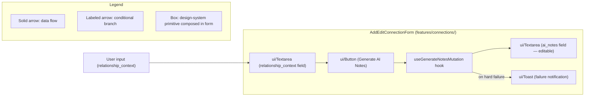

# frontend/src/components

## 1. Purpose

`frontend/src/components/` is the host for the SPA's design-system primitives. The folder contains exactly one subfolder, `ui/`, holding 8 typed, accessible TailwindCSS-based primitives (Badge, Button, Input, Modal, Select, Table, Textarea, Toast). These primitives are dependency-light (TailwindCSS, clsx, lucide-react only) and composed by feature components elsewhere in the SPA. TypeScript 5.7.2 strict mode is enforced; React 19.2.5 forwardRef pattern is used where consumers need imperative refs. The primitives are intentionally feature-agnostic — feature-specific composition (the F-002 "Generate AI Notes" affordance) lives in `features/connections/`, not here.

**Path note**: The "Add/Edit Connection" form that integrates the AI notes feature is implemented at [`frontend/src/features/connections/AddEditConnectionForm.tsx`](../features/connections/AddEditConnectionForm.tsx) — not in this folder. This README documents the design-system primitives this folder hosts AND cross-references the form as the AI-notes integration point per DL-0060 in [`docs/decision-log.md`](../../../docs/decision-log.md).

## 2. Business Context

> "Sales-Connections is expected to be used during weekly sales pipeline review meetings. Sales leaders will add connection ideas before or during the meeting, and SDRs will use the generated notes as 'meeting-ready context' to decide which warm leads to pursue that week."

> The AI-generated note is not just convenience text; it is a prioritization aid that helps the team quickly answer:
>
> - Why is this person worth contacting now?
> - How should the submitter be referenced?
> - Should the submitter make a warm intro, be mentioned softly, or stay uninvolved?
> - What first outbound angle should an SDR use?

The design-system primitives in this folder are the visual building blocks SDRs touch during these review meetings — the Button they click to ask AI for help, the Textarea where they read and edit the response, the Toast that surfaces an error when a hard failure occurs.

## 3. Key Files

This folder contains a single `ui/` subfolder. Each primitive is a single, strictly-typed `.tsx` module that consumes only TailwindCSS, clsx, and lucide-react.

| File | Purpose |
|------|---------|
| `ui/Badge.tsx` | `<Badge>` primitive — compact labels and status indicators (variant + size; optional dot/border). |
| `ui/Button.tsx` | `<Button>` primitive — variants, loading state, icon slots; used for the "Generate AI Notes" action. |
| `ui/Input.tsx` | `<Input>` primitive — text fields with `errorMessage` prop and aria-describedby wiring. |
| `ui/Modal.tsx` | `<Modal>` primitive — native `<dialog>`-based dialog with backdrop dismissal. |
| `ui/Select.tsx` | `<Select>` primitive — typed single-select on native `<select>`. |
| `ui/Table.tsx` | `<Table>` primitive — generic, sortable, typed tabular view with empty/loading states. |
| `ui/Textarea.tsx` | `<Textarea>` primitive — multi-line fields with `errorMessage` prop; used for the editable `ai_notes` field and the `relationship_context` input. |
| `ui/Toast.tsx` | `<Toast>` primitive — global notification store; used for hard AI failure notifications. |

### Cross-reference — AI-notes integration consumer (NOT in this folder)

The "Add/Edit Connection" form that composes these primitives into the AI-notes affordance lives in `features/connections/`, not in this folder. See DL-0060 in [`docs/decision-log.md`](../../../docs/decision-log.md) for the rationale.

- [`frontend/src/features/connections/AddEditConnectionForm.tsx:L324`](../features/connections/AddEditConnectionForm.tsx) — exported `AddEditConnectionForm` component composes `<Button>`, `<Input>`, `<Textarea>`, and `<Toast>` (via `useToast()`) primitives.
- [`frontend/src/features/connections/AddEditConnectionForm.tsx:L359`](../features/connections/AddEditConnectionForm.tsx) — `handleGenerateAi` callback wired to the "Generate AI Notes" `<Button>`.
- [`frontend/src/api/notes.ts:L233`](../api/notes.ts) — `useGenerateNotesMutation` hook the button handler invokes.
- [`frontend/src/api/client.ts:L572`](../api/client.ts) — `apiPost` (the underlying HTTP transport).

## 4. Data Flow

Diagram D5 below shows how the design-system primitives in this folder compose into the AI-notes affordance inside `AddEditConnectionForm` — the textarea where the contributor enters `relationship_context`, the button that triggers AI generation, the textarea that renders the editable AI-populated `ai_notes`, and the toast that surfaces hard failures.



Diagram D5 shows that the form (located in `features/connections/`) composes the design-system primitives this folder provides. The AI button click triggers `useGenerateNotesMutation`, which populates the editable `ai_notes` Textarea on success and triggers a Toast only on hard failures.

## 5. Public Interfaces

This README summarizes the four primitives the AI-notes flow uses. Refer to each TypeScript file for the strict prop type with `readonly` modifiers.

### `<Button>` (ui/Button.tsx)

- `variant`, `size`, `loading`, `leftIcon`/`rightIcon`, `fullWidth`, native button attributes; defaults `type="button"` to prevent accidental form submission; see [`ui/Button.tsx`](./ui/Button.tsx) for the strict prop type.

### `<Input>` (ui/Input.tsx)

- `label`, `helperText`, `errorMessage`, `required`, `inputSize`, `leftIcon`/`rightIcon`, all native input attributes (native `size` attribute is omitted to avoid conflict with `inputSize`); see [`ui/Input.tsx`](./ui/Input.tsx) for the strict prop type.

### `<Textarea>` (ui/Textarea.tsx)

- `label`, `helperText`, `errorMessage`, `required`, `rows` (default 4), `resize` (default "vertical"), all native textarea attributes; see [`ui/Textarea.tsx`](./ui/Textarea.tsx) for the strict prop type. **Used for both the `relationship_context` and the AI-populated `ai_notes` editable fields.**

### `<Toast>` (ui/Toast.tsx)

- Exposed via `useToast()` hook: `toast.success(...)`, `toast.error(...)`, `toast.info(...)`, `toast.warning(...)`; also exposes `show(...)` and `dismiss(id)`; see [`ui/Toast.tsx`](./ui/Toast.tsx) for variant types and the `UseToastReturn` interface.

## 6. Error Handling

- `<Input>` / `<Textarea>` `errorMessage` prop renders the validation message below the field with `aria-describedby` wiring and `aria-invalid="true"` on the control; the surrounding form sets per-field error strings only when `submitAttempted` is true (see [`frontend/src/features/connections/AddEditConnectionForm.tsx`](../features/connections/AddEditConnectionForm.tsx)).
- `<Button>` `loading` state automatically replaces the left icon with a Lucide `Loader2` spinner and disables the button — used while `useGenerateNotesMutation.isPending` is true.
- `<Toast>` summon pattern for hard AI failures: `useGenerateNotesMutation`'s `onError` callback calls `toast.error(...)` ONLY when `isSoftAiFailure(error)` returns false; see [`frontend/src/api/notes.ts:L181`](../api/notes.ts) for the `isSoftAiFailure` predicate definition.
- Soft AI failures (504 `ai_timeout` / 502 `ai_unavailable`) bypass the Toast and surface an inline retry banner in the form via the `aiSoftFailure` derived flag at [`frontend/src/features/connections/AddEditConnectionForm.tsx:L385`](../features/connections/AddEditConnectionForm.tsx), preserving the F-002 non-blocking contract per AAP § 0.4.4.

## 7. Security and Privacy Notes

- **No provider credentials in the frontend** — the Anthropic API key lives ONLY in the backend. The SPA never sees the provider key (per AAP § 0.2.2 user-provided template: "no provider credentials in frontend").
- **HttpOnly cookie-only auth** — JavaScript code NEVER reads the session cookie; the browser includes it on every request via `credentials: "include"` set in [`frontend/src/api/client.ts`](../api/client.ts).
- The `relationship_context` text the user types is sent to the backend over HTTPS only; the SPA does not log it, persist it, or transmit it to any other origin. Server-side sanitization is the authoritative boundary.
- Cross-link to [`docs/security.md`](../../../docs/security.md) for the full security model.

## 8. Operational Notes

- TanStack Query 5.62.16 (per [`frontend/package.json`](../../package.json)) provides the mutation/cache machinery; optimistic updates are used elsewhere (e.g., `StatusChip`) but the AI mutation does NOT use optimistic updates because the AI response is not predictable.
- React 19.2.5 (per [`frontend/package.json`](../../package.json)) with TypeScript 5.7.2 strict mode; primitive props use `readonly` modifiers to prevent accidental mutation in event handlers.
- Correlation ID via the `X-Correlation-Id` header is injected by `apiPost` on every backend call — see [`frontend/src/lib/README.md`](../lib/README.md) for the full correlation ID lifecycle (Diagram D6).
- Loading state is communicated via `<Button loading={mutation.isPending}>`; the rest of the form remains interactive — only the AI button is disabled during the in-flight request.
- The 8 primitives total ~131 KB of source; only Lucide icons, clsx, and TailwindCSS utilities are external runtime deps.

## 9. Examples

**Example 1 — AI button composition pattern**:

```tsx
<Button
  type="button"
  loading={generateNotes.isPending}
  onClick={() => generateNotes.mutate({ relationship_context })}
  leftIcon={<Sparkles aria-hidden="true" />}
>
  Generate AI Notes
</Button>
```

**Example 2 — Soft-failure inline banner pattern**:

```tsx
if (generateNotes.isError && isSoftAiFailure(generateNotes.error)) {
  return <div role="status">AI unavailable. You can still submit.</div>;
}
```

## 10. Related Modules

- [`frontend/src/features/connections/AddEditConnectionForm.tsx`](../features/connections/AddEditConnectionForm.tsx) — actual AI-notes consumer form (per DL-0060).
- [`frontend/src/api/notes.ts`](../api/notes.ts) — `useGenerateNotesMutation` hook (the demo-mode rejection sits at L246-L248 per AAP § 0.9.1).
- [`frontend/src/api/client.ts`](../api/client.ts) — `apiPost`, `ApiError` shared HTTP transport.
- [`frontend/src/lib/README.md`](../lib/README.md) — cross-cutting browser utilities (correlation ID lifecycle, TanStack Query client singleton).
- [`docs/ai-note-generation-workflow.md`](../../../docs/ai-note-generation-workflow.md) — end-to-end F-002 deep-dive (SPA → API → service → provider).
- [`backend/app/api/README.md`](../../../backend/app/api/README.md) — server-side `POST /api/notes/generate` endpoint contract.
- [`docs/decision-log.md`](../../../docs/decision-log.md) — DL-0060 (README placement deviation rationale).
